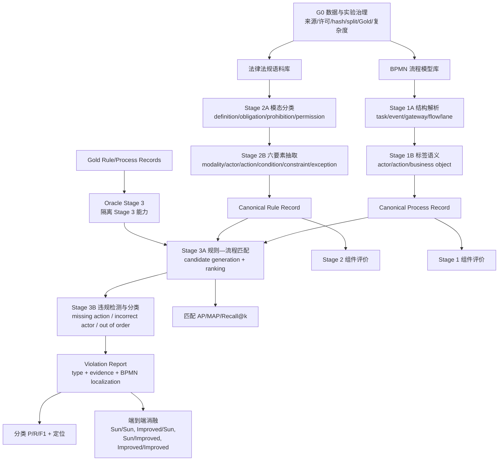

# BPC-Hybrid 完整实验主 Pipeline

**文档版本**：3.6.0
**状态**：ACTIVE — 全项目研究与任务分解的唯一主线  
**最后更新**：2026-08-08
**方法学主干**：Sun et al. (2024)（三阶段方法主干）；Barrientos et al. (2026)（直接借鉴来源：LLM 结构化输出、验证、受控词汇、归一化与评估纪律）
**当前实施优先级**：实验先完成 Stage 2，再补 Stage 1 和 Stage 3；论文非结果章节从现在并行写作；2026-08-08 导师汇报后方向锁定见 §8.8

> 所有 Agent 在修改实验代码、配置、数据协议或研究设计前必须完整阅读本文。
> 本文定义“要完成什么、先后依赖是什么、每一步怎样算完成”。
> `docs/PROJECT_AUDIT.md` 只记录实时进度；不要再创建新的日期版
> `STATUS_*`、`HANDOFF_*` 或平行路线文档。

## 1. 权威层级与更新规则

发生冲突时按以下顺序处理：

1. `AGENTS.md` 与安全边界；
2. `configs/experiment_contract.json` 的当前机器门禁；
3. 本文的完整研究目标、阶段依赖和任务树；
4. `docs/PROJECT_AUDIT.md` 的实时状态；
5. 各阶段设计规范；
6. `_retired/` 与 `docs/research/` 中的历史和证据材料。

本文可以随实验发现持续改进，但不得静默改路线。任何 Pipeline 变更必须：

- 给出新证据、导师要求或用户决定；
- 说明影响的任务 ID、数据、baseline、指标和已完成结果；
- 不重写既有实验结果或历史实验来源事件；
- 通过完整性检查并用 `record_change.py` 追加变更或实验运行日志；
- 在本文末尾的变更日志中追加一行。

当前 `experiment_contract.json` 仍是“优先完成 Stage 2、用固定 Stage 3
测误差传播”的阶段性执行合同。本文规定完整项目还必须完成 Stage 1 和 Stage 3。
进入 Stage 3 方法改进前，必须另行更新并核查机器合同；不能仅凭本文绕过现有门禁。

## 2. 不变的最终目标

本项目的最低完整交付不是“给 Sun Stage 2 加一个 LLM”，而是：

1. 独立、可追溯且可复现地重建 Sun 三阶段端到端方法；
2. 每个阶段都有明确输入、输出、Gold、baseline、指标和失败分析；
3. 优先在 Stage 2 比较传统方法、Sun、LLM 和混合方法；
4. 在预先定义的复杂法律语料上检验复杂度是否放大 LLM 优势；
5. Stage 2 完成后，继续比较和改进 Stage 3；
6. 最终用受控消融解释提升来自 Stage 2、Stage 3，还是二者交互；
7. 即使改进方法没有超过 Sun，也交付完整复现、负结果和误差边界。

允许的正式表述是 `method-level independent reconstruction of Sun Stage 2`：核心组件、
处理顺序、输入输出和评价口径与 Sun 对齐即可；作者原代码、原权重和完整私有词典
不可得不再单独阻断方法级复现。只有逐项核实全部公开规则语义时才使用
`paper-faithful`；始终禁止称 `exact reproduction` 或 `Sun original implementation`。

## 3. 研究问题

| ID | 研究问题 | 主要证据 |
|---|---|---|
| RQ0 | 能否完整重建 Sun 的三阶段设计时合规检查方法？ | 三阶段独立测试 + 端到端复现 |
| RQ1 | 多种非 LLM、Sun、LLM 和混合方法在 Stage 2 上如何比较？ | 模态分类与六要素抽取指标 |
| RQ2 | 法律语料复杂度增加时，不同 Stage 2 方法如何退化？ | 复杂度分层曲线与误差类型 |
| RQ3 | Gold 规则输入下，多个 Stage 3 baseline 与 LLM 谁更可靠？ | Oracle Stage 3 匹配与违规分类 |
| RQ4 | Stage 2/3 的局部改进能否转化为端到端提升？ | 固定组件与交叉消融 |

## 4. 完整流程图



逻辑上 Stage 1 和 Stage 2 并行产生 Stage 3 输入；项目实施顺序是：

```text
先完成 Stage 2 → 补齐并冻结 Stage 1 → 复现 Stage 3 → 扩展 Stage 3 → 端到端消融
```

## 5. 统一中间合同

### 5.1 Process Record

最低字段：process ID；activities/events/gateways；pools/lanes/actors；sequence
flows；activity label 的 action 与 business object；直接顺序、可达、分支、并行和
order relations；来源 BPMN hash 与解析器版本。

### 5.2 Rule Record

最低字段：sample ID、source text、clause spans、modality、actor、action、condition、
constraint、exception、actor-action map、order relations、schema/method/prompt/rule
version 与 provenance。

### 5.3 Violation Report

最低字段：process/rule ID；matching score；compliant 或一个/多个 violation type；
相关 activity、lane/actor、order pair；可复核证据；threshold/model version；运行
manifest 与输入 hash。

任何方法只有通过相同 canonical contract，才能进入同一评价表。

## 6. G0：数据与实验治理

| 任务 ID | 小任务 | 产物 | 当前状态 | 完成条件 |
|---|---|---|---|---|
| G0.1 | 建立唯一 Pipeline 与文档索引 | 本文、`docs/INDEX.md` | verified | Agent 入口唯一、旧路线移出活动入口 |
| G0.2 | 数据注册 | dataset registry/contract | partial | 每个数据集有来源、许可、hash、schema、split、用途 |
| G0.3 | 方法注册 | 方法 registry | partial | 每个正式方法有命令、状态、LLM 标记和版本 |
| G0.4 | 评价合同 | schema、normalization、evaluator | partial | 方法共享同一 Gold 和 evaluator |
| G0.5 | 复杂度合同 | 文本与 BPMN 复杂度字段 | blocked | 看结果前冻结分层规则 |
| G0.6 | Git checkpoint | 有意创建的版本点 | verified | `formal_experiment/` 已在 checkpoint `bfb0b8a` 纳入版本控制 |
| G0.7 | 前人比较注册表 | citation/method/data/code/license/metric/adapter matrix | ready | 每个引用结果可追到原表或本地重跑 manifest |
| G0.8 | 受控文本哈希可移植性 | 合同 `hash_mode` 声明 + gate 归一化 + 窄 `.gitattributes` + 回归测试 | verified | CRLF/LF 工作树对同一受控文本得到同一 canonical hash；未声明资产仍按原始字节；一字变化 fail closed；Sun modality 许可/溯源边界不变 |

外部数据集必须同时满足：来源/版本可定位、许可允许复用、hash 固定、标签兼容或有
人工协议、split 不泄漏、各方法使用同一测试样本、复杂集在运行结果前选定。

## 7. Stage 1：流程模型拆解

### 方法与 baseline

| ID | 方法 | 角色 |
|---|---|---|
| S1-P0 | 纯 BPMN XML 结构解析，保留原标签 | 结构下限 |
| S1-P1 | 简单 verb-object/规则标签解析 | 轻量非 LLM baseline |
| S1-P2 | Sun/Leopold-style 标签、模型上下文和结构分析 | 正式 Sun Stage 1 |
| S1-P3 | LLM 标签语义解析 | 可选扩展，Stage 2 完成前不启动 |

### 工作分解

| 任务 ID | 小任务 | 依赖 | 当前状态 | Definition of Done |
|---|---|---|---|---|
| S1.1 | BPMN 输入与 Process Record schema | G0.2 | partial | schema + fixtures + validator |
| S1.2 | activity/event/gateway/flow/lane 解析 | S1.1 | development | 对测试 BPMN 稳定输出 |
| S1.3 | actor/action/object 标签解析 | S1.2 | blocked | P0/P1/P2 可替换运行 |
| S1.4 | 控制流和可达关系 | S1.2 | development | 分支、并行、顺序测试通过 |
| S1.5 | Stage 1 人工核对样本 | G0.2 | blocked | 固定样本和人工 Gold |
| S1.6 | baseline 评价 | S1.3-S1.5 | blocked | 结构准确率和语义 P/R/F1 |
| S1.7 | 冻结正式 Stage 1 | S1.6 | blocked | 输入/输出/方法/指标/hash 锁定 |

## 8. Stage 2：法规解析（当前主线）

### 8.1 Stage 2A：模态分类

类别：definition、obligation、prohibition、permission。候选 baseline：多数类/随机、
关键词、BiLSTM、CNN/TextCNN、通用/法律域 BERT、Sun BERT-TextCNN、LLM、
分类器 + LLM fallback。主表只保留有代表性的不同范式，同类变体放附录。

### 8.2 Stage 2B：六要素抽取

候选 baseline：marker/regex、spaCy/dependency rules、Sun CoreNLP +
Tregex/Tsurgeon + reconstructed markers、token classifier/CRF（仅在训练 Gold
足够时）、LLM、Sun + field-level LLM fallback。

### 8.3 Stage 2 完整方法

> 2026-08-08 起正式命名直观化（§8.8.3）：`B0 / sun_rule_only → Rules-Only`（纯规则法）、
> `H1 / sun_llm_fallback → Rules+LLM-Repair`（规则+LLM 修复）、`D1 / direct_llm →
> Direct-LLM`（直接 LLM）。新文档一律用正式命名；机器 ID 与 legacy 代号仅用于代码/
> 注册表兼容。Legacy 代号映射：B0 / `sun_rule_only`、H1 / `sun_llm_fallback`、
> D1 / `direct_llm`。

| Legacy 代号 | 正式命名 | 机器 ID | 含义 | 当前状态 |
|---|---|---|---|---|
| B0 | **Rules-Only**（纯规则法） | `sun_rule_only` | 非 LLM 传统流水线：BERT-TextCNN 模态分类 + CoreNLP/Tregex/Tsurgeon 六要素抽取（Sun Stage 2 方法级重建） | B0-R0–R3 verified；B0-R4/R5 blocked on formal Gold |
| H1 | **Rules+LLM-Repair**（规则+LLM 修复） | `sun_llm_fallback` | 同一 Rules-Only，仅按预注册 trigger 修复失败/不确定字段 | **对照方法（不再深究，2026-08-08 用户确认，§8.8.1）**；development 机制已验证，全量 150 运行主口径 F1 0.7621 vs B0 0.7986（净负） |
| D1 | **Direct-LLM**（直接 LLM） | `direct_llm` | LLM 直接生成同一 Rule Record（端到端，不读取 B0 预测） | D1-R0–R3 verified（主方法，粗 Gold F1 0.8726）；D1-R4/R5 blocked on formal Gold |

正式主表的最低方法覆盖为：简单规则下限、一个强监督学习 baseline、完整 B0、H1、
D1。模态分类与六要素抽取分别选方法，不能用一个只做分类的 baseline 冒充完整
Stage 2。训练 Gold 不足时，CRF/token classifier 只列为条件性扩展，不为凑数量
制造不可训练的 baseline。

### 8.4 数据轨道与复杂度

| 轨道 | 数据 | 用途 | Claim 边界 |
|---|---|---|---|
| S2-R1 | Sun 官方 modality 数据 | 模态分类复现 | development schema/split 已锁定；许可未知，禁止再分发或提前提升为 formal |
| S2-R2 | 项目固定 EStG-150 | 六要素主测试 | 项目独立重建，不是 Sun 原 150 |
| S2-C | GDPR、可复用 Luxembourg 语料、Barrientos 等复杂文本 | 外部验证 | 标签需映射或人工裁决 |

复杂度字段至少包括：长度、clause 数、dependency depth、actor/action 数、
condition/constraint/exception 的数量与嵌套、被动语态、隐含 actor、跨句引用、
原语言/翻译标记。

### 8.5 Stage 2 工作分解

| 任务 ID | 小任务 | 依赖 | 当前状态 | Definition of Done |
|---|---|---|---|---|
| S2.1 | 官方 modality 数据 ingestion/schema/license/split | G0.2 | **verified；A/B-R1/C-R1/D 全部通过** | development machine gate 交叉验证来源、合同、schema、quarantine、hash、split 与许可；formal use 仍未解锁 |
| S2.2 | EStG-150 人工裁决 | human-owned | **verified (2026-08-06)**：150/150 adjudicated（用户 2026-07-18 完成的裁决经用户授权从 56d2b03 历史快照恢复至活动 v2 文件，freeze validator 通过） | 150/150 adjudicated，freeze validator 通过 |
| S2.3 | 重建 public marker lexicon | S2.1 | **verified；英文 public-source v1 已锁定** | 来源、规则、hash、dev-only 扩展策略固定 |
| S2.4 | 完成 BERT-TextCNN | S2.1 | ready after separate dispatch；本轮未启动 | 训练、dev 选择、test 评价可复现 |
| S2.5 | 完成 CoreNLP/Tregex/Tsurgeon extractor | S2.3 | blocked | 六要素规则和 fixtures 通过 |
| S2.6 | 组合并验证完整 B0 | S2.4-S2.5 | blocked | 不调用 LLM，输出 canonical Rule Record |
| S2.7 | 实现代表性非 LLM baseline | S2.1/S2.2 | blocked | 相同输入和 evaluator 可运行 |
| S2.8 | 预注册 H1 trigger/merge/call budget | S2.6 | **不再推进（2026-08-08）**：H1 降级为对照方法（§8.8.1），对照所需机制（development wiring、canary、全量 150 运行 commit 74614e3）已具备；正式 trigger 预注册取消 | 对照臂结果可复现：主口径 F1 0.7621 vs B0 0.7986（净负，证据支持 D1-primary 决策 A）；机制工作正常但 trigger+repair 配方增加 FP 而非召回 |
| S2.9 | 锁定 D1 prompt/few-shot/model/budget | S2.2 | **verified (2026-08-06)** | **D1 侧达成（2026-08-06，D1-R2）**：v6 prompt hash 3aa64877 固定、model/sampling/seed 策略与预算合同锁定于 `configs/models/estg150_d1_active_registry_v1.json`；Gold 不可见（few-shot 为合成 fixture、runner 不读 Gold）；S2.2 frozen（150/150 adjudicated，2026-08-06 恢复后 freeze validator 通过），依赖满足 |
| S2.10 | 主数据组件评价 | S2.2/S2.6-S2.9 | blocked | 模态与六字段指标分别报告 |
| S2.11 | 复杂法律语料集冻结 | G0.5 | blocked | 数据资格门禁 + Gold/映射协议 |
| S2.12 | 复杂度分层与误差分析 | S2.10/S2.11 | blocked | 预注册分层曲线和错误类型 |
| S2.13 | Stage 2 冻结 | S2.1-S2.12 | blocked | 方法、数据、Gold、指标、成本、manifest 完整 |

Stage 2 完成时，B0/H1/D1 和选定 baseline 必须共享 test IDs、Gold、schema、
normalization 和 evaluator，并分别报告 modality、phrase 和完整 Rule Record 指标。

### 8.6 B0 方法级复现修复 Pipeline（B0-R0–B0-R5）

本 Pipeline 执行用户在 2026-08-01 明确确认的口径：方法级独立复现可以进入正式
结论，不以取得作者原代码、原权重、完整私有词典或复现作者绝对数值为前提。实施
保持 Sun 的宽松方法边界，不用过度门禁把可解释的规则权衡卡死，但必须先排除确定性
代码错误。

**硬约束仅保留以下六项**：B0 不调用 LLM；不看最终 Gold 反向调规则；span 坐标有效
且文本可回指；同输入可确定性重放；B0/H1/D1 共享输入与 evaluator；每个代码/规则
批次有测试、manifest 或变更日志及 Git checkpoint。缺作者资产、单字段 P/R 回落、
规则词典规模不同或无法达到论文原数值只需披露，不单独阻断方法级复现。

| 任务 | 唯一目标 | 完成信号 | 状态 |
|---|---|---|---|
| B0-R0 | 将实际 B0 方法代码、配置、CoreNLP bridge 与测试整合到当前可审计主线；不整体合并历史数据/输出 | 当前分支存在唯一可运行入口，依赖和版本可追踪，旧 heuristic 不再冒充该入口 | verified |
| B0-R1 | 修复确定性实现错误：Action 任意字符截断、多词 Actor、字符中点分句、德英 cue 验证、错误 fallback、`<`/`<<`、Tsurgeon multi-match | 已完（2026-08-04）：R1-A..C3（半词 span、字符中点分句、Action 截断、required-end 守卫、fatal scope 拒绝）+ R1-E1/E2（主口径 evaluator + v10a/C3 重评）+ R1-ERR（错误分析）+ 七个 §8.6.1 子批次全部闭环（ACTION 已修/质量收益、SCOPE-DISAMBIG 实测拒绝记局限、ALIGN 已修伪 validated、BRIDGE 守卫+测试、ACTOR 已修 +0.0018、LEXICON-DECISION 已实施（用户授权）、CLAUSE-REVIEW 不改动）。DoD 三条验收线全部达成：无半词 span、无伪 validated、无未记录即被剪除的匹配 | **verified** |
| B0-R2 | 对照 Sun 核心方法：BERT-TextCNN、CoreNLP constituency、Tregex/Tsurgeon、公开抽取顺序和六字段输出 | 方法对照表逐项有实现/测试/已披露适配（docs/B0_R2_METHOD_CROSSWALK.md，11 元素）；重建 marker 与德英 adapter 允许使用并记录；`method_conformance_status` 已由用户授权（2026-08-04）改为 `verified_method_level_independent_reconstruction`，`sun_stage2_baseline_not_paper_faithful` blocker 已按设计解除（BLOCKERS 9→8）；Tsurgeon 为诚实非实现（fail-closed 守卫） | **verified（用户授权）** |
| B0-R3 | 在固定 development snapshot 上重跑并做错误分析 | 无 LLM；manifest 锁定代码/配置/输入/evaluator hash；报告 P/R/F1 与失败类型 | **verified（2026-08-04）**：56d2b03 快照运行完成（主口径 F1 0.71865，manifest `…r2_r3_lex_hist56d_v1/`，用户条件授权标记为论文依据候选）+ 最终态错误分析完成（docs/B0_ERROR_ANALYSIS.md §8：失败分布、constraint marker 归因、C2 cue 一致性、label 路由归因；两项不补项及原因记录） |
| B0-R4 | 在与 H1/D1 相同的冻结输入和 Gold 上运行 B0 | 三方法共享 IDs、schema、normalization、evaluator；输出不覆盖 | blocked on formal Gold/shared capsule |
| B0-R5 | 形成论文正式结论 | 结果可为正或负；明确写作“方法级独立复现”，并披露重建资产和适配差异 | blocked on B0-R4 |

**评价口径**：六字段抽取的 Sun 对照主表采用同字段任意非空字符交叠的
Precision/Recall/F1；不强制 clause alignment，不做一对一 assignment。该口径下
`modality` 只评价 evidence span，忽略标签，因此模态四分类必须另表报告 label
P/R/F1。strict exact、token overlap、clause alignment 和 actor-action edge 作为诊断
面板，不作为阻止方法级 B0 进入正式结论的最低分阈值。

**迭代规则**：B0-R1/R2 的候选允许出现字段间 precision/recall trade-off；不得仅因
一个字段回落就停止整个路线。Agent 必须记录变化、原因和已知代价，再由固定的 Sun
主口径与诊断面板共同判断是否保留。只有代码不正确、方法核心组件缺失、数据泄漏、
输出不可复现或比较口径不一致时才 fail closed。Pipeline 不预设最低 P/R/F1；修复后
仍然较低的结果属于可报告的方法局限。

### 8.6.1 B0-R1 当前子批次（依据 2026-08-04 错误分析）

`docs/B0_ERROR_ANALYSIS.md`（B0-R1-ERR）对 C3 注册 attempts 与 56d2b03 历史
Gold 做了逐 span 失败分类：79%（218/276）的 missed Gold span 内容被抽到其它
字段、80%（280/351）的错误预测压到其它字段 Gold 上；字段归属错误是压倒性失败
模式。据此，B0-R1 剩余工作拆为以下子批次，每批必须：focused tests →
`audit_project.py --with-tests` → 用 B0-R1-E2 同一协议（`sun_literal_overlap_evaluation@2.0.0`、
同一 canonical Gold、同一进程双评）重评 → 记录前后 delta 与原因 → `record_change.py`
→ 独立 commit + push：

| 子批次 | 内容 | 量化证据 | 可修性 | 预期影响 |
|---|---|---|---|---|
| B0-R1-ACTION | 修复 action span 吞并：`actor_action.py` `_subtree_span` 把 nsubj/全部依赖纳入 action，span 中位超 Gold 54 字符（192/212 matched 为过长） | constraint 143 个 missed 中 57 个仅被 action 覆盖；244 个 action 中 8 个以冠词开头 | **已修（2026-08-04）**：实测主口径 F1 +0.00005（持平），质量收益：主语开头 8→0、strict-exact action F1 3.0× | 边界质量修复；主口径非指标驱动项 |
| B0-R1-SCOPE-DISAMBIG | constraint↔condition 双向消歧（scope.py `_SURFACE_SCOPE` 与 Tregex 共享 cue） | 114 个 extra constraint 压 condition Gold、31 个反向；44 个同界双发（43 个双 tregex） | **已实测拒绝（2026-08-04）**：候选真实运行 F1 −0.0005，按迭代规则回退；根因=gold 对 "to the extent"/关系从句语义内部不一致 + registry 模式重叠（`to<<an|the` vs `to<<extent|purpose`），不读 Gold 前提下规则层不可安全消歧 | 记为方法局限；registry 模式复核需用户决策 |
| B0-R1-ALIGN | 德英 cue 验证：equal-count/split 路径"伪 validated"（两侧任意锚即 validated） | evidence 匹配 clause 上 label 准确率 79.3%（definition↔obligation 混淆为主） | **已修（2026-08-04）**：`_cross_validates` 语言学映射+否定极性+数字锚；validated 107→49、"无伪 validated" DoD 达成；主口径指标不变（F1 0.71024）；label 面板 −0.48pp（记录代价）；validated_split 42→0（记录副作用，留待细化） | modality label 面板提升未达成（实测微降），正确性缺陷已修 |
| B0-R1-BRIDGE | `<`/`<<` 关系算子与 Tsurgeon multi-match 消费（当前 registry 无 operation，风险潜伏） | SunPhraseRuleBatchBridgeMulti.java:91-103 单记录/多消费结构 | 可修（离线 fixture） | 消除潜伏错误源 |
| B0-R1-ACTOR | 多词 Actor 生产路径测试 + 依赖边查找修复 + under-extension 边界（C7） | 22 个 missed actor：8 个含词典词（依赖失败）、14 个词典无覆盖；modality evidence 80 个过短 | **已修（2026-08-04）**：clause 内全 nsubj 弧 + obl/by-to + 中心词词典校验；实测主口径 F1 +0.0018（0.71024→0.71205，本系列首个正向 delta），actor F1 0.616→0.670，8/8 漏抽找回；C7 过短边界未含在本批 | actor R 提升已验证；C7 另行跟进 |
| B0-R1-LEXICON-DECISION | actor 等词典扩展、代词/名词 Gold 语义裁决（如 "It" 作 actor） | 13 个无词典覆盖名词 + "It" 代词 | **已实施（2026-08-04 用户授权路径 b）**：13 名词以 `authorized_local_frozen_estg150_gap_2026_08_04` 来源加入词典（治理覆盖严格记录于 sources manifest/actor meta/manifest note/事件）；覆盖/未覆盖 P/R 分别报告（覆盖 47/48：P 0.692/R 0.979/F1 0.811；未覆盖 1/48=代词 "It"，需正式 Gold 裁决）；B0-R3 快照 F1 0.71865（+0.0085 vs 原） | actor R 0.958；唯一残余=代词语义 |
| B0-R1-CLAUSE-REVIEW | clause 规划失配复核（38/231 Gold clause 无 IoU≥0.5 配对） | 与 v2 主口径弱相关；58 个真正漏抽中仅 4 个在未配对 clause | **已复核（2026-08-04）：不改动**（v2 口径不依赖 clause 对齐；修复风险大于收益，C1/C2 批次已顺带观察） | 次要 |

B0-R3 的"固定快照重跑 + 错误分析"仍是正式结论的必要步骤：B0-R1-ERR 的分析为
development 快照提前执行，正式错误分析须在 B0-R2 后按同一主口径重做并登记。

### 8.7 D1 方法级复现修复 Pipeline（D1-R0–D1-R5）

与 §8.6 B0 Pipeline 同构、同门禁纪律。D1 是直接 LLM 方法，因此硬约束为：
**真实 LLM 调用必须逐批用户授权并记录硬预算上限与成本**；不看最终 Gold 反向调
prompt；span 坐标有效且文本可回指；同输入同配置可重放（prompt hash、model、
temperature/seed、max_tokens 全部记录进 manifest）；B0/H1/D1 共享输入与 evaluator；
每个 prompt/代码批次有 focused tests、manifest 或变更日志及 Git checkpoint。
缺作者资产、单字段 P/R 回落只需披露，不单独阻断方法级复现。

| 任务 | 唯一目标 | 完成信号 | 状态 |
|---|---|---|---|
| D1-R0 | 将实际 D1 方法（runner/prompt loader/canonical schema/attempts 产物/manifest）整合到当前可审计主线 | 唯一可运行入口 `run_direct_llm.py` + prompt loader + canonical schema；既有 s28_s29 产物 tracked 且可重评；prompt hash 记录于 manifest | ready |
| D1-R1 | 修复 D1 低召回（整体 R=0.665、constraint R=0.288）的确定性/合同缺陷：省略指令、few-shot 缺 constraint/condition、字段错标引导（99 个 constraint 内容进 action span） | 每个候选：prompt vN 变更 + focused tests + 预算内真实 pilot + 重评 delta + keep/reject 记录（见 §8.7.1） | **verified (2026-08-05)**：v6 KEEP；150 全量 0 事故，F1 0.7669→0.7735，constraint R 0.2881→0.4172；见 s27_d1_v6_verify_pass_150_hist56d_v1 |
| D1-R2 | 对照方法要求：prompt/model/budget 锁定（prompt hash 固定、预算上限合同、temperature/seed 记录）；S2.9 DoD（Gold 不可见、prompt hash 固定）达成 | config 锁定 + manifest 记录 | **verified (2026-08-06)**：`configs/models/estg150_d1_active_registry_v1.json` 锁定 v6 prompt（sha 3aa64877，与磁盘/loader/manifest 三方一致）、deepseek-v4-pro 钉死、temp 0/top_p 1/max_tokens 4096、seed 策略 unsupported_or_omitted、transport 配方（thinking-disabled、无 json_object）、共享输入与 evaluator hash、预算合同（逐批授权+`--max-calls` 硬上限 150）、D1-R1 运行登记；12 项 lock-config 测试含 S2.9 Gold 不可见核查（6 个 few-shot 合成 fixture 与 150 测试句零交叠）；§8.5 S2.9 行 DoD（D1 侧）达成，整行仍 partial（S2.2 未 frozen） |
| D1-R3 | 固定快照干净重跑 + 错误分析 | 无事故 transport；manifest 锁定代码/配置/输入/evaluator hash；报告 P/R/F1 与失败类型 | **verified (2026-08-06)**：锁定配方（estg150_d1_active_registry_v1.json 逐项一致）干净重跑 150/150 有效、0 事故；R1/R3 同一进程双评（sun_literal_overlap@2.0.0）R3 F1 0.7756（P 0.8793/R 0.6938）vs R1 0.7735（+0.0021），复现成功；失败类型分析（1055 gold span：matched 732、wrong_field 169 其中 constraint 100、not_extracted 154）见 docs/D1_ERROR_ANALYSIS.md §8 |
| D1-R4 | 与 B0/H1 相同冻结输入和 Gold 上正式比较 | 三方法共享 IDs、schema、normalization、evaluator；输出不覆盖 | blocked on formal Gold 发布（annotation freeze 已达成 2026-08-06；route/data/stage3 重锁 + publication gate 未过）+ shared capsule |
| D1-R5 | 形成论文正式结论 | 结果可为正或负；明确写作"方法级独立复现"，披露模型/prompt/预算与适配差异 | blocked on D1-R4 |

**评价口径**：与 B0 相同——`sun_literal_overlap_evaluation@2.0.0` 主表 + 模态
label 另表。**迭代规则**：候选允许字段间 P/R trade-off；Agent 记录变化、原因与
已知代价，由固定主口径判定保留与否；修复后仍低的结果属可报告的方法局限。

### 8.7.1 D1-R1 子批次（依据 2026-08-04 错误分析，见 docs/D1_ERROR_ANALYSIS.md）

| 子批次 | 内容 | 量化证据 | 预期影响 |
|---|---|---|---|
| D1-R1-FIELD-TYPING | prompt 显式定义 constraint 类别（法律引用/时间/数量限制/"within the meaning of"/"pursuant to"/"subject to"）并禁止并入 action/condition；补 few-shot | 99 个 constraint 内容被 action 吞、16 个进 condition（合计 124 个落错字段） | **done (2026-08-05)**：v6=v5+规则25-27+Ex5/Ex6；pilot 19 配对 F1 +0.0155、constraint F1 +0.0547，KEEP |
| D1-R1-PROMPT-CONTRACT | 规则 14 由"不确定就省略"改为"列出所有候选，不确定的写入 unsupported_or_ambiguous"；补 constraint/condition/exception few-shot（当前 4 例中 condition 0 次、constraint 仅 1 例） | 91 个 constraint + 43 个 condition 完全未抽 | **covered by v5 lineage**：v5 规则 15-19（empty=absent、不确定入 unsupported_or_ambiguous）+ v6 规则 25-27；150 全量实测 constraint R 0.288→0.417 |
| D1-R1-VERIFY-PASS | 两遍法：第二遍仅问"是否遗漏 constraint/condition/exception"（可选，预算翻倍） | 同上 | **done (2026-08-05)**：v6 150 全量 150/150 有效、0 事故；F1 0.7735（+0.0066）、constraint R 0.4172（+0.1291）；两遍法未启用（预算纪律，候选已达标） |
| D1-R1-CLEAN-RERUN | 排除 s28_s29 运行事故影响（lost 104 / recovery 26 / retry 0） | manifest `d1_runtime_incident` | **satisfied by VERIFY-PASS run**：0 lost/recovery/retry，manifest 无 runtime_incident |

每批纪律：prompt/代码变更 + focused tests → 预算内真实 pilot（**逐批用户授权**）
→ 同口径重评 → delta 与原因记录 → keep/reject → `record_change.py` → 独立 commit
+ push。禁止读 Gold 反向调 prompt。

## 8.8 导师汇报确认与方向锁定（2026-08-08）

本节记录 2026-08-08 向导师汇报后确认的四项事实与执行决定。本节是后续论文写作、
消融实验与各 Agent 派工的唯一依据；任何与此冲突的动作必须先更新本节并给出新证据。

### 8.8.1 事实 1：H1（Rules+LLM-Repair）不再深究，仅作为对照

**决定**：H1 降级为**对照方法**，不再作为主方法投入。论文保留其对照臂结果，
用于证明"无证据约束的选择性 LLM 修复会净负，反衬证据约束的必要性"。

**为什么效果不好**（依据 commit `74614e3`，2026-08-08 全量 150 运行，
deepseek-v4-pro，用户授权 150 calls）：
- 主口径（句子级粗 Gold）F1 **0.7621 vs B0 0.7986（−0.0365，净负）**；细 Gold
  F1 0.6875 vs 0.7186（同样净负）；
- LLM 修复在 actor 字段**过度抽取**：P 0.7077→0.2754，actor spans 65→167；
- 其余 5 个字段持平或微升；机制本身工作正常（103 accepted / 89 changed /
  gate=True / 0 incidents），问题出在 **trigger+repair 配方增加 FP 而非召回**。

**困难点**：
1. **trigger 与失败错位**：trigger 只看到推理时信号（低置信、结构冲突、候选多义），
   而 B0 压倒性失败模式是"字段归属错误"（79% 的 missed Gold span 内容被抽到其它
   字段）——这类失败在推理时不可见，Gold-blind trigger 无法对准真正需要修复的样本；
2. **修复难以约束在字段边界内**：请求补 actor 时 LLM 倾向扩大 span、补多个候选，
   把 precision 打穿（actor spans 65→167 的直接原因）；
3. **收益上限受限**：修复收益被触发子集覆盖限制，成本-收益曲线不利。

**优化方向（仅当未来恢复时参考，当前不执行）**：
- 保守修复配方：actor span 长度上限 + 候选数上限 + 修复后 verbatim 回指强制校验；
- 用 risk-coverage 曲线在 development 上选择触发子集，而非全触发；
- 字段级白名单 + patch 前后 diff 约束。

**论文表述**：H1 作为对照臂报告"选择性混合"的负结果；不声称 H1 是贡献。

### 8.8.2 事实 2：B0（Rules-Only）/ D1（Direct-LLM）局限性（列表 + 例子）

**B0（纯规则法，非 LLM）局限性**：
1. **字段归属错误主导**（C1 action 吞并）：matched action 中 192/212 过长、中位超
   Gold 54 字符。例：`"the data shall be processed only to the extent necessary"`
   中整段被并入 action，而 Gold 将 `"to the extent necessary"` 归 constraint。
2. **constraint↔condition 双向混淆**（C2：114 个 extra constraint 压 condition Gold、
   31 个反向），例：`"to the extent"` 双触发。SCOPE-DISAMBIG 候选实测 −0.0005 已回退：
   "不读 Gold"前提下规则层不可安全消歧 → 记为**方法局限**而非代码缺陷。
3. **词典覆盖受限**：13 个无词典覆盖名词漏抽（successor/spouse/child/developers/
   bank/body/society/owners/shareholders/beneficiary 等）；代词 `"It"` 作 actor 需
   Gold 语义裁决（未覆盖 1/48）。
4. **定义范围差异**：我们的 constraint Gold 302 个中仅 13 个（4%）符合 Sun 公开
   marker 定义（Sun 自身仅 35 个）→ 定义口径差异是低分主因之一；Sun-marker 收敛后
   B0 constraint R=1.0 (13/13)、condition R=0.989 (91/92)。
5. **缺 Sun 原资产**：Tsurgeon 为诚实非实现（fail-closed 守卫）；词典规模与分词
   机制为已披露适配。

**D1（直接 LLM）局限性**：
1. **constraint 召回弱**：R1 基线 R=0.288（99 个 constraint 内容进 action span、
   91 个完全未抽）；v6 修至 0.417 仍为最弱字段；R3 失败类型：wrong_field 169
   （constraint 100）+ not_extracted 154（constraint 69）。
2. **actor 泛化误抽**：历史 run P=0.594（69 pred vs 48 gold）。例：表述
   `"the body shall ensure…"` 中抽取无 Gold 交叠的泛指主语作为 actor。
3. **高精度保守型**：细 Gold 口径 P 0.879 vs B0 0.685，但 R 0.694 vs 0.756——
   "宁可漏抽不误抽"在低资源字段（exception/constraint）牺牲召回。
4. **依赖真实 API 与预算合同**：每批需用户授权 + `--max-calls` 硬上限；可复现性
   依赖 transport 配方（thinking-disabled、无 json_object、temp 0）与 prompt hash
   三方锁定。

**对照矩阵（主口径粗 Gold，2026-08-07，同一 Gold 同一 evaluator）**：

| 口径 | B0 P/R/F1 | D1 P/R/F1 | 谁领先 | 可解释原因 |
|---|---|---|---|---|
| 句子级粗 Gold（609 spans，主口径） | 0.7309 / 0.8801 / **0.7986** | 0.9012 / 0.8456 / **0.8726** | **D1（F1 +0.074）** | D1 高精度保持；B0 召回更高（R 0.8801 vs 0.8456） |
| 细 Gold（1055 spans，对照口径） | 0.6845 / 0.7564 / **0.7186** | 0.8793 / 0.6938 / **0.7756** | **D1（F1 +0.057）** | B0 字段归属错误拖低 P；D1 保守漏抽拖低 R |

**结论**：B0 靠规则覆盖全面（R 高）、D1 靠 LLM 精度高（P 高），错误模式互补
（B0 字段归属错、D1 低召回）；但 H1 实测净负（§8.8.1）说明"简单混合"不成立，
主叙事以 D1 为方法主体、B0 为强对照。

### 8.8.3 事实 3：方法命名直观化（B0/H1/D1 → 正式命名）

导师指出 B0/H1/D1 代号不直观，审阅人无法快速理解。自 2026-08-08 起统一使用：

| Legacy 代号 | 机器 ID（不变） | 正式命名（英文） | 中文名 | 一句话本质 |
|---|---|---|---|---|
| B0 | `sun_rule_only` | **Rules-Only** | 纯规则法 | 非 LLM 传统流水线（BERT-TextCNN 分类 + CoreNLP/Tregex 规则抽取），Sun Stage 2 方法级重建 |
| H1 | `sun_llm_fallback` | **Rules+LLM-Repair** | 规则+LLM 修复 | 规则为主，预注册触发器按字段让 LLM 修复；**对照方法** |
| D1 | `direct_llm` | **Direct-LLM** | 直接 LLM | 纯 LLM 端到端生成六要素 Rule Record，不读取规则预测 |

**写作规则**：新文档一律用正式命名；旧文档/代码引用时首次出现给出映射
（如"Direct-LLM（旧代号 D1）"）；机器注册表 `configs/methods.json` 保留 legacy
`id`（代码兼容）并新增 `paper_label` 字段承载正式命名。

### 8.8.4 事实 4：与 Barrientos et al. (2026) 严格对比 + 贡献细模块化（重要）

**背景**：Barrientos et al. (2026) 是**本项目直接借鉴来源**（LLM 结构化输出、
验证、受控词汇、归一化与评估纪律）；Sun et al. (2024) 是三阶段方法学主干。
导师要求：(a) 严格对比 Barrientos 的方法；(b) 消融实验做丰富——"哪个模块缺了
我的不行；把他的模块换成我的模块更好"；(c) 列表跑数据，逐项说明我的好在哪、
他的好在哪、综合谁好；(d) 把贡献拆成细模块讲清楚，**不能只说"调用了 LLM"**
（prompt 只是其中一小部分），方法章节要支撑 4–5 页。

**已锁定的对比事实**（见 `docs/research/BARRIENTOS_BORROWING_AUDIT_2026-07-12.md`
与 `docs/research/BARRIENTOS_LLM_ROLE.md`）：
1. **任务与 schema 不同**：Barrientos=change-impact 表示（precondition/norms/
   temporal_validity）；我们=Sun 六要素 span 抽取（modality/actor/action/condition/
   constraint/exception + evidence span）→ **schema 不能照搬**（已锁定）。
2. **modality 3 类 vs 4 类**：Barrientos 缺 `definition`；我们的 prompt 显式扩展
   4 类并定义触发语义（"主要目的是定义"而非"包含定义"）。
3. **受控词汇**：Barrientos 44 模式 4 维度（control_flow/resource/data/time）约束
   normalized view；我们=public marker lexicon（64 marker）+ 受控 six-field schema
   （normalized view 受控，原文 span 不覆盖）。
4. **评估纪律**：Barrientos 3 维度（semantic coverage / structural encoding /
   deontic correctness）+ **style-equivalent alignment**（表达不同但语义相同算正确）
   + 专家核验（κ=0.52）；我们=span overlap 主口径 + 细/粗 Gold 双口径 + 失败类型
   归因 + label 面板 → style-equivalent 概念列为论文方法学贡献候选。
5. **工程纪律**：strict JSON schema、temperature 0、稳定性测试、deterministic
   normalization → 我们已实现（D1-R2 锁定配方、预算合同、prompt hash 三方一致）。
6. **稳定性实验差距**：Barrientos 20 句×20 次；我们当前 temp0 + prompt hash 锁定，
   正式 5 次重跑稳定性实验**尚未执行** → 列入消融计划 AB-9。

**贡献细模块化（论文方法章节 4–5 页的叙述骨架；禁止只写"调用了 LLM"）**：

Direct-LLM 拆为 8 个可单独叙述/消融的模块：
1. **六要素 schema 与证据契约**：verbatim span 回指（`text == source[start:end]`）、
   clause 内 span、actor-action map、order relations、unsupported_or_ambiguous 兜底
   ——契约决定输出可验证性；
2. **prompt 工程（v1→v6 版本线）**：constraint 六子类显式定义（法律引用/时间/数量/
   "within the meaning of"/"pursuant to"/"subject to"）、empty=absent 语义、禁止并入
   action/condition 指令；v6 实测 constraint R 0.288→0.417（+0.129）。**prompt 只是
   贡献的一部分，不是全部**；
3. **few-shot 合成 fixture 工程**：6 个合成样例覆盖 condition/constraint/exception
   缺口，与 150 测试句零交叠（Gold 不可见保障，S2.9 DoD）；
4. **结构化输出 transport 配方**：thinking-disabled、无 json_object、max_tokens
   4096、temp0/top_p1——150/150 有效、0 事故的可复现调用层；
5. **确定性校验与后处理链**：canonical validator（格式/回指/字段权限）+ span
   canonicalizer（fail-closed unique exact-text re-anchor）——把 LLM 输出转成严格
   契约数据，坏 span/clause/边丢弃并审计；
6. **预算与授权合同**：逐批授权、`--max-calls` 硬上限、manifest 记录 llm_calls/
   max_calls/模型/采样/失败率；
7. **双口径评价协议**：`sun_literal_overlap@2.0.0` 主口径 + 细 Gold（1055 spans）/
   粗 Gold（609 spans，Sun 句子级粒度）双口径 + 失败类型归因（matched/wrong_field/
   not_extracted）；
8. **可复现性资产**：prompt hash 三方锁定（磁盘/loader/manifest）、注册表
   `configs/models/estg150_d1_active_registry_v1.json`。

Rules-Only 的可叙述模块：public marker lexicon 重建（来源/哈希/版本）、模态分类器
（BERT-TextCNN 重建 + marker 路由 + 德英 cue 验证）、CoreNLP 句法/依赖抽取、Tregex
模式注册表、Tsurgeon fail-closed 守卫、actor/action 归属解析（§8.6.1 各批次成果）。

**消融实验矩阵（导师要求"列表跑数据"，全部需逐批用户授权或离线可跑）**：

| 消融 ID | 变量 | 我的设计 vs 替换方案 | 回答的问题 | 状态 |
|---|---|---|---|---|
| AB-1 | prompt 字段定义 | v6 全字段定义 vs 去掉 constraint 子类定义 | 字段定义对 constraint R 的贡献（已有证据：v5→v6 0.288→0.417） | 部分有证据，正式表待补 |
| AB-2 | few-shot | 6 合成 fixture vs 0-shot vs Barrientos 风格样例 | few-shot 对低资源字段的价值 | 待跑 |
| AB-3 | modality 类别 | 4 类（Sun）vs 3 类（Barrientos 投影） | `definition` 类的独立价值 | 待跑（离线可评） |
| AB-4 | 受控词汇 | 六字段受控 schema vs 移植 Barrientos 44 模式 dual-view | 我的归一化约束 vs 他的 pattern 约束 | 待跑 |
| AB-5 | 校验链 | 有 validator/canonicalizer vs 无（裸 JSON 采纳） | 确定性后处理对有效率的贡献 | 可离线推理 |
| AB-6 | transport | thinking-disabled/无 json_object vs 默认配方 | 事故率与可复现性 | 已有 0 事故证据，可整理 |
| AB-7 | 评价口径 | 细 Gold vs 粗 Gold vs Sun-marker 收敛 | 口径敏感性（已有 0.7186/0.7986、0.7756/0.8726） | 有证据，整理成表 |
| AB-8 | B0 模块 | lexicon 逐来源（Sleimi/LexNLP/Wiktionary）、marker 路由、跨语言验证开关 | 每个规则模块的边际贡献 | 部分有证据（R1 各批次） |
| AB-9 | 稳定性 | 5 次重跑 agreement（对照 Barrientos 20 次） | 成本-收益的稳定性保证 | 待授权 |
| AB-10 | style-equivalent 评估 | 开启 vs 关闭该评估维度 | 评估鲁棒性（借鉴 Barrientos 的贡献） | 待实现 |

**输出要求**：每项消融至少一行结论表——「我的模块 vs 换 Barrientos 模块 vs 去掉
模块」三列指标，并写"我的好在哪里 / 他的好在哪里 / 综合谁好及原因 / 可比较性限制
或口径差异"。跨 schema、跨任务或跨口径的 AB-3/AB-4 类比较不得由单一数字宣称谁更
好，只能报告各自口径内结果和定性适配结论。全部以 development/授权预算内真实或离线
方式运行；涉及真实 LLM 的消融逐批授权。

### 8.9 最终执行总控（2026-08-08 审计收敛）

本节固定全项目的唯一执行路线。既有 `G0.x`、`S1.x`、`S2.x`、`B0-Rx`、`D1-Rx`、
`S3.x`、`PWx` 与 `E00/E10/E01/E11` 是唯一可派工、可记录、可进入 manifest 的任务
ID；不得另建 A/B/C/P/D 等第二套主键。`Rules-Only`、`Rules+LLM-Repair`、`Direct-LLM`
是论文名称，B0/H1/D1 仅为 legacy 追溯代号。

**G0 核账，不重复锁定。**下列资产已存在且不得重新定义：canonical Rule Record
schema、`sun_literal_overlap_evaluation@2.0.0` evaluator、粗 Gold 主口径/细 Gold
对照口径的用户决定、D1 的 prompt/model/sampling/transport/budget 锁定，以及 B0/H1
的 development manifest 纪律。只补以下三个缺口：

| 挂靠 ID | 最小补缺 | 规则 |
|---|---|---|
| G0.4 | 双口径评价合同 | 固化粗 Gold 主口径、细 Gold 对照口径、适用指标和禁止混表规则；不改 Gold |
| G0.4 | shared comparison capsule | 复用现有 150 输入资产及 hash（D1 registry 的 `c7dffcc4...` 为候选引用），新建 manifest 而非复制输入；显式绑定 B0/H1/D1 的 input/Gold/schema/normalization/evaluator hash |
| G0.7 | Barrientos adapter 注册 | 记录 schema/标签/数据/指标/许可、adapter 边界、映射、hash 与可比较性限制 |

**Stage 2 正式比较与 Barrientos 专项。**B0-R4/D1-R4 是正式共同运行，B0-R5/D1-R5
才形成论文结论；H1 已停止优化，仅作为对照。H1 的正式对照来源不得预设：formal
Gold 发布后，先核验现有 Gold-blind prediction capsule 是否与 shared comparison capsule
逐项一致；一致时仅做 zero-API 重评并新登记 manifest，不一致时只能在用户逐批授权和
硬预算下重跑。不得把现有 development 数字提升为 formal。

Barrientos 专项使用 `S2-BARR-*` 作为 S2 工作包子任务名，不取代现有 S2 主任务：

| 子任务 | 目的 | 最低产物/门禁 |
|---|---|---|
| S2-BARR-1 | G0.7 的专项适配注册 | schema、标签、数据、指标、许可、adapter 边界和 hash |
| S2-BARR-2 | Barrientos-style adapter | 输出映射到 canonical Rule Record；映射测试和 manifest 完整 |
| S2-BARR-3 | 同数据比较 | 仅在 shared capsule 后运行；报告质量、逐字段、合法率、稳定性、成本、延迟和 Stage 3 可用性 |
| S2-BARR-4 | AB-1--AB-10 模块消融 | 按现有状态分批；真实 LLM 项逐批授权，跨任务项保留可比较性限制 |
| S2-BARR-5 | 稳定性与 style-equivalent 补充 | 重跑协议、成本与评价边界冻结 |

Barrientos 专项轨道与 §10.3 证据等级正交：`L1` 表示同一 frozen IDs/Gold/schema/evaluator
的专项共同重跑，通常可满足 C1 但仍需逐项核验；`L2` 表示资格、许可、标签映射和 Gold
均通过的共同复杂数据轨道，可能属于 C1 或 C2；`L3` 仅引用论文报告值，通常只能按 C3
背景处理。跨任务、跨 Stage 或不可统一口径的比较始终是 C4，禁止用数值直接证明优劣。

**Stage 3 双轨与 formal Gold 交叉门禁。**可受控并行的仅是 `S3.1 -> S3.2/S3.3` 的
BPMN 身份与 Gold 治理，以及明确标注 development 的 wrapper/baseline 实现准备。S3.4
的正式完成仍依赖 S1.7/S2.13；S3.7 必须区分 development Oracle 和正式 Oracle 主表：
前者只能使用 development 输入/Gold 且不得进入正式结果，后者还要求 formal Gold
publication、S1.7、S2.13 和 S3.4-S3.6 完整完成。S3.8-S3.11 不得提前启动。

```text
S2.2 annotation freeze + route locked + stage2 dataset locked
  + S3.1/S3.2/S3.3 完成并经授权重锁 stage3.status
  + freeze policy 重核 + publication gate 精确进入白名单
    -> formal Gold publication
    -> shared comparison capsule
    -> B0-R4 / D1-R4 / 条件成立的 H1 zero-API re-evaluation
    -> S2.10 -> S2.12 -> S2.13
    -> S3.7 formal Oracle -> S3.8/S3.9 -> S3.10 -> S3.11
```

完成 S3.1-S3.3 不自动授权 `stage3.status=locked`；状态翻转必须通过合同变更、完整检查、
日志、Git checkpoint 和明确授权。最终归因只使用既有 E00/E10/E01/E11，且 Oracle 与
end-to-end 必须分表。论文仅并行 PW1-PW6；PW7-PW9 只由对应 formal manifest 回填。

## 9. Stage 3：匹配、违规检测与分类

### 9.1 Stage 3A：规则—流程匹配

候选方法：TF-IDF/BM25、Winter fitness/cost、Sun semantic matching、embedding +
graph features、cross-encoder/reranker、LLM 或 Sun-candidate + LLM rerank。
主指标保留 AP/MAP，可增加 Recall@k 和 nDCG@k。

### 9.2 Stage 3B：违规检测与错误类型分类

共享标签：compliant/none、missing_action、incorrect_actor、out_of_order。
候选方法：词法 + BPMN 图规则、Winter、Sun、embedding + graph rules、LLM、
Sun candidate + LLM verifier。复杂扩展允许 multi-label。

Stage 3 正式主表至少覆盖：词法/检索下限、Winter、完整 Sun、一个现代
embedding/graph baseline；LLM 与 Hybrid 在 Oracle 非 LLM 比较稳定后加入。每种
方法必须同时说明它解决 Stage 3A、Stage 3B，还是二者，避免把 matching 分数和
错误类型分类指标混成一个结果。

### 9.3 数据轨道

| 轨道 | 数据 | 设计 |
|---|---|---|
| S3-R | Sun-compatible GDPR replication | 识别原 4 BPMN；单一人工注入违规 + negatives |
| S3-X1 | 本地全部 7 个 GDPR BPMN | 明确称 all-seven extension |
| S3-X2 | Barrientos 三个复杂 BPMN | 只在共享标签上直接比较；其它标签单列 |
| S3-X3 | 后续公开复杂流程 | 必须通过 G0 门禁 |

### 9.4 Oracle 与 end-to-end

Oracle Stage 3 使用 Gold Rule/Process Records，只评价 Stage 3；end-to-end 使用
B0/H1/D1 的预测 Rule Records，评价误差传播。两种结果必须分表。

### 9.5 Stage 3 工作分解

| 任务 ID | 小任务 | 依赖 | 当前状态 | Definition of Done |
|---|---|---|---|---|
| S3.1 | 确定原 4 个/扩展 7 个 GDPR BPMN | G0.2 | **verified（2026-08-08）**：7 个 Winter-provenance GDPR BPMN 从 56d2b03 checkpoint 以 byte-exact（LF）恢复至 `data/input/stage1_stage3/gdpr7/`；合同 `configs/datasets/stage1_stage3_gdpr7_v1.json`（user-approved 2026-07-18）hash 全匹配；`verify_stage1_stage3_gdpr7.py` 通过（7 byte-exact BPMN、45 activities、135 blank label fields）；audit pass `stage1_formal_bpmn_membership_locked`；claim=all-seven extension（非 Sun 原 4） | 文件名、hash、claim 固定 |
| S3.2 | 锁定 matching Gold | S3.1 | **annotation frozen（2026-08-08）**：25 条 rule-process relevance 候选全部由用户裁决（11 相关 / 14 不相关，含负例）；correction 文件 data/development/human_review/stage3_gold_annotation_human_correction_v1.json；冻结 manifest s32_s33_gold_annotation_freeze_v1.manifest.json；formal Gold 发布仍待 stage3.status 合同门禁 | rule-process relevance Gold 完整 |
| S3.3 | 锁定 violation Gold | S3.1 | **annotation frozen（2026-08-08）**：33 条 violation 候选全部由用户裁决（missing_action 11 / incorrect_actor 11 / out_of_order 11）；negative（合规）判定随 matching 负例与裁决记录；formal Gold 发布仍待 stage3.status 合同门禁 | type、evidence、negative 完整 |
| S3.4 | 完成 Winter wrapper | S1.7/S2.13 | **development wrapper verified（2026-08-08）**：Winter 2020 原型语义转写 + 可移植重放（reachability 双模式、manifest 1.1.0、export index、evidence capsule outputs/evidence/s34_winter_stage3_development_v3_clean|prototype_literal/）；修复后重放 v3_clean/v3_prototype_literal（inference pack check_type 路由、公共 evaluator 口径）；DEV_ONLY：MAP 0.6429/binary F1 0.6111、violation macro 0.373（两模式 out_of_order 无差异）；formal completion blocked on S1.7 and S2.13 | formal canonical I/O + reproducible command |
| S3.5 | 完成 Sun Stage 3 | S3.1-S3.3 | **development implementation verified（2026-08-08）**：Def 4-7 方法级独立重建 + 契约/评价修复（Gold-blind inference pack、check_type 路由、Def 6 论文存在性语义（C=process actor+bs_obj 近似披露）、unobservable 按 check_type 统计（v2：33→10，before/after 对照）、sensitivity 真实重算）；run s35_sun_stage3_development_v2（evidence capsule 含 5 方法 comparison）；DEV_ONLY：MAP 0.8175、binary F1 0.0（如实）、violation macro 0.389/exact 0.364/unobs 10（均较 v1 口径修正）；formal completion blocked on S1.7 and S2.13 | 不再是 fixture approximation；formal Oracle 主表待 formal Gold 门禁 |
| S3.6 | 完成代表性非 LLM baseline | S3.2/S3.3 | **development baseline verified（2026-08-08）**：BM25（v3 candidate-specific：MAP 0.6595/binary F1 0.0；v1/v2 因忽略候选文本标记 superseded_invalid_candidate_agnostic_similarity，不入有效比较/论文）+ TF-IDF/SVD（v2 保留：MAP 0.5881/macro 0.542，经验证不受共享 scorer ID 修复影响）；双域 sims（action/actor 独立候选池）、真实 ID 映射、check_type 路由、sensitivity 重实例化 scorer；阈值 0.5=fixed development setting（非 blind preregistration）；evidence capsule v3/v2；formal completion blocked on S1.7 and S2.13 | 相同 Gold/evaluator；正式 baseline 待 formal Oracle 门禁 |
| S3.7 | Oracle Stage 3 比较 | S3.4-S3.6 + formal Gold publication | blocked（development Oracle 可先行） | 正式 Oracle 主表隔离 Stage 3；development 结果不得替代本表 |
| S3.8 | LLM/Hybrid Stage 3 预注册与实现 | S3.7 | blocked | prompt、预算、重复次数固定 |
| S3.9 | 复杂 BPMN 与多违规扩展 | G0.5/S3.7 | blocked | 复杂度和标签在结果前冻结 |
| S3.10 | end-to-end 误差传播 | S2.13/S3.7 | blocked | B0/H1/D1 进入同一 Stage 3 |
| S3.11 | Stage 3 冻结 | S3.1-S3.10 | blocked | 数据、方法、Gold、指标、manifest 完整 |

## 10. 实验矩阵

### 10.1 组件实验

| 实验 | 固定 | 改变 | 回答问题 |
|---|---|---|---|
| EXP-S1 | BPMN 与 Process Gold | Stage 1 方法 | 流程解析可靠性 |
| EXP-S2A | modality 数据与 Gold | 分类 baseline | 句子级分类能力 |
| EXP-S2B | EStG-150 与 span Gold | 抽取 baseline | 六要素抽取能力 |
| EXP-S3-O | Gold Process/Rule Records | Stage 3 方法 | Stage 3 独立能力 |
| EXP-S2-E2E | 固定 Sun Stage 1/3 | B0/H1/D1 | Stage 2 误差传播 |

### 10.2 最终归因消融

| ID | Stage 2 | Stage 3 | 作用 |
|---|---|---|---|
| E00 | Sun | Sun | 完整 Sun 重建基线 |
| E10 | 最佳 Stage 2 改进 | Sun | Stage 2 单独贡献 |
| E01 | Sun | 最佳 Stage 3 改进 | Stage 3 单独贡献 |
| E11 | 最佳 Stage 2 改进 | 最佳 Stage 3 改进 | 完整改进系统与交互 |

### 10.3 与前人结果比较的四级证据

| 级别 | 做法 | 是否允许直接宣称优劣 |
|---|---|---|
| C1 同测集重跑 | 前人方法和本项目方法跑同一 frozen IDs/Gold/evaluator | 可以，是主比较 |
| C2 官方数据复现 | 在前人公开数据上独立重跑，并完整记录版本与 split | 可以，但只限该数据轨道 |
| C3 论文报告值 | 只抄录论文原表，数据/split/evaluator 未完全统一 | 只能描述，不能作严格显著性结论 |
| C4 跨阶段/跨任务 | Stage 2 与 Stage 3，或标签/指标不同 | 禁止用数值高低证明方法优劣 |

Sun 在 Stage 2 与 Stage 3 使用的输入、Gold 和指标不是同一评价问题，必须分表。
如果 Sun 或其引用文献有公开数据，先通过 G0 数据门禁，再把前人方法与本项目方法
共同重跑；不能把“本项目复杂集上的 LLM 结果”直接减去“前人简单集上的论文数字”
当作提升。前人比较注册表至少记录：论文版本、阶段、数据版本、样本范围、标签、
split、指标定义、源码/权重可得性、许可、适配器、复现忠实度和本地 manifest。

## 11. 评价与统计控制

- 所有方法共享 frozen IDs、Gold、schema、normalization 和 evaluator；
- train/dev/test 与 few-shot examples 隔离；
- threshold、prompt、marker 和 fallback trigger 只在 train/dev 确定；
- LLM 报告模型版本、temperature、重复次数、成本、延迟和失败率；
- 复杂度分层在看 test 结果前冻结；
- 同时报总体、逐类、置信区间/显著性和错误案例；
- 负结果照实报告，不通过改 Gold、阈值或删样本制造优势。

## 12. 实施里程碑与当前主线

| 里程碑 | 内容 | 当前状态 |
|---|---|---|
| P0 | Pipeline、文档入口与目录治理 | verified；日志/检查制度已有回归测试保护 |
| P1 | Stage 2 数据、Gold、复杂度合同 | in progress；EStG-150 150/150 adjudicated（2026-08-06）；S2.1-S2.3 verified、S2.2 frozen |
| P2 | 完整 B0 | blocked |
| P3 | Stage 2 多 baseline | blocked on P1/P2 |
| P4 | Rules+LLM-Repair（对照）/ Direct-LLM 与 Stage 2 复杂集 | Direct-LLM：blocked on formal Gold（D1-R4）；Rules+LLM-Repair：**不再深究，仅作对照（2026-08-08，§8.8.1）** |
| P5 | Stage 1 完整实现与评价 | planned after Stage 2 core |
| P6 | Sun/Winter Stage 3 复现 | blocked on P5 and Stage 3 Gold |
| P7 | Stage 3 多 baseline 与复杂扩展 | blocked on P6 |
| P8 | 最终端到端消融 | blocked on P4/P7 |
| P9 | 论文写作与可复现包 | 非结果章节 in_progress；结果/结论 blocked on P8 |

实验 Agent 应优先从 P1/P2 选择最小可验证任务；论文 Agent 只领取
`PW1`–`PW6` 中已解锁的非结果章节。未经合同变更，不要提前启动 Stage 3 LLM，
也不要因 Stage 3 尚未就绪而修改 Stage 2 Gold 门禁。

### 12.1 论文并行轨道（导师要求立即启动）

论文写作从现在开始，不等待最终实验；但写作进度不能反向解锁实验门禁。实时派工
与可复制 Prompt 见 `docs/PROJECT_AUDIT.md` 和 `docs/AGENT_RUNBOOK.md`。

| ID | 写作任务 | 当前状态 | 回填/完成门禁 |
|---|---|---|---|
| PW0 | 论文目录、骨架、主张矩阵、TODO 和空表 | verified | 本轮建立且无虚构结果 |
| PW1 | 引言、背景、RQ0–RQ4 | ready | 全部结果性表述为待检验或 TODO |
| PW2 | Sun/Winter/Sleimi/Michel/Barrientos 相关工作 | ready | 内部证据回到可核验原论文 |
| PW3 | 三阶段架构和 Rules-Only / Rules+LLM-Repair / Direct-LLM（旧代号 B0/H1/D1）方法设计稿，贡献按 §8.8.4 细模块化（8 模块 Direct-LLM + 7 模块 Rules-Only） | ready | 未完成组件使用 TODO-STATUS |
| PW4 | 数据、五层 Gold 与标注协议 | partial-ready | S2.1/S2.2 后回填实际统计 |
| PW5 | baseline、指标、统计与复现设计 | ready | 参数在对应任务冻结后回填 |
| PW6 | 结果表和图模板 | ready-template-only | 禁止填非正式数字 |
| PW7 | Stage 2 正式结果 | blocked | S2.10/S2.12/S2.13 + manifests |
| PW8 | Stage 1/3/端到端结果 | blocked | S1.7、S3.7–S3.10、P8 |
| PW9 | 讨论、结论、摘要与终稿 | partial/blocked | 主张矩阵全部有正式证据 |

论文占位符统一使用 `TODO-RESULT`、`TODO-SOURCE`、`TODO-STATUS`、
`TODO-DECISION`。开发结果只能标 `DEV_ONLY`；正式数字必须对应 `experiment_run`
事件和 manifest。Stage 2/3、Oracle/end-to-end、C1–C4 前人比较必须分开。

## 13. Agent 任务执行协议

每个工作批次必须：

1. 阅读本文、`PROJECT_AUDIT.md`、`AGENT_RUNBOOK.md`、`DIRECTORY_GUIDE.md`、最新实验日志、
   `AI_CHANGE_PROTOCOL.md`、`ROUTE_LOCK.md`；
2. 运行编辑前快速完整性检查；
3. 从任务表选择一个最小任务 ID；
4. 写明输入、输出、依赖、边界和 Definition of Done；
5. 开发中只跑相关测试；
6. 连贯批次结束后跑一次完整性检查和全量测试；
7. 用 `record_change.py` 记录变更；真实实验还必须记录 `experiment_run` 与 manifest；
8. 只更新 `PROJECT_AUDIT.md`，不新增日期版 status/handoff 文档。

任务状态只使用：`blocked`、`ready`、`in_progress`、`verified`、`complete`。
只有脚手架或单元测试时只能写 `development` 或 `partial`，不得写完成。

执行频率：只读分析不跑全量；连贯编辑批次开始跑快速检查；批次中只跑相关测试；
批次结束/阶段交接跑 `audit_project.py --with-tests` 一次并记录事件。随后
`record_change.py` 复用绑定当前文件状态的测试凭证，不重复跑全套测试。正式运行前
跑 `--require-final-ready`；详细字段与日志示例见 `AI_CHANGE_PROTOCOL.md`。

## 14. 目录边界

活动目录结构见 `docs/DIRECTORY_GUIDE.md`：活动入口留在 `docs/` 顶层；研究证据放
`docs/research/`；已替代路线、快照、旧输出和旧脚本放 `_retired/`；实验事件只追加，
不得重写；`references/` 与根 `archive/` 只读；缓存和临时目录可以清除；数据、Gold、
预测和结果不得因目录整理被删除。恢复 `_retired/` 材料需要用户批准和日志事件。

## 15. Pipeline 变更日志

| 版本 | 日期 | 变更 | 依据 |
|---|---|---|---|
| 3.6.8 | 2026-08-08 | **BM25 candidate-specific 语义修复 + S3.6-A v3 重跑 + Stage 3 method registry v2 + formal Gold 授权包 v2**：BM25 v1/v2 的 sim(a,b) 忽略候选文本（返回 action corpus 最佳文档分数）→ 固定选第一个 action、actor/BO 误用 action corpus、order 可能映射错误 ID；修复：BM25Index candidate-specific score(query,candidate)（候选自身 tf/dl + 域语料 IDF/avgdl，真实 [0,1] 上界归一化 sum(IDF*(k1+1))，b 真实生效，空输入=0）、BaselineScorer 双域 sims factory + 真实 action ID 映射 + 确定性 tie-breaking/duplicate；BM25 v3（config v3 + run v3：MAP 0.6833→0.6595、binary F1 0.4→0.0，v2 invalid → v3 corrected before/after 报告）；v1/v2 标记 superseded_invalid_candidate_agnostic_similarity（不入 comparison/registry active/论文）；TF-IDF 经内容级 byte-identical 验证不受 ID 修复影响（无 duplicate labels）保留 v2；registry v2（active 指向 BM25 v3、superseded_invalid_runs=v1/v2、frozen_at 非 null、config 三 hash 区分：run snapshot/run manifest/当前工作树）；authorization packet v2（JSON Pointer 完整 before/after、freeze_policy 治理内容保留仅更新状态、临时副本门禁校验 False→True、活动合同字节断言未变、明确 formal Gold 与方法正确性为不同门禁）；全量 1621 passed/24 skipped；未读 .env/未调 LLM/未改 Gold/BPMN/correction/未翻转任何正式门禁 | registry v2 + packet v2 + audit --with-tests + record_change 事件 |
| 3.6.7 | 2026-08-08 | **S3.6 sensitivity 修复 + Stage 3 development 方法冻结注册表 + S3.7 前置核账 + formal Gold 授权包（dry-run）**：(1) baseline sensitivity 方法修复——BaselineScorer 的 gamma/theta 影响映射/R/C/分母/可观测性，sweep 改为重实例化 scorer 重算（删 mappings parameter-free 错误声明；matching tau 仍为固定 score cutoff；5 项手算 fixture 证明 gamma 改变 missing/actor observability/order denominator、theta 改变 actor 判定）；v2 runs（主阈值 0.5 不变，主指标与 v1 byte-identical）；(2) 措辞修正：Sun config 输入（inference pack=运行输入、blank pack=验证/溯源）、S3.6 阈值 0.5（fixed development setting before this run、非 blind preregistration、benchmark exposure 未排除）；(3) 方法冻结注册表 configs/stage3_development_method_registry_v1.json（5 方法：run/config/implementation/evidence capsule hashes、primary thresholds、exposure 状态、已知局限、formal_oracle_claim_allowed=false、confirmatory_claim_allowed=false、变更须新版本）；(4) S3.7 Oracle 输入真实性核账 outputs/reports/s37_oracle_readiness_v1.json——真正 Gold Rule/Process Records 均不存在（adapter 输出≠Gold），status=blocked_on_s1_7_s2_13，禁止伪 Oracle；(5) formal Gold 用户授权包 outputs/reports/formal_gold_authorization_packet_v1.{json,md}（dry-run：route/stage2/stage3/gate/freeze 现状+证据、拟议 before/after、预期 blocker 消除/保留、回滚、授权句；未修改合同）；全量 1609 passed/24 skipped；未读 .env/未调 LLM/未改 Gold/BPMN/correction/未翻转任何正式门禁 | registry/readiness/packet + audit --with-tests + record_change 事件 |
| 3.6.6 | 2026-08-08 | **S3.4/S3.5 证据与评价合同修复 + S3.6 非 LLM baseline 闭环（§9.5 S3.4/S3.5/S3.6）**：(1) Gold-blind inference pack（stage3_inference@1.0.0：item_id/process_id/rule_id/rule_text/check_type，无 decision/candidate/evidence，打乱不变；Winter/Sun 移除 idx%3 与 candidate 路由）；(2) 公共 evaluator：unobservable 按 check_type 统计（仅 incorrect_actor）并区分 4 类原因，主口径=计入分母（FN）+ observable-only 诊断子集，sensitivity 移除 score 重算冒充 gamma sweep；(3) Sun Def 6 论文存在性语义（min<theta 等价 exists；C=process actor+bs_obj 近似披露；theta 证据修正 Figure 9：两模型 0.8/两模型 0.7，0.8 预注册）；sensitivity 真实重算（sun/winter_stage3_sensitivity.py 重跑 scorer，fixture 证明 gamma 改变分母）；(4) 运行收口：stage3_run_common.finalise_run（export_index.json + manifest finalised + 缺 artifact fail closed）+ evidence capsule（outputs/evidence/ 版本化可提交）；(5) S3.6 双 arm（BM25 归一化 Okapi / TF-IDF/SVD numpy 自实现）共享 BaselineScorer + config 预注册阈值；(6) 5 方法同口径 DEV_ONLY 比较（compare_stage3_methods_dev.json，不宣称优劣）；全量 1601 passed/24 skipped；未读 .env/未调 LLM/未改 Gold/BPMN/correction | 5 run manifest + evidence capsule + audit --with-tests + record_change 事件 |
| 3.6.5 | 2026-08-08 | **S3.4 可移植重放收口 + S3.5 Sun Stage 3 development 闭环（§9.5 S3.4/S3.5）**：(1) 公共 Stage 3 contract configs/schemas/stage3_prediction.schema.json + 公共 evaluator scripts/evaluate_stage3_common.py（per-process AP/MAP、binary P/R/F1、三类 violation 逐类+macro/micro、exact type acc、unobservable、denominator、threshold sweep 纯重算、error analysis）；(2) Winter reachability 双模式（corrected_reachability 主版本 / prototype_literal 敏感性）——clean replay s34_..._v2_clean + s34_..._prototype_literal，manifest 1.1.0（implementation hashes/export index/external prerequisites/bpmn 聚合 hash 替代 null），两模式 out_of_order 分数无差异（bug 分支未被数据触发，已记录），v1 原 run 未覆盖；(3) Sun Stage 3 方法级独立重建（Def 4-7 + §5.3 阈值）：sun_model（复用 canonical Process Record；pool 名可观察、lane 名空）、sun_rule_extraction（Gold-blind development adapter）、sun_scorer（matching=max(action,actor/object) 比例、missing=Def5、actor=Def6 含 unobservable、order=Def7 可达性）；config tau/gamma/theta=0.8 预注册 + 固定 sweep；run s35_sun_stage3_development_v1（公共 schema + 公共 evaluator + threshold_sensitivity + comparison_with_winter_dev + error_analysis + manifest 绑定干净 commit）；DEV_ONLY：Winter MAP 0.6429/binary F1 0.6111/violation macro 0.373；Sun MAP 0.8175/binary F1 0.0（tau 下无正预测，如实报告）/violation macro 0.333（missing 全 positive 假象、actor 全 unobservable、order denominator 0）；全量 1586 passed/24 skipped；未读 .env/未调 LLM/未改 Gold/BPMN/correction | 三个 run manifest + audit --with-tests + record_change 事件 |
| 3.6.4 | 2026-08-08 | **S3.4 Winter Stage 3 wrapper development 闭环（§9.5 S3.4 → development wrapper verified）**：Winter et al. (2020) 原型方法转写（只读研究 
eferences/winter_2020_model_check/model_check/lib，代码独立重写不 import）——BPMN 义务任务解析（task/start/end/intermediate events + sequence-flow 可达性）、条款 constraint/obligation/flow 解析（signalwords/sequencemarkers/stopwords，spaCy 依存切分）、Pair 语义（max-similarity mapping、fitness、cost_obligation/cost_resource/cost_so、加权 cost，gamma 0.4/delta 0.8/权重 1/3）；阈值与输入绑定入 versioned config configs/winter_stage3_development_v1.json；唯一入口 scripts/run_winter_stage3_development.py + 评价器 scripts/evaluate_winter_stage3_development.py；58 条冻结候选全量运行（25 matching + 33 violation），产物 outputs/development/s34_winter_stage3_development_v1/（config_snapshot/predictions/evaluation/error_analysis/manifest，DEV_ONLY：matching P 0.44/R 1.0/F1 0.61、mean AP 0.64；violation macro F1 0.37、exact type acc 0.33）；gold-blind（runner 只读 blank pack）、确定性（双跑 byte-identical）、无 LLM/网络；原型差异披露：is_reachable_from 恒真 bug 已修正（否则 out_of_order 恒 0）、participant 为空致 resource cost vacuous、en_core_web_sm 无词向量（与原型同款模型）；新增 12 项聚焦测试；修正 MASTER_PIPELINE P1 里程碑 0/150 残留为 150/150 adjudicated；全量 1566 passed/24 skipped。formal completion blocked on S1.7 and S2.13 | 运行 manifest + audit --with-tests + record_change 事件 |
| 3.6.3 | 2026-08-08 | **S3.2/S3.3 人工裁决完成（§9.5 S3.2/S3.3 → annotation frozen）**：用户逐批裁决全部 58 条候选（25 matching=11 相关/14 不相关；33 violation=missing_action/incorrect_actor/out_of_order 各 11），裁决写入 data/development/human_review/stage3_gold_annotation_human_correction_v1.json（decision 字段=用户裁决、candidate 字段=预填草稿，二者分离记录）；验证脚本新增 --validate-correction 冻结校验（身份/58 条全 adjudicated/decision 合法，fail closed）并生成冻结 manifest s32_s33_gold_annotation_freeze_v1.manifest.json；review 工具新增 --import-decisions 批量导入与 --print-batch 出题模式；.gitignore 忽略 review 备份目录；新增 3 项冻结校验测试；全量 1554 passed/24 skipped。formal Gold 发布仍待 stage3.status 合同门禁（§8.9 链） | 用户裁决导入 + 冻结校验 + manifest + audit --with-tests + record_change 事件 |
| 3.6.2 | 2026-08-08 | **S3.2/S3.3 标注包基础 + 裁决工具（§9.5 S3.2/S3.3 → ready for human review）**：新增 Stage 3 Gold 标注体系——schema configs/schemas/stage3_gold_annotation.schema.json（matching relevance 项 + violation type/evidence 项 + review_state 纪律，禁止推断决策）、构建脚本 scripts/build_stage3_gold_annotation.py（从 S3.1 Process Records + Winter regulations 生成候选：25 matching 候选=相关对+负例、33 violation 候选=每相关规则对三类注入点，并嵌入条款原文 rule_text）、验证脚本 scripts/verify_stage3_gold_annotation.py（身份/冻结流程对齐/候选完整性/rule_text/确定性重建/禁止推断决策，fail closed）+ manifest s32_s33_gold_annotation_blank_v1.manifest.json；交互式裁决工具 scripts/review_stage3_gold_annotation.py（每条显示流程活动+条款原文+预填判定与证据，输入 y/n（matching）或 missing_action/incorrect_actor/out_of_order/none（violation），支持跳过/撤销/断点续审，原子保存+独立备份目录）；空白模板 data/development/human_review/stage3_gold_annotation_blank_v1.json 全 unreviewed；新增 14 项测试；全量 1551 passed/24 skipped。正式 matching/violation Gold 需用户裁决后冻结（S3.2/S3.3 DoD 未完全达成，blocked on adjudication） | 构建+验证+review 工具 + manifest + audit --with-tests + record_change 事件 |
| 3.6.1 | 2026-08-08 | **S1/S3.1 资产恢复与 binding 修复（§9.5 S3.1 → verified）**：从 56d2b03 checkpoint 恢复全部 S1/S3 资产（47+5 文件：configs/schemas/data/docs/outputs/scripts/src/tests/fixtures + 5 个 s1 gate 模块 + process_record.schema.json）；7 个 GDPR BPMN 以批准 LF 字节落地（工作区原 CRLF 变体内容一致、仅行尾，已备份至 `.tmp/untracked_gdpr7_backup_2026_08_08/`）；`data/input/stage1_stage3/gdpr7/*.bpmn` 加入 `.gitattributes` `text eol=lf`（G0-EOL 同纪律）；修复 56d2b03 快照先存的跨任务 binding 过期（s13/s15/s16 合同 upstream manifest hash、5 个 gate 期望、合同 stage1 块），s13/s15/s16/s15_s31 manifest 按当前合同重新生成并全链更新 hash；`verify_stage1_stage3_gdpr7.py` 通过（7 byte-exact、45 activities、135 blank fields）；S1 gate 集成进 status.py/audit.py（`stage1_*_verified`、`stage1_formal_bpmn_membership_locked` pass）；37 项 stage1 测试全绿，全量 1537 passed/24 skipped | 56d2b03 checkpoint 恢复 + verify 脚本重生成 + audit --with-tests + record_change 事件 |
| 3.6.0 | 2026-08-08 | **最终执行总控收敛（§8.9）**：既有任务 ID 为唯一派工主键；G0 改为核账并仅补双口径合同、shared comparison capsule、Barrientos adapter 注册；新增 `S2-BARR-1..5` 专项工作包并规定 L1/L2/L3 与 C1-C4 正交；H1 停止优化且 formal 对照仅可在 capsule 核验后 zero-API 重评或重新授权运行；Stage 3 明确 development/formal 双态、S3.1-S3.3 受控并行和 S3.7 formal 前置；formal Gold 交叉门禁、E00/E10/E01/E11 与论文回填边界固定。同步修正实时门禁与派工入口的过期 0/150/H1 文本 | 2026-08-08 机器完整性检查：freeze_ready=true、formal Gold/final=false；独立审查 findings 的逐项裁决 |
| 3.5.0 | 2026-08-08 | **导师汇报后方向锁定（§8.8 新增四项事实）**：(1) Rules+LLM-Repair（旧代号 H1）**降级为对照方法、不再深究**——全量 150 运行（commit 74614e3）主口径 F1 0.7621 vs Rules-Only 0.7986（净负）、LLM 修复过度抽取 actor（P 0.7077→0.2754），机制正常但 trigger+repair 配方加 FP 不加召回；S2.8 正式 trigger 预注册取消；§8.3 方法表/P4 里程碑/PW3 同步；(2) Rules-Only 与 Direct-LLM **局限性列表+实例**写入 §8.8.2（B0：字段归属错误 C1/C2、词典缺口 13 名词+"It"、Sun-marker 定义口径差异、Tsurgeon 诚实非实现；D1：constraint R 弱 0.417、actor 泛化误抽 P 0.594、高精度保守型、API/预算依赖）；(3) **命名直观化**：B0→Rules-Only（纯规则法）、H1→Rules+LLM-Repair（规则+LLM 修复）、D1→Direct-LLM（直接 LLM），映射表 §8.8.3，机器 ID 不变、methods.json 增 paper_label；(4) **与 Barrientos et al. (2026) 严格对比 + 贡献细模块化**（§8.8.4）：Direct-LLM 拆 8 模块（schema 契约/prompt 工程/few-shot/transport/校验链/预算/双口径评价/可复现资产）、Rules-Only 拆 7 模块；消融矩阵 AB-1..AB-10（列表跑数据：我的模块 vs 换 Barrientos 模块 vs 去掉模块，明确谁好及原因）；论文方法章节目标 4–5 页、禁止只写"调用了 LLM" | 2026-08-08 导师汇报确认；H1 全量运行 commit 74614e3；B0/D1 收口 brief outputs/reports/b0_d1_experiment_closure_brief.md；Barrientos 审计 docs/research/BARRIENTOS_BORROWING_AUDIT_2026-07-12.md；record_change 事件 + audit --with-tests |
| 3.4.34 | 2026-08-06 | formal Gold 发布路径推进 2/4 前置（用户授权按 pipeline）：`experiment_contract.json` route.status→**locked**（最终版方法对齐按方法级独立复现口径完成：B0-R2 verified/crosswalk 11 元素、method_conformance_status 已翻转、official supplement 57 文件 hash 匹配；missing_for_lock 为披露项）与 stage2_dataset.status→**locked_for_human_review**（modality verified + phrase Gold freeze 150/150）；sun_modality_gate.py 中间状态期望同步；5 个状态依赖测试更新；BLOCKERS 7→5（`final_version_route_alignment_pending`/`stage2_dataset_route_relock_pending` 消除，新增 pass `reconstruction_route_locked`/`stage2_dataset_route_locked`）；1486 passed / 24 skipped。剩余前置：stage3.status=locked（需先完成最终子集配置+violation Gold 锁定，S2.11/S3 任务）+ publication gate 白名单精确匹配 | record_change 事件 + audit --with-tests |
| 3.4.33 | 2026-08-06 | **S2.2 裁决冻结达成**：用户 2026-07-18 完成的 150/150 Layer E 裁决（adjudicated、reviewer=user）经用户授权从 56d2b03 历史 blob 恢复至活动 v2 文件（v2 工作流 2026-07-16 重建时未迁移；新脚本 `scripts/restore_layer_e_adjudication_from_56d2b03.py`，按 sample_id 合并 6 个用户输入字段、保留 llm_candidate 等、备份+validate_global 双真+原子替换）；gate 2 `human_review_freeze_ready` **False→True**（150/150 adjudicated、900/900 decisions、approved 150/150），BLOCKERS 8→7（`annotation_freeze_pending`→pass `annotation_freeze_ready`）；S2.2 行 → verified；S2.9 行 → verified（D1 侧锁定 + S2.2 frozen 依赖满足）；`validate_layer_d_v2.py` layer_e_pristine FALLBACK 语义更新（0/150 计数器不再适用，promote 从不写 Layer E，字节保护由 run_config sha256 主路径承担）；15 个状态依赖测试更新 + 3 项 restore 测试；1486 passed / 24 skipped。formal Gold 发布仍 blocked：route/data/stage3 各自重锁 + publication gate 状态白名单精确匹配；随后 D1-R4/B0-R4 三方法正式比较解锁 | Layer E 恢复 manifest + validate_global 报告 + record_change 事件 + audit --with-tests |
| 3.4.32 | 2026-08-06 | D1-R3 完成：锁定配方固定快照干净重跑（150 calls v4pro 官方API thinking-disabled 无json_object 4096/temp0/top_p1；prompt sha 3aa64877、model 三态、sampling/transport 与 estg150_d1_active_registry_v1.json 逐项一致）；150/150 有效、0 验证失败、0 LLM 错误、0 事故；新评估脚本 scripts/evaluate_d1_r3_clean_rerun.py（git show 56d2b03 只读提取 Layer E/membership → build_canonical_gold_records，membership sha e8e62686 与注册绑定一致 → 同一进程双评 R1/R3）；R1 重评 F1 0.773495 与已登记数字逐位一致（评估路径交叉验证）；R3 F1 0.775625（P 0.879268/R 0.693839，missed 323 vs R1 327）；逐字段 F1 delta：modality −0.01123/actor −0.02778/action +0.00051/condition +0.00660/constraint +0.02094/exception +0.05929；失败类型分析（1055 gold span）：R3 matched 732/wrong_field 169（constraint 100 最大头）/not_extracted 154（constraint 69），R1 matched 728/wrong_field 185/not_extracted 142；结论=固定快照复现 R1 并微优（+0.0021，噪声范围），可重放性验证成功；D1-R3 行 → verified；D1_ERROR_ANALYSIS.md §8 追加 R3 失败类型小节；PROJECT_AUDIT 同步。D1-R4 仍 blocked on formal Gold | D1-R3 experiment_run 事件 + evaluation_d1_r3_20260806.json + audit --with-tests（1483 passed） |
| 3.4.31 | 2026-08-06 | D1-R2 锁定完成：新增 `configs/models/estg150_d1_active_registry_v1.json`（schema `estg150_d1_active_registry@1.0.0`）——v6 prompt（sha 3aa64877，与磁盘/loader/run manifest 三方 hash 一致）、v5 七月基线（79f6f76f，不可改）、deepseek-v4-pro fail-closed 钉死、sampling（temp 0/top_p 1/max_tokens 4096）、seed 策略 `unsupported_or_omitted`（官方 API 无 seed，可复现依赖 temp0，manifest 记录实际发送值）、transport 配方（thinking-disabled、无 json_object）、共享输入（input_150_hist56d_v1.jsonl，sha c7dffcc4）与 evaluator（sun_literal_overlap_evaluation@2.0.0，config sha 352113b5）、预算合同（每批逐批用户授权+`--max-calls` 硬上限 150、无授权不批）、D1-R1 VERIFY-PASS 运行登记（manifest sha 87cb1bea）；新增 12 项 lock-config 测试（含 S2.9 Gold 不可见核查：6 个 few-shot 合成 fixture 与 150 测试句相等/嵌入零交叠）；§8.7 D1-R2 行 → verified；§8.5 S2.9 行 DoD（D1 侧）达成注记，整行保持 partial（S2.2 未 frozen）；PROJECT_AUDIT/AGENT_RUNBOOK 同步。下一步=D1-R3（固定快照干净重跑 150 calls + 错误分析，需用户逐批授权） | D1-R2 lock-config 12 项 focused 测试 + audit --with-tests + record_change 事件 |
| 3.4.30 | 2026-08-04 | 新增 §8.7 D1 方法级复现修复 Pipeline（D1-R0–R5，与 §8.6 B0 同构同门禁）：D1-R0 整合（ready，核验 run_direct_llm.py + prompt loader + s28_s29 产物 tracked）→ D1-R1 低召回修复（4 个子批次：FIELD-TYPING 双向收益 / PROMPT-CONTRACT / VERIFY-PASS / CLEAN-RERUN）→ D1-R2 锁定 → D1-R3 快照+错误分析 → D1-R4 三方法共享 Gold → D1-R5 结论；硬约束含逐批 LLM 授权+硬预算。新增 docs/D1_ERROR_ANALYSIS.md：D1 低召回根因（constraint 215/354 漏抽=99 进 action+91 未抽+16 进 condition；prompt 省略指令与 few-shot 缺口；运行事故 lost104/recovery26）；字段归位理论 R 上限 0.288→0.699 | 用户指示"与 B0 同理，列出 D1 pipeline 严格逐点修复"；D1 逐字段重算分析 |
| 3.4.29 | 2026-08-04 | B0-R3 由进行中改为 **verified**：快照运行（F1 0.71865）+ 最终态错误分析（B0_ERROR_ANALYSIS §8）均完成；至此 B0-R0–B0-R3 全部 verified，B0 完善阶段结束；B0-R4（三方法正式比较）待 formal 门禁重锁，B0-R5 待 B0-R4 | B0-R3 experiment_run 事件 + §8 错误分析事件 |
| 3.4.28 | 2026-08-04 | 状态行更正：B0-R1 由 ready 改为 **verified**（§8.6.1 七个子批次全部闭环，DoD 三条验收线达成）；B0-R3 由 blocked 改为 **进行中**（56d2b03 快照运行完成 F1 0.71865 + manifest，正式错误分析待补）；B0-R4/R5 仍 blocked on formal Gold | §8.6.1 各批次事件与 manifest |
| 3.4.27 | 2026-08-04 | 三项用户授权执行并入库：(1) LEXICON-DECISION 路径 b——13 个 actor 名词以 `authorized_local_frozen_estg150_gap_2026_08_04` 加入 v2 词典（治理覆盖严格记录；覆盖/未覆盖 P/R 分别报告）；(2) B0-R2 门禁翻转——`method_conformance_status` 改为 `verified_method_level_independent_reconstruction`，`sun_stage2_baseline_not_paper_faithful` blocker 按设计解除（BLOCKERS 9→8），B0-R2 行状态 verified；(3) B0-R3 固定快照运行（最终方法+授权词典，56d2b03 输入）——主口径 F1 **0.71865**（P 0.6845/R 0.7564），优于原始 0.71019，按用户条件授权标记为论文依据候选；actor F1 0.8039（R 0.958），覆盖 47/48（P 0.692/R 0.979/F1 0.811）未覆盖 1/48（代词 "It"）；§8.6.1 LEXICON 行更新；formal 门禁（Gold 冻结/route/stage3）仍锁定 | 用户授权逐字记录 + B0-R3 experiment_run 事件与 manifest |
| 3.4.26 | 2026-08-04 | B0-R1-LEXICON-DECISION 治理分析与 CLAUSE-REVIEW 复核入库：13 个无词典覆盖 actor 名词的扩展违反 S2.3 公开种子构造模式（`public_marker_sources_en_v2.json` construction_mode=pinned_public_seed，9 来源全为公开引证）与"不看 Gold 调规则"硬约束（缺口选择由开发 Gold 驱动）→ 需用户决策，合规路径 a/b/c 写入 §8.6.1 与 B0_ERROR_ANALYSIS；CLAUSE-REVIEW 复核结论=不改动（v2 口径不依赖 clause 对齐，58 个真正漏抽中仅 4 个在未配对 clause）；C7 过短边界判定为质量类（any-overlap 口径无主指标收益）暂缓 | 治理约束复核 + 分析证据 |
| 3.4.25 | 2026-08-04 | B0-R1-ACTOR 实测结果入库（commit f82b2b7+b0548c1，run v2）：真实 CoreNLP 取证（8 个词典内漏抽=5 个无情态 nsubj + 3 个 obl+case by/to），修复=clause 内全 nsubj 弧候选 + obl/by-to + 首个过滤候选胜出 + actor 中心词词典校验（排除自身 case 介词与尾部标点）；实测主口径 F1 0.71024→0.71205（**+0.0018，本系列首个正向 delta**），R +0.0066、P −0.0023，actor F1 0.616→0.670，8/8 漏抽找回；v1 无中心词校验 −0.0021 被拒（迭代验证）；§8.6.1 ACTOR 行更新；C7 过短边界留待后续 | B0-R1-ACTOR experiment_run 事件与运行 manifest（v1/v2 两轮） |
| 3.4.24 | 2026-08-04 | B0-R1-ALIGN 实测结果入库（commit fcf7b34）：DE↔EN cue 对应验证（`_cross_validates` 语言学情态映射表+否定极性+数字锚，equal-count/monotone/split 三路径统一，split 连接词优先切点+逐片验证）；validated 107→49（validated_split 42→0）、unsupported 30→72，"无伪 validated" DoD 达成；主口径 span 指标不变（F1 0.71024），label 面板 79.33%→78.85%（−0.48pp 记录代价），strict clause accuracy 0.6407→0.6364，independent82 macro F1 +0.0012；判定保留（正确性 DoD 项），validated_split=0 记为副作用待细化；§8.6.1 ALIGN 行更新 | B0-R1-ALIGN experiment_run 事件与运行 manifest |
| 3.4.23 | 2026-08-04 | B0-R1-ACTION 与 B0-R1-SCOPE-DISAMBIG 实测结果入库：ACTION（commit 00f4ad8+efb3d14）主口径 F1 +0.00005（持平），质量收益（主语开头 8→0、strict-exact action 3.0×），定性为边界质量修复而非主口径驱动项；SCOPE-DISAMBIG（commit a3ad64f+2de85b0）候选真实运行 F1 −0.0005（负），按 §8.6 迭代规则拒绝并回退，44 个同界双发中 43 个为双 tregex（registry 模式重叠），根因=gold 对 "to the extent"/关系从句语义内部不一致，不读 Gold 前提下规则层不可安全消歧，记为方法局限；§8.6.1 子批次表两行更新 | B0-R1-ACTION / B0-R1-SCOPE-DISAMBIG 的 experiment_run 事件与运行 manifest |
| 3.4.22 | 2026-08-04 | B0-R1 推进与子批次拆分：(1) B0-R1-E2 真实离线重评（`sun_literal_overlap_evaluation@2.0.0`、同一 canonical Gold 双评 v10a/C3：F1 0.7099→0.7102，旧 clause-aligned 0.5398→0.5326 被推翻，非主口径结论）；(2) B0-R1-ERR 逐 span 错误分析（`docs/B0_ERROR_ANALYSIS.md` + `scripts/analyze_b0_error_types.py`）：79% missed 内容在其它字段、80% 错误预测压其它字段 Gold；根因 C1 action 吞并（matched action 中 192/212 过长、中位超 54 字符）、C2 constraint↔condition 混淆（114+31）、C7 under-extension（202 个 matched 过短，modality evidence 80）、C3 modality label 79.3%、C4 actor missed 22（8 依赖失败+14 词典缺口）、C5 clause 38/231、C6 结构性限制；B0-R1 行完成信号更新，新增 §8.6.1 子批次表（ACTION/SCOPE-DISAMBIG/ALIGN/BRIDGE/ACTOR/LEXICON-DECISION/CLAUSE-REVIEW）与每批验收纪律（重评协议 + delta 记录）；B0-R3 正式错误分析保留 | 用户指示"寻找 B0 准确率不高的原因并做成文档、逐个修复"；B0-R1-E2/B0-R1-ERR 的 `experiment_run`/`change` 事件与 manifest（commit bcd3193/02dea72） |
| 3.4.20 | 2026-08-01 | 新增 B0-R0–B0-R5 方法级复现修复 Pipeline：以 Sun 核心组件、顺序和宽松同字段 overlap 为主对照；确定性代码错误、泄漏、不可复现和口径不一致为硬门禁，作者资产缺失或单字段权衡改为披露项；明确修复后负结果可进入正式结论 | 用户确认“方法级复现即可作为正式结论”，并要求避免代码错误、不要用过严门禁卡死、对照 Sun 宽松要求并持续记录日志 |
| 3.4.21 | 2026-08-02 | B0-R0 verified：actor_action.py + 12 个 b0_v10 模块 + sun_style/lexicon_v2_runtime + estg150_b0_development v1/v2/v3/v10 + corenlp_runtime/sun_b0/bert_textcnn + stage2_evaluation v1/v3 + 7 个 v2 lexicon 资源 + SunPhraseRuleBatchBridgeMulti.java + sun_corenlp_runtime.json + sun_b0_s26_candidate_B_v1.json + sun_bert_textcnn_s24.json + estg150_b0_enhanced_s27_v10a.json + estg150_b0_v10_preregistration_v2.json + stage2_evaluator_s210_v3.json + stage2_prediction.schema.json + scripts/run_estg150_b0_enhanced_v10_development.py + test_b0_v10_integration_contract.py（15 验收点） 已纳入 main；audit 在 `sun_rule_only.method_conformance_status='blocked_until_b0_r2'` 下同时保持 `b0_paper_faithful_components_present` pass 与 `sun_stage2_baseline_not_paper_faithful` blocker；外部 441MB checkpoint / CoreNLP jar / Legal-BERT cache 仍为 external runtime prerequisites（未提交、未下载、未复制）；B0-R1 ready、B0-R2–B0-R5 仍按依赖 blocked；run_b0_batch_v10 / --help 离线验证通过；未运行 CoreNLP、未读 Gold/Layer E、未调 API、未改 D1/H1；先前 6341136 的 B0-R0-C0 仅依赖闭包，状态从 COMPLETE 修正为 verified，correction event 已追加 | 用户确认修正 6341136 误报，要求 audit 区分 component presence 与 method-conformance；要求补齐 v10 runner + CoreNLP bridge + pattern registry + s26/s24 配置 + v10 默认配置 + 离线集成测试 |
| 3.4.19 | 2026-08-01 | S2.8D-R6C1 安全补完 R6 剩余 5 个冻结 plan（原 order 6–10），形成完整 10-plan pilot 证据（用户授权新增 hard cap=5、retry=0、每 plan 至多 1 次、禁止重调 order 1–5、禁止重跑原 10-call 命令）：阶段 A 验证游标修复（37ab7ef）并实现 continuation 模式（--continuation-plan，schema h1_pilot_continuation@1.0.0）：调用前 fail-closed 绑定父 frozen plan hash/keys、prior R6 manifest/capture hash、prior telemetry 恰好 order 1–5 各一次、无 order 6–10 先例、continuation 恰为 order 6–10、交集空、并集=父 10 plan、5 个不同 sample、model/prompt/B0 hash、risk/repair_fields/reasons、--max-calls=5、与 --frozen-plan/--exclude-plan 互斥；新增 configs/s28d_r6c1_h1_remaining_pilot_plan_v1.json（sha f0946bdd…）与 29 项测试（30 验收点，含 combine 测试）；阶段 B 0-API plan-only：selected=5/5、orders=[6..10]、calls=0、交集空、覆盖 10/10、byte-identical；阶段 C 唯一一次真实命令：**actual new API calls=5**（order 6–10 各 1 次；order 1–5 新调用=0；retry=0；无 early stop；模型/capture 全对）；结果：proposed=5、accepted=1、rejected=4（canonical_invalid=4、reference_mismatch=4）、effective=1、changed=1、H1!=B0=1、gate=true、identity violation=0；canonicalizer reanchored 5/5（already-valid 1、reanchored spans 12、zero/amb/contract=0）；usage 总 9652（8000/1652）；continuation replay（s28d_r6c1_h1_remaining_pilot_replay_v1，0 API calls）逐项一致、byte-identical；新 scripts/combine_h1_pilot_runs.py 合并 R6+R6C1 为完整 capsule（s28d_r6_complete_h1_small_pilot_v1）：10/10 覆盖、keys sha=bb8d73b2…、每 plan 一次、10 不同 sample、identity 0、byte-identical；合并指标：calls=10、proposed=10、accepted=4、rejected=6、effective=4、changed=4、H1!=B0=4、effective rate=0.40、usage 总 18628（15634/2994）；P/R=not_computed；下一步 S2.8D-R7 完整 10-plan Gold-blind 结果审计与受控 P/R 评价解锁准备 | R6C1 manifest sha 38421f74…、capture sha 0e48bcb5…；continuation focused 29 passed；audit --with-tests；5 new real API calls、retry 0；Gold/Layer E/.env 未读；P/R not_computed |
| 3.4.18 | 2026-08-01 | S2.8D-R6 执行冻结的 10 次真实 deepseek-v4-flash H1 小规模 pilot（用户明确授权 hard cap=10、retry=0、每 plan 至多 1 次、不补选、不扩大）：主真实命令只执行一次；**实际 API calls=5**（≤10），5 个已调用 plan 恰为冻结 order 1–5（estg_000118/000133/000164/000206/000207），每 plan 1 次、HTTP 200、extraction=ok_message_content、requested/resolved/returned 均 deepseek-v4-flash、capture 全部绑定、无未冻结 plan、retry=0；结果：proposed=5、accepted=3、rejected=2（coordinate_canonicalization_zero_match=1、canonical_invalid=1、reference_mismatch=1）、effective=3、changed=3、H1!=B0=3、h1_non_identity_gate=true、identity violation=0；canonicalizer：reanchored 4/5、failed 1/5、already-valid spans=1、reanchored spans=7、zero=1/ambiguous=0/contract=0；usage 总 8976（7634/1342）；**early stop 触发于 order 5 之后，记录原因 plan_key_mismatch，但取证为误报**：R5 runner early-stop 计数缺陷（coordinate-canonicalization-failed 分支未推进 frozen-order 游标）导致防御性 plan-key 检查错位；已修复（游标改为 selected plan 处理开始时统一推进）+ 新增 3 项回归测试（含 frozen-plan 离线 transport replay 子集绑定保留 early-stop 状态，runner 放开 frozen+offline-transport-replay 限制）；未调用 order 6–10 保留 pilot_early_stop_not_called、不补跑；离线 replay（s28d_r6_h1_small_pilot_replay_v1，0 API calls）重建 5 个真实响应：逐 plan H1/B0 hash、accepted/effective/changed/rejection、identity、聚合计数与真实运行一致，同路径 byte-identical；机制最低可用门 passed=true（5 calls、identity=0、effective=3、changed=3、H1!=B0=3）；P/R=not_computed；下一步 S2.8D-R7（Gold-blind pilot 结果审计与受控 P/R 评价解锁准备）+ 用户决定是否授权完成剩余 5 个冻结 plan（未调用、不再调用） | 真实 manifest sha 69ea63b2…、capture sha 5c3db68b…；H1 focused 109 passed；audit --with-tests；5 real API calls、retry 0；Gold/Layer E/.env 未读；P/R not_computed |
| 3.4.17 | 2026-08-01 | S2.8D-R5 冻结 Gold-blind 小规模 H1 pilot 计划（10 calls、预算与执行门禁；0 real API calls、retry 0、未运行 pilot）：历史真实调用集合只读恢复（5 个 real_api run：canary 1 + v4-flash pilot 19 + v4-pro 偏差 20 + R1 canary 1 + R4 canary 1 = 42 calls，去重 20 个 plan keys，keys sha c813a384…）；Gold-blind 确定性选样复用现有 build_repair_plans + risk 排序，排除历史已调用 keys、每 sample 取首个 plan、取 10 个不同 sample；新 frozen plan 配置 `configs/s28d_r5_h1_small_pilot_plan_v1.json`（sha 35dc6a75…，含 B0/prompt sha、budget cap=10/retry=0、early-stop 策略、历史 keys、10 个 plan 的 risk/repair_fields/reasons/各 hash）；新 `src/bpc_hybrid/h1_pilot_plan.py` 纯函数模块 + runner `--frozen-plan` 严格绑定（B0 attempts/manifest sha、prompt variant/sha、model、plan 存在性、clause_index/risk/repair_fields/reasons、b0/clause/context hash、10 个不同 sample、execution_order 1-10、历史交集为空；`--max-calls` 必须 10、与 `--exclude-plan` 互斥；任一不一致调用前 fail closed）；early-stop 合同实现（provider model mismatch / capture binding failure / 调用计数越界 / plan key mismatch / 连续 3 次 transport-extraction 失败 → abort_remaining，剩余 plan 标记 pilot_early_stop_not_called、不补选；patch 级拒绝 record_and_continue）；默认行为（无 --frozen-plan）不变；plan-only 验证（新目录 s28d_r5_h1_small_pilot_plan_check_v1）：selected=10/10、llm_calls=0、real_api=false、patch 0/0/0、gate=false、H1==B0（150 样本逐位一致）、execution order 与 frozen 一致、keys sha 一致、历史交集空、同路径 byte-identical；新增 29 项测试覆盖 30 个验收点；H1 focused 106 passed；P/R=not_computed；下一步 S2.8D-R6 十次真实 pilot 需用户单独授权 | 0 real API calls；Gold/Layer E/.env 未读；B0/trigger/risk/prompt/validator/schema/model gate 未改；P/R not_computed |
| 3.4.16 | 2026-08-01 | S2.8D-R4 单次真实 deepseek-v4-flash canary（用户明确授权硬上限 1、retry 0，coordinate canonicalization 已启用）：run_id=s28d_r4_h1_canary_v1，requested/resolved/returned 模型均 deepseek-v4-flash；policy stream=false、thinking.disabled、response_format=json_object、tools 未发；HTTP 200、extraction=ok_message_content、reasoning=false、tool_calls=0、usage=1305/405/1710；模型返回 1 个非空可解析 patch（content 1531 chars，sha e7514386…）。Coordinate canonicalizer 正常执行：status=reanchored、3/3 span 唯一 exact 重锚（modality.evidence[0] [0,99]→[0,95]、actors[0] [55,99]→[49,95]、conditions[0] [100,211]→[97,207]，occurrence=1），zero/ambiguous/contract=0；original patch sha 810a433c…→canonicalized sha c9014f7c…。现有 canonical validator 通过、atomic merge accepted、effective_patch=true、changed=1、h1_non_identity_gate=true、H1!=B0（B0 sha 57f3564b…→H1 sha 5bcf26d7…，与 R3 离线重放 merged hash 逐位一致）、identity 字段不变；R1/R3 历史结果未改。离线 replay（新目录 s28d_r4_h1_canary_replay_v1，0 API calls）重建同一 capture：H1 sha 与真实运行一致、byte-identical。P/R=not_computed；未进入 pilot；formal S2.8 仍 blocked on S2.6 | 真实 canary manifest sha 9734c2ed…、capture sha 92df6817…；focused 71 passed；audit --with-tests；1 real API call、retry 0；Gold/Layer E/.env 未读；P/R not_computed |
| 3.4.15 | 2026-07-31 | S2.8D-R3 fail-closed unique exact-text coordinate canonicalization（development mechanism verified，0 real API calls）：新 `bpc_hybrid/h1_span_canonicalizer.py` 纯函数模块——Python/Unicode code point、0-based、end-exclusive、相对完整 source_text；搜索窗口严格为 clause_span；匹配纯 exact（无 strip/normalize/lower/fuzzy/语义）；already-valid 不动；clause 内唯一 exact match 才重锚 start/end；zero/ambiguous/contract violation 整 patch fail closed（稳定错误码）；只修改 start/end，其余字段深拷贝不变；relation 字段不处理；原子化无部分修复。接入 runner 单一共享路径（parser 后、apply_patch_envelope 前），覆盖 offline-patches/offline-replay/offline-transport-replay/allow-llm 四模式；per-event 脱敏审计 + manifest 聚合统计；_rejection_codes 映射三个稳定码。validator/prompt/schema/B0/trigger/risk/budget 未改。R3 离线 transport replay（同一 R1 capture 重建行，行 hash 96f8bbdc…）：canonicalization=reanchored、3/3 span 重锚（[0,99]→[0,95]、[55,99]→[49,95]、[100,211]→[97,207]，occurrence=1）、zero/ambiguous=0、canonical validator 通过、merge accepted、effective_patch=true、changed=1、gate=true、H1!=B0（H1 hash 5bcf26d7…与 R2 counterfactual merged hash 逐位一致）、identity 不变、重放 byte-identical。R1 历史 strict 结果（accepted=0/gate=false/H1==B0/canonical_invalid+reference_mismatch）未改。新增 26 项测试 + 更新 span-mismatch 测试（invented text 现在以 zero_match 整体拒绝）；全量测试 | 新增 26 项 S2.8D-R3 测试；focused 88 passed；全量检查；0 real API calls；Gold/Layer E/.env 未读；P/R not_computed |
| 3.4.14 | 2026-07-31 | S2.8D-R2 canary span/offset 离线取证（Gold-blind、forensic-only，0 real API calls）：逐 span 脱敏诊断证明 3/3 被拒 span 均为**正确文本、错误坐标**——文本在 source_text 与 clause 窗口内均唯一 exact match（无 zero/ambiguous），`end` 全部恰好超界 +4 字符（start Δ 0/+6/+3）；排除 Unicode/byte 混淆（纯 ASCII）；clause_span.start==0 使 frame 混淆在本样本不可区分（列为限制）。Strict replay（同一 decoder→parser→validator→merge）复现真实 canary 拒绝：canonical_invalid=1、reference_mismatch=1、accepted=0、effective=0、changed=0、gate=false、H1==B0。Diagnostic-only counterfactual（仅修正 start/end 到唯一 clause 内 exact match，文本/id/field/label/relation 不动，zero/ambiguous 即 fail closed）通过同一 validator 与 atomic merge：schema+cross-field valid、merge=accepted、effective_patch=true、gate=true、identity 字段不变；counterfactual 仅诊断，未覆盖 strict 结果、未写入真实 prediction。Prompt coordinate contract 审查（未修改）：`text == source_text[start:end]` 明确存在；0-based/end-exclusive/code-point 单位仅由示例隐含、逐 span 自检指令缺失、frame 表述歧义；masked 字段未隐藏 offset 所需信息。**结论：情况 A → 唯一推荐 S2.8D-R3：fail-closed unique exact-text coordinate canonicalization（本轮未实现）**。新增 `scripts/s28d_r2_canary_forensics.py` + 17 项离线测试；证据 `docs/research/S28D_R2_CANARY_OFFSET_FORENSICS.md/.json` | 全量测试 + experiment/change 事件；0 real API calls；Gold/Layer E 未读；P/R not_computed |
| 3.4.13 | 2026-07-31 | S2.8D-R1 单次 v4-flash canary（用户明确授权硬上限 1、0 retry）完成，**未达 non-identity 门**：requested/resolved/returned model 均为 deepseek-v4-flash；显式 policy 为 stream=false、thinking.disabled、response_format=json_object；HTTP 200，`chat.completion`，`finish_reason=stop`，`ok_message_content=1`，reasoning=false，usage=1305 prompt + 436 completion = 1741 tokens。响应形成 1 个 schema-valid patch envelope，但 span text/offset 与 source reference 不一致，原子 canonical 校验以 `canonical_invalid` + `reference_mismatch` 拒绝；valid=1、proposed=1、accepted=0、effective=0、changed=0、gate=false，H1 仍等于 B0。脱敏 capture 已保存且无凭据；未重试、未进入完整 pilot；历史真实调用累计 41 次，P/R 仍 not_computed | `outputs/development/s28d_r1_h1_canary_v1/manifest.json` + sanitized capture；全量 1137 passed, 24 skipped；experiment_run event |
| 3.4.12 | 2026-07-31 | S2.8D-R1 DeepSeek transport 离线修复（development contract verified，0 real API calls）：新 `bpc_hybrid/h1_transport.py`（显式 H1 request policy：stream=false/thinking.disabled/response_format=json_object、tools 不发；纯函数 `decode_chat_completion_envelope` 十个稳定 extraction status codes；reasoning 只存 presence/length/hash、tool arguments 只存 name/length/hash、Responses API/SSE/invalid JSON 全 fail closed；递归敏感键脱敏保留 usage 数值；安全 endpoint 描述）；`RealAPITransport` 与离线 replay 共用同一 decoder 并暴露 last_decode/last_request_policy/last_request_body_sha256；runner 新增 `--transport-capture`（--allow-llm 必需，调用前拒绝）与 `--offline-transport-replay --transport-responses-jsonl`（严格绑定，byte-identical 重放，无时间戳）；空 content 现在产生稳定 rejection code（如 empty_final_content）而非泛化 other；manifest 记录 transport 节（policy sent、safe endpoint、capture path/hash、extraction_status_counts、raw_response_saved=false）；新增 11 个 envelope fixtures 与 44 项全离线测试（合法 content→effective patch/gate=true；reasoning/tool/output/delta 均不被误当 patch；15 项验收全覆盖）；canary 未授权未运行 | 新增 44 项 S2.8D-R1 测试；focused 193 passed；全量检查 |
| 3.4.11 | 2026-07-31 | S2.8D v4-flash 真实 pilot 执行完成，**结果：未达最低成功门（如实报告失败）**：canary 1 次 + 剩余 19 次 = 20 次新调用（硬上限精确满足）；每次调用 requested=resolved=provider-returned 均为 deepseek-v4-flash（模型身份全部验证）；但 20/20 响应内容为空（sha256==空串），valid=0、effective=0、changed=0、gate=false。runner 新增 `--exclude-plan`（canary 协议用，不动 trigger/risk/budget）与 per-response `response_model`/`response_provider` 记录。历史总计 40 次真实调用（20 次 v4-pro 偏差 + 20 次 v4-flash pilot），均未产生有效 patch；无 P/R 可报（not_computed）；formal S2.8 仍 blocked on S2.6 | 新增 exclude-plan/response-model 测试 2 项；全量 1104 passed 24 skipped；canary+pilot manifests |
| 3.4.10 | 2026-07-31 | S2.8D 真实 pilot 模型偏差处理 + fail-closed 模型钉死：20 次真实调用因 .env profile 键优先级生效于 deepseek-v4-pro（未授权模型），已作为 exploratory deviation 原样保留并记录（`outputs/development/s28d_h1_real_pilot_deviation/`）；runner 新增 `--model`（--allow-llm 必需、CLI 覆盖 profile/.env、解析值必须等于 deepseek-v4-flash 否则调用前中止）并打印/记录 resolved model 与来源；preflight v2（同一冻结 20 plans/16 samples，~$0.10 上限）；canary→19 次调用待用户再次授权 | 新增 4 项模型门禁测试；全量 1102 passed 24 skipped；deviation record + preflight v2 |
| 3.4.9 | 2026-07-31 | S2.8C effective fallback 链路验证（development）：每 selected plan 增加 effective-patch audit（b0/proposed/merged hash、requested/proposed/accepted/rejected fields、merge_status、rejection codes、semantic_changed、changed_fields、effective_patch 五条件定义）；新增 `--offline-replay --responses-jsonl` 通道（response 绑定 request_id/sample_id/clause_index/prompt SHA/variant/B0 hash，缺失/重复/错配/额外全 fail closed，与真实 API 同一 parse/validate/merge 路径，manifest 无时间戳可 byte-identical 重放）；no-op 一律拒绝为 no_semantic_change 且不计入 effective；manifest 报告 `h1_non_identity_gate`；新只读对比脚本 `compare_h1_fallback_paths.py`（P/R 仅用户显式 --reference 且拒绝 Layer E/正式 Gold，本次 not_computed）；fixtures 证明合法 modality/actor/action+依赖 patch 改变 prediction（gate=true）、plan-only 保持 B0 identity（gate=false）；B0 v10a plan-only 两臂与 no-op replay 全链路验证，0 API calls；formal S2.8 仍 blocked on S2.6 | 新增 25 项 S2.8C 测试 + 既有 H1/prompt 套件全绿 + 全量检查 |
| 3.4.8 | 2026-07-31 | S2.8B masked-selected-fields repair 合同（development contract verified）：`--prompt-variant full_b0_v4\|masked_selected_v5`（默认 full_b0_v4，v4 prompt SHA 钉住不变）；新 `bpc_hybrid/h1_context.py` 纯函数遮蔽依赖闭包（actors\|actions→actor_action_map、actions→order_relations）与泄漏审计（selected IDs 不得经未遮蔽 relation 泄漏，否则拒绝 request）；新 v5 masked prompt；plan-only 也为 selected plans 记录 context audit；B0 v10a 两臂 plan-only（max_calls=50）：221 triggered / 50 selected plans / 41 samples 完全一致，两臂 predictions 与 B0 semantic hash 全等且 byte-identical，50/50 context audits 通过、0 leak、0 API calls；formal S2.8 仍 blocked on S2.6 | 新增 25 项 S2.8B 测试 + 既有 H1/prompt 套件全绿 + 全量检查 |
| 3.4.7 | 2026-07-31 | G0-TEST-REAL-BACKUP-SNAPSHOT：review-tool 测试改为 session 级纯只读快照守卫（`tree_snapshot`/`snapshot_diff`/`format_diff` + autouse session fixture），允许真实备份目录预先非空，要求整个 session 前后 byte-identical；修复 action-log 恒真断言与"目录必须为空"错误断言；新增 14 项 tmp_path 单元测试（增/删/改/改名/append/missing→created/确定性/不输出内容/symlink 越界 fail closed，平台不支持时显式 skip 并有模拟测试兜底）；全量测试首次 0 failed | 1048 passed, 24 skipped；既有真实文件 SHA 防护未降低 |
| 3.4.6 | 2026-07-31 | S2.8A Gold-blind H1 clause/field 诊断表生成器：抽出共享 B0 绑定模块 `bpc_hybrid/b0_artifact.py`（H1 runner 行为不变，既有测试全绿）；新 `build_h1_trigger_diagnostics.py` 只消费 persisted B0 + manifest + inference-visible telemetry，逐 clause 输出确定性特征行（含 per-feature missing 指标），manifest 绑定输入/输出 SHA-256 并做 coverage accounting；B0 v10a 上 150 samples/256 clauses 离线生成，重复运行 byte-identical，未调 LLM、未读 Gold/Layer E、未改 B0 | 新增 15 项 S2.8A 测试 + 既有 H1/prompt 31 项全绿 + 全量检查 |
| 3.4.5 | 2026-07-31 | G0.8 受控文本哈希可移植性：合同显式声明 `source_manifest.hash_mode=canonical_lf_utf8_text`，S2.1-D gate 只对声明资产做 CRLF→LF 归一化验证，`formal_experiment/.gitattributes` 仅固定该资产为 `text eol=lf`；修复 Windows `core.autocrlf=true` 下 source_manifest 哈希误报，integrity/sun_modality/human-review-input 门禁恢复 true，未放宽任何许可/formal 边界 | 新增受控文本哈希策略测试 18 项 + modality/audit 相关套件全绿 + 全量检查 |
| 3.4.3 | 2026-07-16 | 建立 `formal_experiment/` 首个可追踪 Git checkpoint `bfb0b8a`，并在既有 `paper/README.md` 中固定外部 ChatGPT 的 GitHub 读取、新鲜度回报和论文主张门禁；未新增平行 status/handoff | Event 40、930 项离线测试、提交后机器检查的 `formal_capsule_versioned` pass |
| 3.4.2 | 2026-07-16 | S2.3 离线重建并锁定 `public_marker_lexicon_en_v1`：64 个显式 public seed、逐类版本化资源、来源/生成/payload hash、空 dev 扩展表和独立机器门禁；保持 development-only，未进入 S2.4/S2.5 | S2.3 source snapshot、manifest、fixtures、负测试与全量检查 |
| 3.4.1 | 2026-07-16 | S2.1-D 完成可移植 manifest 与独立 development 数据门禁；S2.1 整体 verified，旧 modality 未摄入 blocker 改为精确 route-relock blocker；许可/formal/Gold/Stage 3 门禁保持关闭 | S2.1-D gate、负测试与全量审计 |
| 3.4.0 | 2026-07-15 | 在不改变 Stage 2→Stage 1→Stage 3 实验顺序的前提下启动论文并行轨道；增加 PW0–PW9、Agent 分阶段派工和主张证据门禁 | 导师要求现在开始写论文；用户要求按 Pipeline 给 Agent 稳步派工 |
| 3.3.0 | 2026-07-15 | 建立 `_retired/` 专属归档、中文目录地图与逐文件目录；活动日志改为中文 `EXPERIMENT_LOG` + 原样保留的机器事件；Agent 入口和自动检查同步固定 | 用户要求彻底整理目录并让日志同时可供人和 Agent 阅读 |
| 3.2.0 | 2026-07-15 | 治理语义改为“实验日志为主、自动完整性检查为辅、正式复核只在里程碑”；真实运行增加结构化日志字段；精确状态测试凭证消除重复全测 | 用户要求判断审计与日志何者适合普通论文实验 |
| 3.1.1 | 2026-07-14 | P0 完成：全量检查通过并记录 Event 27；主线转入 P1/S2.1 | `record_change.py` 的已验证结果 |
| 3.1.0 | 2026-07-14 | 固定各阶段最低 baseline 覆盖；增加前人数据/结果的 C1-C4 比较证据等级，禁止跨数据和跨阶段误比 | 用户要求多 baseline、复用公开数据并澄清第二/三阶段比较 |
| 3.0.0 | 2026-07-14 | 扩展为完整三阶段重建；Stage 2 优先，多 baseline 与复杂数据；Stage 3 后续扩展；建立 WBS、依赖、DoD 与 Agent 协议 | 用户根据导师要求明确指示 |
