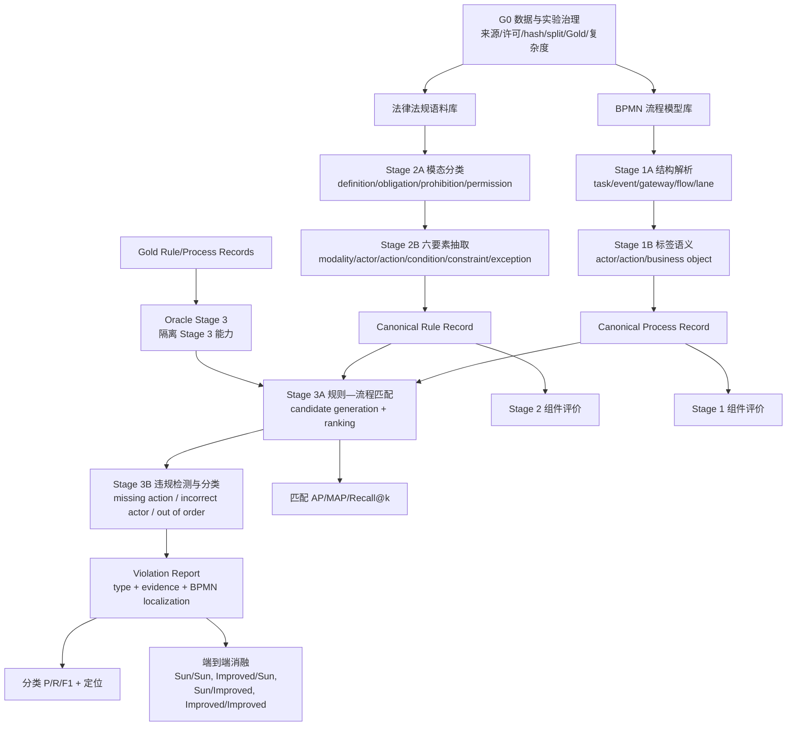

# BPC-Hybrid 完整实验主 Pipeline

**文档版本**：4.8.3
**状态**：ACTIVE — 全项目研究与任务分解的唯一主线  
**最后更新**：2026-07-26
**方法学主干**：Sun et al. (2024)  
**当前实施优先级**：实验先完成 Stage 2，再补 Stage 1 和 Stage 3；论文非结果章节从现在并行写作

> 所有 Agent 在修改实验代码、配置、数据协议或研究设计前必须完整阅读本文。
> 本文定义“要完成什么、先后依赖是什么、每一步怎样算完成”。
> `docs/PROJECT_AUDIT.md` 只记录实时进度；不要再创建新的日期版
> `STATUS_*`、`HANDOFF_*` 或平行路线文档。
> 全实验实际问题统一追加到 `docs/REAL_WORLD_ISSUE_REGISTER.md`；解决后补齐方法、
> 验证证据和实验事件，未解决问题保持开放，不得从记录中消失。

## 1. 权威层级与更新规则

发生冲突时按以下顺序处理：

1. `AGENTS.md` 与安全边界；
2. `configs/experiment_contract.json` 的当前机器门禁；
3. 本文的完整研究目标、阶段依赖和任务树；
4. `docs/PROJECT_AUDIT.md` 的实时状态；
5. 各阶段设计规范；
6. `_retired/` 与 `docs/research/` 中的历史和证据材料。

本文可以随实验发现持续改进，但不得静默改路线。任何 Pipeline 变更必须：

- 给出新证据、导师要求或用户决定；
- 说明影响的任务 ID、数据、baseline、指标和已完成结果；
- 不重写既有实验结果或历史实验来源事件；
- 通过完整性检查并用 `record_change.py` 追加变更或实验运行日志；
- 在本文末尾的变更日志中追加一行。

当前 `experiment_contract.json` 仍是“优先完成 Stage 2、用固定 Stage 3
测误差传播”的阶段性执行合同。本文规定完整项目还必须完成 Stage 1 和 Stage 3。
进入 Stage 3 方法改进前，必须另行更新并核查机器合同；不能仅凭本文绕过现有门禁。

## 2. 不变的最终目标

本项目的最低完整交付不是“给 Sun Stage 2 加一个 LLM”，而是：

1. 独立、可追溯且可复现地重建 Sun 三阶段端到端方法；
2. 每个阶段都有明确输入、输出、Gold、baseline、指标和失败分析；
3. 优先在 Stage 2 比较传统方法、Sun、LLM 和混合方法；
4. 在预先定义的复杂法律语料上检验复杂度是否放大 LLM 优势；
5. Stage 2 完成后，继续比较和改进 Stage 3；
6. 最终用受控消融解释提升来自 Stage 2、Stage 3，还是二者交互；
7. 即使改进方法没有超过 Sun，也交付完整复现、负结果和误差边界。

允许的正式表述是 `paper-faithful independent reconstruction`。没有作者完整源码、
权重或原始 Gold 时，禁止称 `exact reproduction` 或 `Sun original implementation`。

## 3. 研究问题

| ID | 研究问题 | 主要证据 |
|---|---|---|
| RQ0 | 能否完整重建 Sun 的三阶段设计时合规检查方法？ | 三阶段独立测试 + 端到端复现 |
| RQ1 | 多种非 LLM、Sun、LLM 和混合方法在 Stage 2 上如何比较？ | 模态分类与六要素抽取指标 |
| RQ2 | 法律语料复杂度增加时，不同 Stage 2 方法如何退化？ | 复杂度分层曲线与误差类型 |
| RQ3 | Gold 规则输入下，多个 Stage 3 baseline 与 LLM 谁更可靠？ | Oracle Stage 3 匹配与违规分类 |
| RQ4 | Stage 2/3 的局部改进能否转化为端到端提升？ | 固定组件与交叉消融 |

## 4. 完整流程图



逻辑上 Stage 1 和 Stage 2 并行产生 Stage 3 输入；项目实施顺序是：

```text
先完成 Stage 2 → 补齐并冻结 Stage 1 → 复现 Stage 3 → 扩展 Stage 3 → 端到端消融
```

## 5. 统一中间合同

### 5.1 Process Record

最低字段：process ID；activities/events/gateways；pools/lanes/actors；sequence
flows；activity label 的 action 与 business object；直接顺序、可达、分支、并行和
order relations；来源 BPMN hash 与解析器版本。

### 5.2 Rule Record

最低字段：sample ID、source text、clause spans、modality、actor、action、condition、
constraint、exception、actor-action map、order relations、schema/method/prompt/rule
version 与 provenance。

### 5.3 Violation Report

最低字段：process/rule ID；matching score；compliant 或一个/多个 violation type；
相关 activity、lane/actor、order pair；可复核证据；threshold/model version；运行
manifest 与输入 hash。

任何方法只有通过相同 canonical contract，才能进入同一评价表。

## 6. G0：数据与实验治理

| 任务 ID | 小任务 | 产物 | 当前状态 | 完成条件 |
|---|---|---|---|---|
| G0.1 | 建立唯一 Pipeline 与文档索引 | 本文、`docs/INDEX.md` | verified | Agent 入口唯一、旧路线移出活动入口 |
| G0.2 | 数据注册 | dataset registry/contract | partial | 每个数据集有来源、许可、hash、schema、split、用途 |
| G0.3 | 方法注册 | 方法 registry | partial | 每个正式方法有命令、状态、LLM 标记和版本 |
| G0.4 | 评价合同 | schema、normalization、evaluator | **verified-offline（S2.10-E）** | exact membership、四类 modality、五字段 span、coverage、edge、invalid/API、cost 与人工 style 模板已锁定；尚无正式结果 |
| G0.5 | 复杂度合同 | 文本与 BPMN 复杂度字段 | **verified：11/12 固定指标、low/medium/high 分层与泄漏防护已锁定** | 只允许输入/人工批准 Gold 侧特征；禁止方法预测、test 结果或事后改 bin |
| G0.6 | Git checkpoint | 有意创建的版本点 | verified | `formal_experiment/` 已在 checkpoint `bfb0b8a` 纳入版本控制 |
| G0.7 | 前人比较注册表 | citation/method/data/code/license/metric/adapter matrix | ready | 每个引用结果可追到原表或本地重跑 manifest |

外部数据集必须同时满足：来源/版本可定位、许可允许复用、hash 固定、标签兼容或有
人工协议、split 不泄漏、各方法使用同一测试样本、复杂集在运行结果前选定。

## 7. Stage 1：流程模型拆解

### 方法与 baseline

| ID | 方法 | 角色 |
|---|---|---|
| S1-P0 | 纯 BPMN XML 结构解析，保留原标签 | 结构下限 |
| S1-P1 | 简单 verb-object/规则标签解析 | 轻量非 LLM baseline |
| S1-P2 | Sun/Leopold-style 标签、模型上下文和结构分析 | 正式 Sun Stage 1 |
| S1-P3 | LLM 标签语义解析 | 可选扩展，Stage 2 完成前不启动 |

### 工作分解

| 任务 ID | 小任务 | 依赖 | 当前状态 | Definition of Done |
|---|---|---|---|---|
| S1.1 | BPMN 输入与 Process Record schema | G0.2 | **verified-offline** | `process_record@1.0.0` schema、validator、two synthetic fixtures 与 exact-hash gate 通过 |
| S1.2 | activity/event/gateway/flow/lane 解析 | S1.1 | **verified-offline structural** | synthetic 分支/并行 BPMN 的 pool/lane/activity/event/gateway/12 flows 稳定输出；正式 BPMN 尚未读取 |
| S1.3 | actor/action/object 标签解析 | S1.2 | **verified-offline P0/P1** | P0 原标签/泳道上下文不推断；P1 固定单泳道 actor + 首词/action、余词/object 表面切分；P2/正式评价仍待人工 Gold |
| S1.4 | 控制流和可达关系 | S1.2 | **verified-offline** | direct/transitive reachability、activity order、branch/parallel、cycle/unreachable tests 与门禁通过 |
| S1.5 | Stage 1 人工核对样本 | G0.2 | **formal all-seven membership locked；human Gold 0/7** | 7 个 Winter-provenance GDPR BPMN 字节精确提升并与 Stage 3 共锁；7 个唯一 Process Record、45 activities、135 个空白字段通过门禁；仍须人工作出结构/标签决定 |
| S1.6 | baseline 评价 | S1.3-S1.5 | **verified-offline evaluator；formal results blocked on human Gold** | 8 类结构 set P/R/F1、3 字段 exact-value P/R/F1、triple accuracy、coverage 与 terminal/invalid 分母已锁；正式数值等 7/7 Stage 1 人工 Gold |
| S1.7 | 冻结正式 Stage 1 | S1.6 | blocked on human adjudication | BPMN membership/hash 已锁；仍需 7/7 structure adjudication、135/135 label decisions、P0/P1/P2 正式评价与最终 output/method freeze |

## 8. Stage 2：法规解析（当前主线）

### 8.1 Stage 2A：模态分类

类别：definition、obligation、prohibition、permission。候选 baseline：多数类/随机、
关键词、BiLSTM、CNN/TextCNN、通用/法律域 BERT、Sun BERT-TextCNN、LLM、
分类器 + LLM fallback。主表只保留有代表性的不同范式，同类变体放附录。

### 8.2 Stage 2B：六要素抽取

候选 baseline：marker/regex、spaCy/dependency rules、Sun CoreNLP +
Tregex/Tsurgeon + reconstructed markers、token classifier/CRF（仅在训练 Gold
足够时）、LLM、Sun + field-level LLM fallback。

### 8.3 Stage 2 完整方法

| ID | 正式含义 | 当前状态 |
|---|---|---|
| B0 / `sun_rule_only` | BERT-TextCNN + CoreNLP/Tregex/Tsurgeon | S2.4/S2.5/S2.6 已 verified：真实 checkpoint 与 attested extractor 输出已生成 schema-valid canonical record；S2.10-E evaluator 已验证；S2.2 annotation 已冻结，正式 batch/性能评价仍待 route/language/context QA 与正式 input/Gold publication |
| H1 / `sun_llm_fallback` | 同一 B0，仅按预注册 trigger 修复失败/不确定字段 | S2.8 verified-offline：已重基到 S2.6 B0，并冻结 trigger/merge、gpt-4.1 快照请求、确定性 45-call 分配、可计分 recovered-error 回退及 46.08 万 token/1.5 USD budget；真实 LLM 未授权 |
| D1 / `direct_llm` | LLM 直接生成同一 Rule Record | development-only；真实调用未授权 |

正式主表的最低方法覆盖为：简单规则下限、一个强监督学习 baseline、完整 B0、H1、
D1。模态分类与六要素抽取分别选方法，不能用一个只做分类的 baseline 冒充完整
Stage 2。训练 Gold 不足时，CRF/token classifier 只列为条件性扩展，不为凑数量
制造不可训练的 baseline。

### 8.4 数据轨道与复杂度

| 轨道 | 数据 | 用途 | Claim 边界 |
|---|---|---|---|
| S2-R1 | Sun 官方 modality 数据 | 模态分类复现 | development schema/split 已锁定；许可未知，禁止再分发或提前提升为 formal |
| S2-R2 | 项目固定 EStG-150 | 六要素主测试 | 项目独立重建，不是 Sun 原 150 |
| S2-C | GDPR、可复用 Luxembourg 语料、Barrientos 等复杂文本 | 外部验证 | 标签需映射或人工裁决 |

复杂度字段至少包括：长度、clause 数、dependency depth、actor/action 数、
condition/constraint/exception 的数量与嵌套、被动语态、隐含 actor、跨句引用、
原语言/翻译标记。

### 8.5 Stage 2 工作分解

| 任务 ID | 小任务 | 依赖 | 当前状态 | Definition of Done |
|---|---|---|---|---|
| S2.1 | 官方 modality 数据 ingestion/schema/license/split | G0.2 | **verified；A/B-R1/C-R1/D 全部通过** | development machine gate 交叉验证来源、合同、schema、quarantine、hash 与 split；本地非商业训练/评价已由项目决定解锁，再分发仍禁止 |
| S2.2 | EStG-150 人工裁决 | human-owned | **verified annotation freeze / formal Gold publication blocked**：Layer E 150/150 approved、900/900 六字段决策已闭合、150/150 adjudicated，共 231 个最终 clauses；deterministic receipt 与 exact-hash gate 已通过。该 receipt 只冻结 sentence-only approved English annotation，不声称德译英经人工验证，不发布 formal Gold，不授权正式方法运行 | S2.2 人工裁决与 annotation freeze 已完成；下一步闭合 RWI-0001 context sidecar/公平输入合同和 RWI-0007 语言 QA/主次数据轨道，再重锁 route/data/publication gate |
| S2.3 | 重建 public marker lexicon | S2.1 | **verified；英文 public-source v1 已锁定** | 来源、规则、hash、dev-only 扩展策略固定 |
| S2.4 | 完成 BERT-TextCNN | S2.1 + 本地研究使用决定 | **verified：Legal-BERT + TextCNN 已完成训练、dev 选择和唯一一次 test 评价** | 运行 `s24_legal_bert_textcnn_seed20260717_v1`；best epoch 5；test accuracy=0.924883、macro-F1=0.851071；只发布聚合指标，不外传原始或逐条派生数据 |
| S2.5 | 完成 CoreNLP/Tregex/Tsurgeon extractor | S2.3 | **verified：A/B、外部 runtime、live fixtures 全部通过** | 4.5.10 archive/JAR/artifact hash、12 patterns、六字段顺序和 7 surgeries 锁定 |
| S2.6 | 组合并验证完整 B0 | S2.4-S2.5 | **verified-technical + development batch measured**：真实 S2.4 checkpoint + attested S2.5 输出已组成 canonical B0；另在冻结 Layer E 上完成 sentence-only English development batch | 150/150 immutable attempts、schema-valid=100%、LLM=0；v1 exact-ID/span 结果因 RWI-0014 被替代。v1.2 重算全量 modality micro P/R/F1=0.394737/0.454545/0.422535、macro-F1=0.406801、clause alignment P/R/F1=0.680451/0.783550/0.728370；独立82 modality micro P/R/F1=0.433071/0.504587/0.466102。结果只属 development，不解除 route/language/formal publication 门禁 |
| S2.7 | 实现代表性非 LLM baseline | S2.1/S2.2 | **modality component verified；phrase/full Stage 2 blocked pending formal route/input publication** | 同一 1985/420/426 split 上 train-majority、固定德文 keyword、word 1–2 gram Multinomial NB 已 aggregate-only 运行并 exact-hash；NB test accuracy=0.784038、macro-F1=0.568849。S2.2 annotation 已冻结，phrase baseline 仍须 route/language/context QA 与 formal input/Gold publication gate |
| S2.8 | 预注册 H1 trigger/merge/call budget | S2.6 + S2.10-E | **verified-offline** | v5 prompt 绑定 extraction-contract v1；exact S2.6 B0、推理时 trigger、字段与受控 ambiguity metadata merge、45-call 名额、每条最多 1 次/0 重试、46.08 万 token/1.5 USD 上限及可计分 B0 回退由 v6 manifest 锁定；未调用真实 LLM |
| S2.9 | 锁定 D1 prompt/few-shot/model/budget | S2.10-E；正式运行另依赖 S2.2 | **verified-offline** | v5 prompt 绑定 extraction-contract v1，并插入 4 个覆盖代词/被动/多行为/例外/多 clause 的手工 synthetic canonical few-shot；模型、temperature=0、5 repeats、0 retry、750 次/921.6 万 token/37 USD 上限与失败保留由 v5 manifest 锁定；真实 API 未授权 |
| S2.10 | 统一 evaluator + 主数据组件评价 | S2.2/S2.6-S2.9 | **v1.2 evaluator verified；B0 corrected development evidence locked；formal results blocked** | S2.10-E v1.2 固定 method-independent global span-IoU alignment（阈值0.5）并单列 exact segmentation；adversarial/regression/exact-hash gate 通过。immutable B0 已重算 all-150 与 independent-82；没有重跑模型/API。正式 B0/H1/D1 主表仍等待 route QA、formal Gold/input publication 与模型运行 |
| S2.11 | 复杂法律语料集冻结 | G0.5 | **verified-input/protocol：官方 GDPR Articles 5–50 的 50 条成员已锁定** | CELEX/Formex 来源、EUR-Lex reuse、source hashes、覆盖优先 deterministic membership、空白人工 Gold/schema/canonical mapping 与 exact-hash gate 通过；语义 Gold 仍 0/50，未生成复杂度 profile 或方法结果 |
| S2.12 | 复杂度分层与误差分析 | S2.10/S2.11 | **protocol verified-offline；formal results blocked** | S2.12-P 已冻结 6 个主 endpoint、2 个 B0 对照、每数据轨道 12 假设 Holm family、10,000 次 sample-cluster bootstrap、10,000 次 sign-swap、固定 strata、错误 taxonomy 与 deterministic case selection；EStG annotation 已 150/150 冻结，真实曲线仍等待其 formal route/input、GDPR 50/50 与 exact-membership predictions |
| S2.13 | Stage 2 冻结 | S2.1-S2.12 | blocked | 方法、数据、Gold、指标、成本、manifest 完整 |

Stage 2 完成时，B0/H1/D1 和选定 baseline 必须共享 test IDs、Gold、schema、
normalization 和 evaluator，并分别报告 modality、phrase 和完整 Rule Record 指标。

## 9. Stage 3：匹配、违规检测与分类

### 9.1 Stage 3A：规则—流程匹配

候选方法：TF-IDF/BM25、Winter fitness/cost、Sun semantic matching、embedding +
graph features、cross-encoder/reranker、LLM 或 Sun-candidate + LLM rerank。
主指标保留 AP/MAP，可增加 Recall@k 和 nDCG@k。

### 9.2 Stage 3B：违规检测与错误类型分类

共享标签：compliant/none、missing_action、incorrect_actor、out_of_order。
候选方法：词法 + BPMN 图规则、Winter、Sun、embedding + graph rules、LLM、
Sun candidate + LLM verifier。复杂扩展允许 multi-label。

Stage 3 正式主表至少覆盖：词法/检索下限、Winter、完整 Sun、一个现代
embedding/graph baseline；LLM 与 Hybrid 在 Oracle 非 LLM 比较稳定后加入。每种
方法必须同时说明它解决 Stage 3A、Stage 3B，还是二者，避免把 matching 分数和
错误类型分类指标混成一个结果。

### 9.3 数据轨道

| 轨道 | 数据 | 设计 |
|---|---|---|
| S3-R | Sun-compatible GDPR replication | 识别原 4 BPMN；单一人工注入违规 + negatives |
| S3-X1 | 本地全部 7 个 GDPR BPMN | 明确称 all-seven extension |
| S3-X2 | Barrientos 三个复杂 BPMN | 只在共享标签上直接比较；其它标签单列 |
| S3-X3 | 后续公开复杂流程 | 必须通过 G0 门禁 |

### 9.4 Oracle 与 end-to-end

Oracle Stage 3 使用 Gold Rule/Process Records，只评价 Stage 3；end-to-end 使用
B0/H1/D1 的预测 Rule Records，评价误差传播。两种结果必须分表。

### 9.5 Stage 3 工作分解

| 任务 ID | 小任务 | 依赖 | 当前状态 | Definition of Done |
|---|---|---|---|---|
| S3.1 | 确定原 4 个/扩展 7 个 GDPR BPMN | G0.2 | **partial：扩展 7 个已锁；原 4 个未识别** | all-seven extension 的 7 文件/来源/hash/claim 已固定并与 Stage 1 共享；Sun 论文未报告原 4 个文件名，原 4 复现轨道继续标为 unresolved |
| S3.2 | 锁定 matching Gold | S3.1 | blocked | rule-process relevance Gold 完整 |
| S3.3 | 锁定 violation Gold | S3.1 | blocked | type、evidence、negative 完整 |
| S3.4 | 完成 Winter wrapper | S1.7/S2.13 | blocked | canonical I/O + reproducible command |
| S3.5 | 完成 Sun Stage 3 | S3.1-S3.3 | development scaffold only | 不再是 fixture approximation |
| S3.6 | 完成代表性非 LLM baseline | S3.2/S3.3 | blocked | 相同 Gold/evaluator |
| S3.7 | Oracle Stage 3 比较 | S3.4-S3.6 | blocked | 隔离 Stage 3 的主表 |
| S3.8 | LLM/Hybrid Stage 3 预注册与实现 | S3.7 | blocked | prompt、预算、重复次数固定 |
| S3.9 | 复杂 BPMN 与多违规扩展 | G0.5/S3.7 | blocked | 复杂度和标签在结果前冻结 |
| S3.10 | end-to-end 误差传播 | S2.13/S3.7 | blocked | B0/H1/D1 进入同一 Stage 3 |
| S3.11 | Stage 3 冻结 | S3.1-S3.10 | blocked | 数据、方法、Gold、指标、manifest 完整 |

## 10. 实验矩阵

### 10.1 组件实验

| 实验 | 固定 | 改变 | 回答问题 |
|---|---|---|---|
| EXP-S1 | BPMN 与 Process Gold | Stage 1 方法 | 流程解析可靠性 |
| EXP-S2A | modality 数据与 Gold | 分类 baseline | 句子级分类能力 |
| EXP-S2B | EStG-150 与 span Gold | 抽取 baseline | 六要素抽取能力 |
| EXP-S3-O | Gold Process/Rule Records | Stage 3 方法 | Stage 3 独立能力 |
| EXP-S2-E2E | 固定 Sun Stage 1/3 | B0/H1/D1 | Stage 2 误差传播 |

### 10.2 最终归因消融

| ID | Stage 2 | Stage 3 | 作用 |
|---|---|---|---|
| E00 | Sun | Sun | 完整 Sun 重建基线 |
| E10 | 最佳 Stage 2 改进 | Sun | Stage 2 单独贡献 |
| E01 | Sun | 最佳 Stage 3 改进 | Stage 3 单独贡献 |
| E11 | 最佳 Stage 2 改进 | 最佳 Stage 3 改进 | 完整改进系统与交互 |

### 10.3 与前人结果比较的四级证据

| 级别 | 做法 | 是否允许直接宣称优劣 |
|---|---|---|
| C1 同测集重跑 | 前人方法和本项目方法跑同一 frozen IDs/Gold/evaluator | 可以，是主比较 |
| C2 官方数据复现 | 在前人公开数据上独立重跑，并完整记录版本与 split | 可以，但只限该数据轨道 |
| C3 论文报告值 | 只抄录论文原表，数据/split/evaluator 未完全统一 | 只能描述，不能作严格显著性结论 |
| C4 跨阶段/跨任务 | Stage 2 与 Stage 3，或标签/指标不同 | 禁止用数值高低证明方法优劣 |

Sun 在 Stage 2 与 Stage 3 使用的输入、Gold 和指标不是同一评价问题，必须分表。
如果 Sun 或其引用文献有公开数据，先通过 G0 数据门禁，再把前人方法与本项目方法
共同重跑；不能把“本项目复杂集上的 LLM 结果”直接减去“前人简单集上的论文数字”
当作提升。前人比较注册表至少记录：论文版本、阶段、数据版本、样本范围、标签、
split、指标定义、源码/权重可得性、许可、适配器、复现忠实度和本地 manifest。

## 11. 评价与统计控制

- 所有方法共享 frozen IDs、Gold、schema、normalization 和 evaluator；
- train/dev/test 与 few-shot examples 隔离；
- threshold、prompt、marker 和 fallback trigger 只在 train/dev 确定；
- LLM 报告模型版本、temperature、重复次数、成本、延迟和失败率；
- 复杂度分层在看 test 结果前冻结；
- 同时报总体、逐类、置信区间/显著性和错误案例；
- 负结果照实报告，不通过改 Gold、阈值或删样本制造优势。

## 12. 实施里程碑与当前主线

| 里程碑 | 内容 | 当前状态 |
|---|---|---|
| P0 | Pipeline、文档入口与目录治理 | verified；日志/检查制度已有回归测试保护 |
| P1 | Stage 2 数据、Gold、复杂度合同 | in progress；统一六要素合同与 EStG-150 annotation snapshot 已冻结，正式 Gold publication/input capsule 仍待 RWI-0001/RWI-0007 与 route/data gate 重锁 |
| P2 | 完整 B0 | verified-technical + measured-development；全量150与独立82 development evaluator 结果已 exact-hash，正式 batch/主张仍待 route QA 与正式输入/Gold publication |
| P3 | Stage 2 多 baseline | partial：S2.7-M modality 三 baseline 已验证；phrase/full Stage 2 仍 blocked on P1 formal route/input publication |
| P4 | H1/D1 与 Stage 2 复杂集 | partial：H1 S2.8、D1 S2.9 均已离线预注册；正式运行待 P1 formal route/input、总门禁与真实 LLM 授权，复杂集语义 Gold 仍 0/50 |
| P5 | Stage 1 完整实现与评价 | planned after Stage 2 core |
| P6 | Sun/Winter Stage 3 复现 | blocked on P5 and Stage 3 Gold |
| P7 | Stage 3 多 baseline 与复杂扩展 | blocked on P6 |
| P8 | 最终端到端消融 | blocked on P4/P7 |
| P9 | 论文写作与可复现包 | 非结果章节 in_progress；结果/结论 blocked on P8 |

实验 Agent 应优先从 P1/P2 选择最小可验证任务；论文 Agent 只领取
`PW1`–`PW6` 中已解锁的非结果章节。未经合同变更，不要提前启动 Stage 3 LLM，
也不要因 Stage 3 尚未就绪而修改 Stage 2 Gold 门禁。

### 12.1 论文并行轨道（导师要求立即启动）

论文写作从现在开始，不等待最终实验；但写作进度不能反向解锁实验门禁。实时派工
与可复制 Prompt 见 `docs/PROJECT_AUDIT.md` 和 `docs/AGENT_RUNBOOK.md`。

| ID | 写作任务 | 当前状态 | 回填/完成门禁 |
|---|---|---|---|
| PW0 | 论文目录、骨架、主张矩阵、TODO 和空表 | verified | 本轮建立且无虚构结果 |
| PW1 | 引言、背景、RQ0–RQ4 | verified | 全部结果性表述为待检验或 TODO |
| PW2 | Sun/Winter/Sleimi/Michel/Barrientos 相关工作 | verified | 内部证据回到可核验原论文 |
| PW3 | 三阶段架构和 B0/H1/D1 方法设计稿 | verified | 已验证组件、计划方法和 blocker 使用不同完成时态 |
| PW4 | 数据、五层 Gold 与标注协议 | verified-current-draft | S2.1 统计已回填；S2.2 annotation receipt 已固定 150 records、900 resolved decisions、231 clauses；formal Gold publication 边界待 route QA 后回填 |
| PW5 | baseline、指标、统计与复现设计 | **verified-design + evaluator/analysis implemented** | S2.10-E evaluator 与 S2.12-P bootstrap/CI/randomization/Holm/error-analysis 参数均已在正式结果前 exact-hash 冻结 |
| PW6 | 结果表和图模板 | verified-template-only | 空表、图轴/series/source 与 provenance 回填位已建立；禁止填非正式数字 |
| PW7 | Stage 2 正式结果 | blocked | S2.10/S2.12/S2.13 + manifests |
| PW8 | Stage 1/3/端到端结果 | blocked | S1.7、S3.7–S3.10、P8 |
| PW9 | 讨论、结论、摘要与终稿 | partial/blocked | 主张矩阵全部有正式证据 |

论文占位符统一使用 `TODO-RESULT`、`TODO-SOURCE`、`TODO-STATUS`、
`TODO-DECISION`。开发结果只能标 `DEV_ONLY`；正式数字必须对应 `experiment_run`
事件和 manifest。Stage 2/3、Oracle/end-to-end、C1–C4 前人比较必须分开。

### 12.2 S2.2 GPT-5.6 Sol AI 候选（development-only）

为降低 150 条纯人工裁决负担，已准备独立的双轮 AI 候选通道，但它不静默改变既有
`LLM-assisted, human-adjudicated Gold` 路线，也不把 AI 输出称为人工审核：

1. Pass A 只看德文原句和冻结英文候选，复核翻译并抽取统一六要素；
2. Pass B 重新看原句，并把 Pass A 与旧 Layer C 六要素草稿作为可错建议进行批判，
   输出最终 AI candidate；DeepSeek Layer D 不进入两轮输入；
3. 两轮固定 `gpt-5.6-sol`、`reasoning_effort=high`、strict JSON Schema；任何 model ID、
   JSON、exact span、关系 ID、usage 或 finish reason 异常立即停止，不自动降级；
4. 输出只进 `data/development/estg/llm_candidate_runs/<run_id>/`，不读写 Layer E，
   不设置 reviewed/adjudicated，不自动 promotion；
5. 默认 dry-run。真实运行必须由用户再次确认第三方中转风险、AI 非人工性质、实时
   币种/单价、硬预算和调用上限，并在本机隐藏输入密钥；pilot 限 1–5 条且不会自动
   继续全量。全量 150 条必须在 pilot 验收后获得一次新的明确授权。

离线合同位于 `configs/estg150_ai_review_gpt56sol_v1.json`，命令入口为
`scripts/run_estg150_ai_review.py`。当前状态仅为 `development pilot prepared`，尚未发生
真实 API 调用，也未验证中转方是否实际透传 Sol、reasoning 与 strict schema；见
RWI-0010。用户完成第三方风险、价格/预算和具体数据外发的两次知情授权后，Codex
托管策略仍在读取密钥、创建 run 目录或发出 HTTP 请求前拒绝 ChatAnywhere 外发；
不得绕过。用户随后明确授权 Codex 内置 `gpt-5.6-sol` 子代理替代路线，并在 pilot 后
明确授权扩展到全部 150 条。索引 0–2 保留已锁定 Pass A/Pass B 双轮结果；索引 3–149
由三个 high-reasoning Sol 子代理分批执行“先独立读 A/B，再以 C 为可错自检”的完整
clause 六要素提取。根合并器对 150/150 执行 strict schema、固定 sample 顺序、exact
span、关系引用和明显规范性 cue clause 覆盖检查，发现并退回修复 1 个遗漏 definition
clause 后全部通过。最终共 232 clauses；翻译决定 accepted=138、edited=11、uncertain=1；
上下文 sufficient=51、insufficient=26、uncertain=73；confidence high=50、medium=89、
low=11。aggregate 位于
`data/development/estg/llm_candidate_runs/codex_internal_gpt56sol_full150_v1/`，实际文件
SHA-256=`98fdda3e51622b39acb9c53a5f15059c5c40b8257bcdccc5dc84969172737c93`。
未调用外部 API、外部费用为 0、未读 DeepSeek Layer D、未由 Agent 改写 Layer E。
推荐的 `estg150_simple_review_tool.py` 只在用户点击“保存并下一条”后将当前显示结果写入
Layer E；AI aggregate 本身仍不是 human Gold。

在上述历史候选冻结后，C0 已把同一历史可见协议收口为唯一 external canonical runner：
`scripts/run_estg150_candidate_protocol.py`。它逐字节绑定 A/B/C、membership、三份原 prompt
和原 schema；保留索引 0–2 的 Pass A/Pass B 与 3–149 的一次 full extraction；固定
system/developer/user 顺序、UTF-8/LF/紧凑 JSON、response extraction、schema/span/关系/
normative-cue validation，并让中转、DeepSeek、Qwen、xAI adapters 共享同一 semantic
request。历史隐藏 Codex system/API envelope 未存档，故明确记录
`historical_hidden_transport_payload_not_archived=true`，不得称隐藏 transport 的 exact
reproduction。C0 只完成离线 fixture/tests/dry-run；随后官方 DeepSeek V4 Pro 与
ChatAnywhere 六个 GPT 模型完成获授权 C1 矩阵。5.6-luna/5.4-nano 证实 canonical schema
不符合中转 strict subset，4.1-nano/3.5-turbo 不识别 `reasoning_effort`，5-nano 为 503
retry exhaustion，gpt-4o 为无响应断连，DeepSeek 拒绝 `developer` role；共 7 logical
requests、2 transport retries、0 候选/P/R/C2。错误正文诊断见 RWI-0023；断连重试分类修复
见 RWI-0024；出站 request bytes 未改。详见 `docs/ESTG150_CANDIDATE_PROTOCOL_V1.md`。旧
ChatAnywhere 专用 runner 的真实执行已退役。

C1 transport compatibility 已以版本化 adapter 修复并完成最小 runtime 验证（RWI-0025）：保留 canonical schema
SHA `fbbb628a...` 与 serializer `d20ae560...`，新增 OpenAI strict transport adapter v1.1
及 SHA `ef8c684b...` 的派生 schema，结构差恰好为 6 个字符串 const/enum 的
`type:string`。递归 preflight 锁定 object/required/additionalProperties/const-enum type/
`$ref`/nested-anyOf/约束，七模型 capability allowlist 禁止静默删除 reasoning、合并角色、
降级 json_object 或改 tool call；future receipt 同时保存 canonical 与 transport provenance。
获新授权的 ChatAnywhere `gpt-5.6-luna` 单条 synthetic 已生成 1 个候选并通过原始 canonical
schema/span/cue validator；无重试，provider usage=1167+829=1996 tokens，记录费用
0.042987 CA。C1 passed=true；evaluation 未启动、P/R=null、C2=false。relay 报告的具体模型
身份未独立验证；任何后续 C2 或新 provider 调用仍需新的显式 provider/model/token/cost 授权。

C2 的离线准备已在不可覆盖目录中冻结：索引 0–2 各自 Pass A/Pass B，共六份
`relay_openai_compatible` / `gpt-5.6-luna` transport request 全部通过 strict preflight，且
`request_downgrade_applied=false`。三个 Pass-A hash 精确绑定当前锁定输入/model/profile；三个
Pass-B hash 只用于历史 validated Pass-A fixture 的离线 preflight，未来 live hash 必须等待同次
运行 Pass A 输出。预注册 fail-closed 护栏为 6 calls / 78,000 tokens / 1.92 CA；没有 API、账单、
候选、评价或阶段转换，C2 仍为 false，真实运行仍需新 run ID 和新明确授权（RWI-0026）。

为降低后续成本，另获授权的 ChatAnywhere `gpt-5.4-nano` 单条 C1 使用同一 canonical
request 与 strict transport v1.1：1 logical call、0 retry，provider usage=1167+1789=2956
tokens，按锁定价格记录 0.01728755 CA。模型返回 schema-shaped JSON，但把 57 字符翻译的
整句 `clause_span.end` 写成 58，canonical exact-span validator fail closed；0 valid candidates，
未修复/重试，C1=false、C2=false、evaluation=0、P/R=null。原 failure 的零 usage 记账缺陷
以 hash-bound correction 修正且原证据不改写；runner 顺序修复见 RWI-0027。

## 13. Agent 任务执行协议

每个工作批次必须：

1. 阅读本文、`PROJECT_AUDIT.md`、`AGENT_RUNBOOK.md`、`DIRECTORY_GUIDE.md`、最新实验日志、
   `AI_CHANGE_PROTOCOL.md`、`ROUTE_LOCK.md`；
2. 运行编辑前快速完整性检查；
3. 从任务表选择一个最小任务 ID；
4. 写明输入、输出、依赖、边界和 Definition of Done；
5. 开发中只跑相关测试；
6. 连贯批次结束后跑一次完整性检查和全量测试；
7. 用 `record_change.py` 记录变更；真实实验还必须记录 `experiment_run` 与 manifest；
8. 只更新 `PROJECT_AUDIT.md`，不新增日期版 status/handoff 文档。

任务状态只使用：`blocked`、`ready`、`in_progress`、`verified`、`complete`。
只有脚手架或单元测试时只能写 `development` 或 `partial`，不得写完成。

执行频率：只读分析不跑全量；连贯编辑批次开始跑快速检查；批次中只跑相关测试；
批次结束/阶段交接跑 `audit_project.py --with-tests` 一次并记录事件。随后
`record_change.py` 复用绑定当前文件状态的测试凭证，不重复跑全套测试。正式运行前
跑 `--require-final-ready`；详细字段与日志示例见 `AI_CHANGE_PROTOCOL.md`。

## 14. 目录边界

活动目录结构见 `docs/DIRECTORY_GUIDE.md`：活动入口留在 `docs/` 顶层；研究证据放
`docs/research/`；已替代路线、快照、旧输出和旧脚本放 `_retired/`；实验事件只追加，
不得重写；`references/` 与根 `archive/` 只读；缓存和临时目录可以清除；数据、Gold、
预测和结果不得因目录整理被删除。恢复 `_retired/` 材料需要用户批准和日志事件。

## 15. Pipeline 变更日志

| 版本 | 日期 | 变更 | 依据 |
|---|---|---|---|
| 4.8.6 | 2026-07-26 | 获授权的 ChatAnywhere gpt-5.4-nano 单条 C1：strict v1.1 preflight/request 通过，1 call、0 retry；provider 返回 1167+1789=2956 tokens、0.01728755 CA，但 clause_span.end=58 超出 57 字符 proposed text，canonical validator fail closed，0 candidate、C1/C2=false、无评价/P/R。原 failure 在校验后才取 usage 而误记 0，保留原证据并新增 SHA-bound accounting correction；runner 改为先计 usage 后校验，无 API 重跑 | frozen failure/request/raw response、accounting correction、RWI-0027、聚焦回归、完整验证、Event 123 |
| 4.8.5 | 2026-07-26 | 冻结 C2 索引 0–2 × Pass A/B 的六请求离线准备：relay gpt-5.6-luna strict v1.1 全 preflight pass、无 downgrade；锁定 3 个 exact Pass-A hash 与 3 个 historical-fixture-only Pass-B hash，未来 live Pass-B hash deferred；canonical/serializer/adapter/transport hash 无漂移；fail-closed 配置 6 calls / 78,000 tokens / 1.92 CA。provider_authorized=false、API=0、billed tokens=0、evaluation=0、P/R=null、C2=false | no-overwrite dry-run receipt/preregistration、RWI-0026、聚焦回归、完整验证、Event 122 |
| 4.8.4 | 2026-07-26 | 获新授权的 ChatAnywhere gpt-5.6-luna 单条 C1 runtime：strict transport v1.1 请求生成 1 个候选，原始 canonical schema/exact-span/cue 验证通过；0 retry，1167 input + 829 output = 1996 tokens，0.042987 CA；C1=true、evaluation=0、P/R=null、C2=false | frozen run manifest/request/response/candidate、runtime audit gate、RWI-0025 resolved、Event 121 |
| 4.8.3 | 2026-07-26 | C1 请求前兼容性离线修复：canonical v1 schema/prompt/messages/synthetic/serializer/hash 全部保留；派生 strict transport schema v1.1 只增加 6 个 type:string；递归 Structured Outputs preflight、七模型 capability fail-closed、双 schema/request/validation/downgrade receipt 字段和 audit gate 落地。未调用 API，C1 仍未通过，P/R=null，C2 未开始 | RWI-0025、57 项聚焦回归、offline dry-run、完整验证与本批次 change event |
| 4.8.2 | 2026-07-25 | 完成用户授权的七模型 C1 transport 矩阵：ChatAnywhere 5.6-luna/5.4-nano 定位 strict schema 缺 `type`，4.1-nano/3.5-turbo 定位不支持 `reasoning_effort`，5-nano 为 503+2 retries，gpt-4o 无 HTTP response 断连；官方 DeepSeek V4 Pro 定位不支持 `developer` role。总计 7 logical requests、2 identical-byte retries、0 candidates/evaluations，P/R=null，C2=false。修复 `RemoteDisconnected` 未进入网络重试分支（RWI-0024），没有额外重跑；canonical request/schema 不降级 | C1 matrix manifest、七份 failure/raw error artifacts、17 项聚焦回归、RWI-0023/0024、Event 119 |
| 4.8.1 | 2026-07-25 | C1 transport 排查：官方 DeepSeek V4 Pro 与 ChatAnywhere 中转 gpt-4o 各一次获授权 synthetic 调用均返回 HTTP 400，无候选/P/R/C2。发现旧 runner 丢弃 `HTTPError` response body（RWI-0023）；后续终态 HTTP 错误限长保存 raw body/hash/request ID/retry，并在实际 key 回显时拒绝正文落盘。C0 serializer 与既有 gpt-4o transport bytes/hash 均未变化；旧两次具体字段根因仍未知，下一轮模型矩阵须新总预算授权 | `ESTG150_CANDIDATE_PROTOCOL_V1.md`、两份 C1 failure、15 项聚焦回归、RWI-0023、Event 118 |
| 4.8.0 | 2026-07-25 | 完成 EStG-150 原始候选协议 C0：八项历史资产 hash 全匹配；确认隐藏 Codex transport 未存档；冻结 canonical external serializer v1、Layer-A 顺序与 0–2/3–149 分流、四 provider adapter、strict fail-closed validation、prereg 模板和 UTF-8/LF fixture；旧中转专用真实入口退役。未读 Layer D/E/Gold 派生材料，未调用网络/API，未启动 C1–C4 | `ESTG150_CANDIDATE_PROTOCOL_V1.md`、serializer lock/fixture、C0 tests、RWI-0022 |
| 4.7.9 | 2026-07-25 | B5 genuine sequential Tsurgeon + post-surgery Tregex consumption 已结构实例化：v3 的 29 条 pattern 字符串/顺序保持一致，真实 CoreNLP 4.5.10 合成门 15/15；唯一 All-150 得到 raw/attempted/accepted/rejected=1103/338/336/2、post action/actor matches=322/253，dependency candidate/fallback=0/0。A/B/C/E/F 失败、D 通过；actor/action/overall Table8 F1 分别由 0.512195/0.695122/0.539776 降至 0.428571/0.574431/0.505585，active parent 保持 v10-A。并发 Grok 会话在唯一运行期间覆盖 prereg/部分实现，造成 manifest 末尾记录的 prereg SHA `38a11e...` 与启动前冻结且现已逐字节恢复的 `2b3062...` 不一致；第二次命令调用约 5 秒即 fail closed，未产生第二次 All-150。既有输出不修改、不重跑，只保留为 diagnostic evidence，不能称严格可接受的 preregistered negative candidate | `s27_estg150_b0_enhanced_b5`、manifest `d937d02a...`、prereg `2b3062da...`、RWI-0021；B6/BERT 阶段未启动 |
| 4.7.7 | 2026-07-25 | B3a diagnostic correction v2 纠正旧 v1 的六项机会归因缺陷：surface regex proxy、跨记录 clause-text 合并、重复 Gold-text 合并、只在无 Gold constraint 子句统计 FP、按 pattern 简单相加 union、主桶/facet 混合。v2 使用真实实例键和 opaque trace hash，实际运行 CoreNLP 4.5.10 与原样六条 Tregex，并重放 v10-A constraint scope/normalization/dedup 与冻结 Table8 一对一 any-overlap。六条均编译；raw/accepted/final=106/98/76，关系 exact/normalized/containment/partial/new=40/0/24/2/10；add-only delta TP/FP/FN=0/10/0。v1 安全意义上的 not-instantiated 保留，但旧机会归因状态更正为 `inconclusive_not_instantiated_invalid_for_tregex_opportunity_attribution`。本轮不是性能结果，未建生产候选、未跑候选 All-150、未启动 B3b | `s27_estg150_b0_b3a_constraint_tregex_diagnostic_v2`、`s27_estg150_b0_b3a_status_correction_v2.manifest.json`、32 项定向测试、Event 109 |
| 4.7.8 | 2026-07-25 | B3b typed condition–constraint ownership 只读 development Gold opportunity 诊断：在固定 v10-A span、segmentation、v3 Tregex、lexicon v2 与 v10 scope 下，仅按 typed evidence 重分配已有 span。父版 580 条 condition/constraint span 来源重放完全一致；规则 firing 为 constraint→condition 79、condition→constraint 8，实际改变 87 spans/53 records，其中 59 条为 target duplicate suppress，ambiguous 268 条 100% 保持，capacity fail-closed=0。opportunity overall TP/FP/FN 458/415/366→434/380/390，F1 0.539776→0.529915；18 项实例化门槛中 11 项失败，决定 `not_instantiated`。未建生产 resolver/config/runner/prereg，未跑候选 All-150，未改 active registry，未启动 B3c/actor/marker/Tsurgeon/BERT | `s27_estg150_b0_b3b_typed_ownership_diagnostic_v1`、RWI-0020、Event 110 |
| 4.7.6 | 2026-07-21 | 修复 S2.10-E v1.1 将方法本地 ID/exact boundary 当共享身份造成的系统性低计（RWI-0014）：v1.2 在结果重算前固定全局最大总权重一对一字符-span IoU≥0.5，entity 指标忽略 method-local IDs，exact segmentation 独立保留，并禁止阈值搜索/论文分数目标化。复用 immutable B0 attempts、0 模型/API 重跑；all-150 modality micro P/R/F1=0.394737/0.454545/0.422535、macro-F1=0.406801，clause alignment P/R/F1=0.680451/0.783550/0.728370；independent-82 modality micro P/R/F1=0.433071/0.504587/0.466102。旧低分报告保留但标为 superseded development provenance。Sun 本地可核的 0.77/0.83/0.80 属 Stage 3 violation checking，与当前 Stage 2/重建数据不构成“10个百分点”可接受性判据，只作跨阶段诊断警报 | v1.2 contract/schema/evaluator、synthetic+adversarial manifest、immutable B0 re-evaluation、two exact gates、RWI-0014、Event 86 |
| 4.7.5 | 2026-07-21 | 用户完成 EStG-150 全量人工审核；S2.2 strict validator 验证 approved English 150/150、六字段决策 900/900、adjudicated 150/150，最终 231 clauses。新增 deterministic no-overwrite receipt 与 fail-closed exact-hash gate。冻结范围仅为 sentence-only approved English annotation snapshot；RWI-0001 context/fairness 与 RWI-0007 language QA 继续 open，因此未写 `data/gold`/`data/input`、未发布 formal Gold、未授权或运行正式 B0/H1/D1/API。主线下一节点改为 Stage 2 route/language/context QA 与 formal input/publication 重锁 | Layer E strict validator、`s22_estg150_human_annotation_freeze_v1.manifest.json`、S2.2 machine gate、回归测试与用户完成声明 |
| 4.7.4 | 2026-07-20 | 经用户明确授权，三个 Codex 内置 `gpt-5.6-sol` 子代理完成固定 EStG-150 全量六要素候选：前3条沿用双轮 pilot，余147条先独立 A/B 后用 C 自检；150/150 strict schema/exact-span/关系通过，root cue gate 发现并修复1个漏 clause，最终232 clauses。新增极简单屏工具：只显示法规、全部 clause 与六要素；span/offset/ID 后台自动定位，一次“保存并下一条”完成用户当前条确认；旧 Layer E 3条用户结果未改。RWI-0011/RWI-0012 resolved；外部 API/费用均为0 | full aggregate/manifest 实际文件 hash、27项 Sol/工具聚焦回归、150条 membership/coverage gate；用户明确全量与简化工作流授权 |
| 4.7.3 | 2026-07-20 | ChatAnywhere 因托管数据外发策略在密钥/API 前停止后，经用户明确授权改用两个独立 Codex 内置 `gpt-5.6-sol` 子代理完成前3条双轮 development pilot。Pass A 盲看 A/B，Pass B 批判 Pass A 并只看相关 C；均禁止 D/E。两轮与根代理 3/3 strict schema/exact-span/关系校验通过；最终翻译 accepted=1、edited=2，上下文 insufficient=1/uncertain=2，confidence 均 medium。未调用外部 API、未修改 Layer E、未授权全量 | hash-locked run config、Pass A/B JSON、逐条 manifest、summary 与活动回归门禁；RWI-0010 保持 mitigated |
| 4.7.2 | 2026-07-20 | 准备 EStG-150 GPT-5.6 Sol 双轮 AI 裁决候选通道：只写 development run，禁止读取 DeepSeek Layer D 和 Layer E；固定 high reasoning + strict JSON Schema，支持中转 `/v1`/完整端点规范化，隐藏密钥、实时价格/币种、硬预算、pilot≤5、全量二次授权和精确输出校验均 fail-closed。RWI-0010 mitigated；未调用真实 API，未修改人工决定 | 用户提供 ChatAnywhere 模型/计价/端点截图并要求稍后自行输入密钥；离线 endpoint/request/schema/membership/security 回归与全量门禁 |
| 4.7.1 | 2026-07-20 | 修复 S2.2 审核工具人工值来回导航后显示为空及未提交风险：按复数 span 数组恢复 actor/action/condition/constraint/exception；上一条、下一条、下一条待审、保存、复核与裁决均先统一提交当前控件；exact span 或关系校验失败时留在当前记录。RWI-0009 resolved；未修改用户 Layer E 决定 | 用户在真实审核中报告；文件级核验确认 action 已落盘而 GUI 读错键；48 项审核工具聚焦回归 |
| 4.7.0 | 2026-07-19 | 冻结 `stage2_extraction_contract@1.0.0`：人工、D1、H1 统一六要素、最小 exact span、normalized 边界、`It/they/this/these/such`、无显式 actor 被动句、missing/uncertain、scope、多 clause/并列、禁止外部推断、评价与 Stage 3 admission。现有 canonical schema byte-identical 保留；D1/H1 升至 v5 prompt，H1 增加完整 ambiguity metadata merge；12 条 EStG ID/hash 只作静态 pilot，不是 Gold/few-shot/性能。RWI-0008 resolved；RWI-0001/RWI-0007 继续 open | 合同/人读差异表、hash bundle、59 项聚焦回归、S2.8 v6 与 S2.9 v5 离线 exact-hash gates；无真实 LLM/API、无 Layer E 修改 |
| 4.6.7 | 2026-07-21 | 在 S2.2 annotation freeze 后运行 EStG-150 B0 sentence-only English development evaluation：150/150 canonical attempts、266 CoreNLP sentences、0 LLM/API、0 USD；all-150 modality clause accuracy/macro-F1=0.103896/0.090583，independent-82=0.128440/0.119124，并保存五字段 strict/token-overlap P/R/F1。首次运行暴露 Tsurgeon 完整树删除，登记 RWI-0013；保留原锁定 bridge/rules并以 batch bridge 显式记 2 次 terminal removal 后成功重跑。另锁定 7 条低置信度的 B0/H1/D1 同 ID、最多14-call诊断 pilot，但精确 gpt-4.1 子代理/transport 当前不可用，未执行或静默换模 | `s27_estg150_b0_development_v1`、exact-hash gate、RWI-0013、`estg150_h1_d1_low_quota_pilot_v1.json` |
| 4.6.8 | 2026-07-21 | B0 method-defect repair as versioned `b0_enhanced` development: clause-level DE/EN modality routing, CoreNLP merge/split, multi-match bridge, enhanced Tregex, Sun Table8 any-overlap diagnostic. all-150 modality micro F1 0.423→0.612；clause alignment F1 0.728→0.771；complete-record 0.06→0.167。RWI-0015 mitigated；RWI-0001/0007 still open；not formal | `s27_estg150_b0_enhanced_v3`、RWI-0015 |
| 4.6.9 | 2026-07-21 | B0 enhanced v4/v5：readonly error-oracle、definition-first modality、hybrid segmentation、dep actor/action、scope regex。v4 欠分割回退保留；v5 all-150 modality micro F1 0.612→0.624、align F1 0.771→0.801、complete-record 0.167→0.347、Table8 F1 0.443→0.492。仍 development-only | `s27_estg150_b0_enhanced_v5`、oracle v1 |
| 4.6.10 | 2026-07-22 | Phase A correction (RWI-0016); S2.4 candidates A/B/C; lexicon v2 runtime; v7 modest promote vs v5 (mod F1 0.624→0.628). v6 remains negative. | `s27_estg150_b0_enhanced_v7`, `s24_candidate_B_*`, phase_a_correction_v2 |
| 4.6.11 | 2026-07-22 | v8 prereg + residual Phase A v3 + overlap v2 + v8-A/B/C. None promoted (mod F1 +0.004 only). v7 provisional best. | `estg150_b0_v8_preregistration_v1`, `s27_estg150_b0_enhanced_v8a/b/c`, phase_a_residual_v3 |
| 4.6.12 | 2026-07-22 | v8 status correction; active registry; modular b0_v9; v9a clean-core run not promoted; v9-B not_instantiated | `s27_estg150_b0_enhanced_v9a`, v8_status_correction_v2, active_registry_v1/v2 |
| 4.6.13 | 2026-07-23 | B2a2 单一增量：先确认 B2a 的 40 条新增 record fallback 均有同子句四分类概率，再预注册三类受限解码并只跑一次 All150。路线门槛 A 与 v10-A 锁定 E 全过（fallback 20、supported 新增 0、pred/aligned 256/195），但 definition TP/FP/FN=2/13/37、F1=0.074，overall micro F1=0.583，B/C/D 失败；候选作为负证据保留，不调参、不重跑、不改 active registry | `s27_estg150_b0_b2a2_route_diagnostic_v1`、`s27_estg150_b0_enhanced_b2a2`、RWI-0018、Event 105 |
| 4.6.14 | 2026-07-23 | B2b 只读 prohibition↔permission 诊断：v10-A aligned prohibition→permission=6，但严格允许的强否定语义族只覆盖 no-subject modal 1 条，其余 5 条无可用白名单 clause-local 信号；预计触发/可恢复上限=1、permission TP loss=0，未达到至少 3 条的实例化门槛。按预定停止条件写 `not_instantiated`，未创建生产 resolver、未预注册、未运行 All150、未改 active registry | `s27_estg150_b0_b2b_prohibition_diagnostic_v1`、RWI-0019、Event 106 |
| 4.6.6 | 2026-07-18 | 完成 EStG-150 逐条句级独立性盘点：按“独立/需上下文核实/不独立”三类审查主体、行为及其余六要素可判定性，得到 82/26/42；生成只读 XLSX、JSONL 与 hash manifest。`estg_000003` 因 `It` 无句内先行词且 `shorter` 缺比较基准判为不独立。报告不自动修改 Layer E，RWI-0001 因 context sidecar、来源 hash 和 B0/H1/D1 公平输入合同未锁定继续 open | 用户要求检测全部150条法规是否独立；150个唯一 sample_id、分类计数复核、XLSX公式/重新导入/逐表渲染验证 |
| 4.6.5 | 2026-07-18 | 明确 Sun 语言证据边界：EStG 来源为德文，phrase 方法明确依赖英语句法、marker、示例和模型，但论文未说明两者之间的转换。登记 RWI-0007 open；非德语用户只裁决冻结英文工作文本上的六要素/span，不承担德译英认证，疑似翻译问题留待裁决。正式冻结前仍须选择原生英文 phrase 主轨道，或锁定独立翻译与德语复核 QA；当前不静默改变既有 150 membership | Sun §4.2.2/§5.1–§5.2 原文、本地语言缺口审计、用户明确说明完全不懂德文 |
| 4.6.4 | 2026-07-18 | 建立 `REAL_WORLD_ISSUE_REGISTER.md` 作为全实验唯一实际问题登记册：发现即登记；`open/mitigated/resolved/accepted_risk` 状态不删除历史；已解决必须带解决方法、验证证据和实验事件。补录当前句级上下文缺失为 RWI-0001 open，并回填 GUI 长候选、接受物化断链和 DeepSeek 空正文三个已解决实例。全量验证又发现活动测试把 Layer E 写死为 0/150，登记为 RWI-0005 并改为进度无关不变量，保留用户 1/150 人工进度；Event 74 后的终端乱码经文件级核验确认只是显示异常，登记为 RWI-0006 resolved。登记流程写入 Agent 合同、变更协议、导航和回归测试，不改人工 Gold | 用户要求整个实验持续记录实际问题，并区分已解决方法与未解决状态；RWI-0005 聚焦回归 13 passed；RWI-0006 持久化乱码匹配 0 |
| 4.6.3 | 2026-07-18 | 修复 S2.2 审核工具六要素长候选被单行裁切：候选单元格改为只读自动换行文本，普通长值显示 1–3 行，双击可打开带滚动条且可复制的完整候选全文；重新分配字段/候选/人工值/决策列宽。只改显示层，不改 Layer C 候选或 Layer E 人工决定 | 45 项审核工具聚焦测试通过；新增长文本高度上限与全文入口回归测试 |
| 4.6.2 | 2026-07-18 | 修复 S2.2 审核工具“决策已接受但人工结果仍为空”的断链：只有用户点击后才把 Layer C 候选值和精确 span 物化到 Layer E；增加整条六字段接受按钮、无精确 span 时 fail-closed、编辑字段唯一位置解析、拒绝时清空旧人工值、关系 JSON 真正保存与 ID 校验。右侧伪可编辑 JSON 改为只读预览，Layer D 150/150 时显示真实绿色状态；不会自动标 reviewed/adjudicated | 44 项审核工具聚焦测试；全量 1101 passed、22 skipped；Layer E 人工进度未被自动改变 |
| 4.6.1 | 2026-07-18 | 用户指定深度求索 `deepseek-v4-flash` 后，Layer D 首个 provider-default thinking pilot 暴露空正文失败并作为 provenance 保留；runner 新增并锁定 `thinking_mode=disabled`，修复 run-dir 校验器未加载 run_config、补跑行顺序和 promoter 路径幂等问题。正式 run 完成150/150中文辅助与150/150盲回译，25项严格校验通过并原子激活v2；用户原有第1条英文接受决定经工具 service 原样恢复。当前进入唯一不可自动跨越的 S2.2 人工裁决节点 | `run_20260718_layerd_deepseek_v4_flash_v2_nonthinking`、Layer D v2 SHA-256 `f3bd24eb98a7416a...`、用户明确模型/provider授权、严格 validator/promotion |
| 4.6.0 | 2026-07-18 | 经用户明确批准，将 Winter provenance 中 7 个 GDPR BPMN 以 byte-exact copy 提升到共享 Stage 1/Stage 3 活动输入并冻结为 `all-seven GDPR BPMN extension`。7/7 文件解析成功，共 45 activities；源文件 3/4 的内部 process ID 冲突通过 `input_id` 项目级适配消除且保留 raw ID。生成不可变 Process Record 候选、空白模板和唯一可编辑人工副本，共 135 个字段，全部 unreviewed/null；没有自动 Gold 或性能结果。Sun 原 4 文件名仍未识别 | S1.5 formal membership 解锁；S3.1 extension 子轨道锁定；S1.6/S1.7 仍等待人工 Gold；Stage 3 整体仍等待 matching/violation Gold |
| 4.5.0 | 2026-07-17 | 完成 S1.6 evaluator 离线合同：对 P0/P1 强制 exact method×process membership；结构分别计算 pools/lanes/activities/events/gateways/sequence flows/direct edges/activity order 八类 set P/R/F1 和总体 micro；语义对 actor/action/business-object 采用大小写敏感 exact surface，错误非空值同时计 1 FP+1 FN，Gold/pred 均 absent 计 TN，并报告字段/总体 P/R/F1、exact-value accuracy 与 activity triple exact accuracy。terminal error 与 invalid prediction 留在分母，结构/标签 coverage 分开；formal scope 在 S1.5 membership/Gold 未就绪时拒绝。synthetic 常数仅验证算术与失败语义，不是 human Gold 或性能结果 | S1.6 config/report schema/evaluator/runner/verifier、synthetic semantic reference、v1 manifest、exact-hash gate |
| 4.4.0 | 2026-07-17 | 完成 S1.5 可离线推进的空白人工标注协议：schema 精确绑定 BPMN source SHA-256 与 Process Record canonical hash，按 activity 固定 raw-label/lane context，并为 actor/action/business-object 建立 unreviewed/present/absent/needs-adjudication 状态。blank builder 只生成 unreviewed/null，不复制 P0/P1 值、不生成 Gold；freeze 必须同时满足 formal scope、frozen membership、全记录 adjudicated、有效 Gold Process Record 和 18/18 resolved 字段。synthetic 1-process/6-activity/18-field pack 验证为 0 resolved、0 adjudicated、0 Gold、freeze=false；source/context/summary/field inconsistency 均 fail closed。活动目录正式 BPMN 数仍为 0，57 个 provenance 候选的提升需用户批准并与 Stage 3 subset 共锁 | S1.5 config/schema/guide/implementation/runner/verifier、v1 protocol manifest、exact-hash gate |
| 4.3.0 | 2026-07-17 | 完成 S1.3 P0/P1 标签语义离线合同。P0 逐 activity 保留 raw label 与 lane-label context，actor/action/business object 均不推断；P1 仅在单一非空泳道标签时给出 actor surface，以折叠空白后的首个 token 作为 action surface、余文作为 business-object surface，不做大小写归一、词形还原、POS、词表或学习模型。6-activity synthetic fixture 覆盖空标签、标点首词、单词标签、无泳道和多泳道歧义；unknown baseline、schema extra field 与派生值篡改 fail closed。输出以 canonical Process Record JSON hash 绑定上游；未读正式 BPMN/人工 Gold、未调用网络/LLM、未做性能评价 | S1.3 config/schema/implementation/runner/verifier、edge-case BPMN fixture、v1 synthetic manifest、exact-hash gate |
| 4.2.0 | 2026-07-17 | Stage 2 无 Gold/API 的离线合同已收口后，按总路线转入 Stage 1：完成 S1.1 `process_record@1.0.0`、S1.2 deterministic BPMN structural parser 与 S1.4 control-flow derivation。synthetic 分支/并行 fixture 验证 pool/lane、5 activities、2 events、4 gateways、12 flows、53 reachable pairs 与 8 activity orders；cycle fixture 明确识别 2 个 cyclic nodes 和 1 个 unreachable node。XML sibling order 不影响语义输出；duplicate ID、unknown flow、DOCTYPE/entity、schema extra field 与派生关系篡改均 fail closed。未推断 label semantics、未读正式 BPMN/人工 Gold、未调用网络或 LLM、未做性能评价 | Process Record schema、Stage 1 contract/parser/runner/verifier、two BPMN fixtures、v1 synthetic manifest、exact-hash gate |
| 4.1.0 | 2026-07-17 | 补齐 H1 真实运行前的最后一组离线语义：固定 `gpt-4.1-2025-04-14` 与完整 Chat Completions 请求体，按 `sample_id, clause_id` 排序并证明输入数组顺序不影响 45 个调用名额，拒绝重复 B0 与孤立 telemetry，锁定 8192/2048 单请求 token 与 46.08 万总 token、1.5 USD 上限；同时把 S2.10-E 升到 v2，区分 terminal 与 recovered provider error，使超时后的 canonical B0 fallback 保持 H1 method identity、样本不丢失且仍可计分。D1 与 S2.12 均已重锁到 evaluator v2。全程无真实 LLM/API、无正式 Gold 或性能评价 | H1 v5 manifest、S2.10-E v2、D1 v4、S2.12-P v2、exact-hash gates |
| 4.0.0 | 2026-07-17 | 完成 S2.12-P 结果前分析预注册：每个正式数据轨道固定 B0/H1/D1、H1−B0 与 D1−B0 两个 contrast、modality Macro-F1 加五字段 strict exact F1 共 6 个主 endpoint，形成 12 个主假设；以 sample_id 为 cluster 做 10,000 次 percentile bootstrap，并用独立 10,000 次 paired sign-swap 生成双侧 p 值，每个数据轨道单独做 Holm 控制。G0.5 low/medium/high 不得事后改 bin；分层 n<10 只报 n/点估计并标记 CI 不可估；invalid/API/missing 留在分母。冻结非互斥错误 taxonomy、主错误优先级及 SHA-256 定序的每类 3 例质性样本选择。验证只用 6 条 synthetic count fixture，未读 Gold/正式预测、未生成复杂度 profile、未调用 LLM、未产生性能主张 | `s212_analysis_protocol.json`、`s212_analysis.py`、synthetic manifest、S2.12-P exact-hash gate |
| 3.9.0 | 2026-07-17 | 推进 S2.7 的 modality component：在与 S2.4 相同的重建 1985/420/426 split 上运行 train-majority、固定德文 keyword 和无外部 ML 依赖的 word 1–2 gram Multinomial NB。test 聚合结果分别为 accuracy/macro-F1 0.457746/0.157005、0.483568/0.414154、0.784038/0.568849；不保存逐条预测。透明披露：versioned run 前曾用完全相同 NB 配置做 1 次未版本化 test-label implementation smoke，没有尝试替代配置，也没有用 test 选模型/超参；versioned run 后已锁定不再重跑。phrase/full Stage 2 baseline 继续被 S2.2 0/150 阻塞，synthetic 不能替代 Gold | `s27_non_llm_baselines.json`、`non_llm_modality_baselines.py`、aggregate manifest、S2.7-M exact-hash gate |
| 3.8.0 | 2026-07-17 | 完成 S2.9 D1 离线预注册：修复 v3 prompt 因嵌套 Markdown fence 导致实际请求只到第一个示例 `Output:` 即被截断的问题；v4 用 `{few_shot_block}` 显式插入 4 个已解析 canonical few-shot。模型锁为 `gpt-4.1-2025-04-14`，temperature=0/top_p=1/max output=4096、5 次独立重复、0 重试；150 条全稳定性设计最多 750 次请求、921.6 万 token、按冻结价最坏 36.864 USD 并设 37 USD 上限。non-JSON、identity mismatch 和 API error 通过 S2.10-E attempt envelope 留在分母。验证只使用 3 条 synthetic 输入和 deterministic mock response；没有读取 `.env`/Gold/B0/H1 预测，没有网络、真实 LLM 或性能评价。v3 manifest 另显式保留 CLI `--max-calls` 与 `gold_read_by_runner=false` 安全证据 | `sun_d1_s29.json`、prompt v4、`d1_direct.py`、offline runner/verifier、`s29_sun_d1_offline_prereg_v3.manifest.json`、S2.9 exact-hash gate |
| 3.7.0 | 2026-07-17 | 完成 S2.10-E 统一离线 evaluator：exact membership 和 Gold/attempt 同集拒绝策略；clause-level 四类 modality；actor/action/condition/constraint/exception 的 strict、safe-normalized 与 token-overlap micro/macro；coverage/hallucination/complete/schema/unsupported；actor-action/order edge P/R/F1/Jaccard；clause segmentation、invalid/API、错误分类与成本。v2 将 terminal API error 与 recovered provider error 分开计数，并允许 H1 用 canonical-valid B0 fallback 保持样本可计分。safe 规则集固定为 `safe-legal-v1`，人工 style-equivalent 模板固定 seed/默认 40 且禁止自动填值。5 条 synthetic attempts 覆盖正常、误类、漏抽、幻觉、terminal timeout、recovered timeout 与 invalid，数组顺序不影响结果，formal scope 在总门禁未就绪时 fail closed。没有读取正式 Gold、没有真实 LLM、没有正式性能比较 | `stage2_evaluator_s210.json`、report/style schemas、`stage2_evaluation.py`、runner/verifier、`s210_stage2_evaluator_contract_synthetic_v2.manifest.json`、S2.10 exact-hash gate |
| 3.6.0 | 2026-07-17 | 完成 S2.11 输入与协议冻结：从 EU Publications Office 官方 CELEX 32016R0679 英语 Formex XML 解析 Articles 5–50 的 200 个顶层条文单位；按固定 seed 的 coverage-first SHA-256 规则锁定 50 条，覆盖全部 46 个 Article 并加 4 条 deterministic supplement。EUR-Lex reuse 证据、source/data/membership hashes、空白 0/50 人工 Gold schema、canonical 映射、离线 verifier 与 exact-hash gate 已通过。旧 `gdpr50` 仅 44/50 可匹配整份官方文本、29/50 可定位 Article 5–50，且为规则自动标注，未被导入。未读取方法结果、未生成复杂度 profile、未调用 LLM、未评价性能 | `gdpr_articles_5_50_s211.json`、官方 Cellar XML、membership `9a6a...28b9`、`COMPLEX_LEGAL_GOLD_GUIDE.md`、`s211_gdpr_complex_dataset_freeze_v1.manifest.json`、S2.11 exact-hash gate |
| 3.5.1 | 2026-07-17 | 完成 G0.5 预结果复杂度合同：文本固定 11 个指标、BPMN 固定 12 个指标，统一 low/medium/high；文本依赖人工批准/冻结 Gold 侧语义，BPMN 只读冻结输入，模型预测/test 结果/事后调 bin 均 fail closed。synthetic 文本与带环 BPMN fixtures 通过 schema、依赖深度、SCC/condensation 和固定分层验证；未选择复杂数据集、未读 Gold/test、未评价性能 | `complexity_contract.json`、profile schema、`complexity.py`、`g05_complexity_contract_synthetic_v1.manifest.json`、exact-hash G0.5 gate |
| 3.5.0 | 2026-07-17 | 完成 S2.8 H1 离线预注册：活动 runner 消费 verified S2.6 canonical B0；只允许推理时可见 trigger，动作/参与者修复带引用字段依赖闭包，非法或验证失败 patch 回退 B0。v5 进一步锁定 `gpt-4.1-2025-04-14` 完整 Chat Completions 请求体、sample_id/clause_id 确定性排序、45 次/每条一次/0 重试、46.08 万 token 与 1.5 USD 上限，拒绝重复 B0/孤立 telemetry，并验证 provider timeout 后 H1-tagged B0 fallback 可被 S2.10-E v2 正常计分。无真实 LLM、Gold、test 或性能评价 | `sun_h1_s28.json`、`h1_selective.py`、prompt v4、`s28_sun_h1_selective_dry_run_v5.manifest.json`、exact-hash S2.8 gate |
| 3.4.9 | 2026-07-17 | 完成 S2.6 no-LLM canonical B0 组合：加载 exact S2.4 checkpoint，消费 S2.5 已证明的 live Tregex/Tsurgeon observations，按“德文分类、对齐英文抽取/出 canonical”路由生成 1 条 schema-valid record；invalid=0，未读 Gold、未重评 test、未调用 LLM/API。最初两份语言路由探索 manifest 不作为证据，机器门只接受 v3 | `sun_b0_s26.json`、`sun_b0.py`、`s26_sun_b0_canonical_composition_v3.manifest.json`、exact-hash S2.6 gate |
| 3.4.8 | 2026-07-17 | 完成 S2.4 Legal-BERT + TextCNN 训练、dev 选择和唯一一次冻结 test 评价：7 epochs、best epoch 5、test n=426、accuracy=0.924883、macro-F1=0.851071；checkpoint 与不可含逐条预测的 aggregate-only manifest 已 exact-hash 锁定；当前主线进入 S2.6 | `s24_legal_bert_textcnn_seed20260717_v1.manifest.json`、checkpoint SHA-256、离线训练器与机器门禁 |
| 3.4.7 | 2026-07-17 | 按用户明确决定将“许可证据事实”和“项目本地研究使用决定”分层锁定：许可证仍为 `unknown_pending_confirmation`，但 S2.4 本地非商业训练、dev 选择、评价和论文聚合指标已解锁；原始/逐条派生数据再分发、商业使用、外部上传、Gold 修改与 LLM/API 调用继续禁止 | `sun_modality_local_research_use.json`、experiment contract 2.0.6、exact-hash 门禁与负测试 |
| 3.4.6 | 2026-07-16 | 完成 S2.4-L 许可门禁证据复核：实时官方 Archive.org 元数据仍为 `licenseurl=null` / `rights=null`；Springer 仅有合理请求的数据可用性声明；本地 ZIP 无许可文件。许可证据 exact-hash 门禁 verified，但 S2.4 仍 blocked，未训练/评价，未进入 S2.6 | 官方只读元数据、出版社页面、机器证据记录、负测试与完整性检查 |
| 3.4.5 | 2026-07-16 | 完成 S2.5-B：获取并外置 CoreNLP 4.5.10，锁定 ZIP/code/models hash，修复候选 Tregex 语法，增加 Java 8 bridge 与可重放 live verifier；2 条 synthetic 句子上 12 patterns 全编译、11 fields 命中、7 Tsurgeon surgeries。S2.5 整体 verified；严格停在 S2.5，S2.4/S2.6 仍 blocked | runtime manifest、exact hashes、live command、synthetic expected、机器门和全量测试 |
| 3.4.4 | 2026-07-16 | S2.4 的 `ready` 矛盾按现有许可合同收口为明确 blocked；完成 S2.5-A CoreNLP 4.5.10 离线运行合同、六字段 Tregex/Tsurgeon 候选规则、抽取顺序、synthetic fixture 与独立机器门。未获取/运行第三方发行包，S2.5 整体仍未 verified | exact artifact hashes、负测试、`contract_ready=true` / `runtime_ready=false` |
| 3.4.3 | 2026-07-16 | 建立 `formal_experiment/` 首个可追踪 Git checkpoint `bfb0b8a`，并在既有 `paper/README.md` 中固定外部 ChatGPT 的 GitHub 读取、新鲜度回报和论文主张门禁；未新增平行 status/handoff | Event 40、930 项离线测试、提交后机器检查的 `formal_capsule_versioned` pass |
| 3.4.2 | 2026-07-16 | S2.3 离线重建并锁定 `public_marker_lexicon_en_v1`：64 个显式 public seed、逐类版本化资源、来源/生成/payload hash、空 dev 扩展表和独立机器门禁；保持 development-only，未进入 S2.4/S2.5 | S2.3 source snapshot、manifest、fixtures、负测试与全量检查 |
| 3.4.1 | 2026-07-16 | S2.1-D 完成可移植 manifest 与独立 development 数据门禁；S2.1 整体 verified，旧 modality 未摄入 blocker 改为精确 route-relock blocker；许可/formal/Gold/Stage 3 门禁保持关闭 | S2.1-D gate、负测试与全量审计 |
| 3.4.0 | 2026-07-15 | 在不改变 Stage 2→Stage 1→Stage 3 实验顺序的前提下启动论文并行轨道；增加 PW0–PW9、Agent 分阶段派工和主张证据门禁 | 导师要求现在开始写论文；用户要求按 Pipeline 给 Agent 稳步派工 |
| 3.3.0 | 2026-07-15 | 建立 `_retired/` 专属归档、中文目录地图与逐文件目录；活动日志改为中文 `EXPERIMENT_LOG` + 原样保留的机器事件；Agent 入口和自动检查同步固定 | 用户要求彻底整理目录并让日志同时可供人和 Agent 阅读 |
| 3.2.0 | 2026-07-15 | 治理语义改为“实验日志为主、自动完整性检查为辅、正式复核只在里程碑”；真实运行增加结构化日志字段；精确状态测试凭证消除重复全测 | 用户要求判断审计与日志何者适合普通论文实验 |
| 3.1.1 | 2026-07-14 | P0 完成：全量检查通过并记录 Event 27；主线转入 P1/S2.1 | `record_change.py` 的已验证结果 |
| 3.1.0 | 2026-07-14 | 固定各阶段最低 baseline 覆盖；增加前人数据/结果的 C1-C4 比较证据等级，禁止跨数据和跨阶段误比 | 用户要求多 baseline、复用公开数据并澄清第二/三阶段比较 |
| 3.0.0 | 2026-07-14 | 扩展为完整三阶段重建；Stage 2 优先，多 baseline 与复杂数据；Stage 3 后续扩展；建立 WBS、依赖、DoD 与 Agent 协议 | 用户根据导师要求明确指示 |
