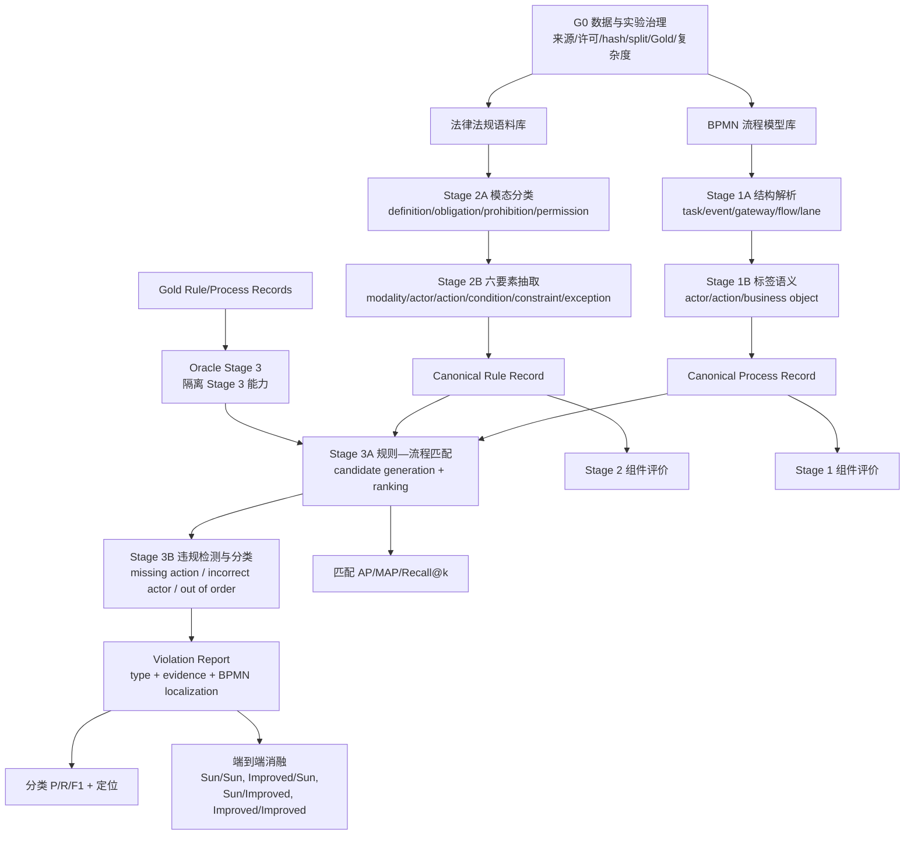

# BPC-Hybrid 完整实验主 Pipeline

**文档版本**：3.4.13
**状态**：ACTIVE — 全项目研究与任务分解的唯一主线  
**最后更新**：2026-07-31
**方法学主干**：Sun et al. (2024)  
**当前实施优先级**：实验先完成 Stage 2，再补 Stage 1 和 Stage 3；论文非结果章节从现在并行写作

> 所有 Agent 在修改实验代码、配置、数据协议或研究设计前必须完整阅读本文。
> 本文定义“要完成什么、先后依赖是什么、每一步怎样算完成”。
> `docs/PROJECT_AUDIT.md` 只记录实时进度；不要再创建新的日期版
> `STATUS_*`、`HANDOFF_*` 或平行路线文档。

## 1. 权威层级与更新规则

发生冲突时按以下顺序处理：

1. `AGENTS.md` 与安全边界；
2. `configs/experiment_contract.json` 的当前机器门禁；
3. 本文的完整研究目标、阶段依赖和任务树；
4. `docs/PROJECT_AUDIT.md` 的实时状态；
5. 各阶段设计规范；
6. `_retired/` 与 `docs/research/` 中的历史和证据材料。

本文可以随实验发现持续改进，但不得静默改路线。任何 Pipeline 变更必须：

- 给出新证据、导师要求或用户决定；
- 说明影响的任务 ID、数据、baseline、指标和已完成结果；
- 不重写既有实验结果或历史实验来源事件；
- 通过完整性检查并用 `record_change.py` 追加变更或实验运行日志；
- 在本文末尾的变更日志中追加一行。

当前 `experiment_contract.json` 仍是“优先完成 Stage 2、用固定 Stage 3
测误差传播”的阶段性执行合同。本文规定完整项目还必须完成 Stage 1 和 Stage 3。
进入 Stage 3 方法改进前，必须另行更新并核查机器合同；不能仅凭本文绕过现有门禁。

## 2. 不变的最终目标

本项目的最低完整交付不是“给 Sun Stage 2 加一个 LLM”，而是：

1. 独立、可追溯且可复现地重建 Sun 三阶段端到端方法；
2. 每个阶段都有明确输入、输出、Gold、baseline、指标和失败分析；
3. 优先在 Stage 2 比较传统方法、Sun、LLM 和混合方法；
4. 在预先定义的复杂法律语料上检验复杂度是否放大 LLM 优势；
5. Stage 2 完成后，继续比较和改进 Stage 3；
6. 最终用受控消融解释提升来自 Stage 2、Stage 3，还是二者交互；
7. 即使改进方法没有超过 Sun，也交付完整复现、负结果和误差边界。

允许的正式表述是 `paper-faithful independent reconstruction`。没有作者完整源码、
权重或原始 Gold 时，禁止称 `exact reproduction` 或 `Sun original implementation`。

## 3. 研究问题

| ID | 研究问题 | 主要证据 |
|---|---|---|
| RQ0 | 能否完整重建 Sun 的三阶段设计时合规检查方法？ | 三阶段独立测试 + 端到端复现 |
| RQ1 | 多种非 LLM、Sun、LLM 和混合方法在 Stage 2 上如何比较？ | 模态分类与六要素抽取指标 |
| RQ2 | 法律语料复杂度增加时，不同 Stage 2 方法如何退化？ | 复杂度分层曲线与误差类型 |
| RQ3 | Gold 规则输入下，多个 Stage 3 baseline 与 LLM 谁更可靠？ | Oracle Stage 3 匹配与违规分类 |
| RQ4 | Stage 2/3 的局部改进能否转化为端到端提升？ | 固定组件与交叉消融 |

## 4. 完整流程图



逻辑上 Stage 1 和 Stage 2 并行产生 Stage 3 输入；项目实施顺序是：

```text
先完成 Stage 2 → 补齐并冻结 Stage 1 → 复现 Stage 3 → 扩展 Stage 3 → 端到端消融
```

## 5. 统一中间合同

### 5.1 Process Record

最低字段：process ID；activities/events/gateways；pools/lanes/actors；sequence
flows；activity label 的 action 与 business object；直接顺序、可达、分支、并行和
order relations；来源 BPMN hash 与解析器版本。

### 5.2 Rule Record

最低字段：sample ID、source text、clause spans、modality、actor、action、condition、
constraint、exception、actor-action map、order relations、schema/method/prompt/rule
version 与 provenance。

### 5.3 Violation Report

最低字段：process/rule ID；matching score；compliant 或一个/多个 violation type；
相关 activity、lane/actor、order pair；可复核证据；threshold/model version；运行
manifest 与输入 hash。

任何方法只有通过相同 canonical contract，才能进入同一评价表。

## 6. G0：数据与实验治理

| 任务 ID | 小任务 | 产物 | 当前状态 | 完成条件 |
|---|---|---|---|---|
| G0.1 | 建立唯一 Pipeline 与文档索引 | 本文、`docs/INDEX.md` | verified | Agent 入口唯一、旧路线移出活动入口 |
| G0.2 | 数据注册 | dataset registry/contract | partial | 每个数据集有来源、许可、hash、schema、split、用途 |
| G0.3 | 方法注册 | 方法 registry | partial | 每个正式方法有命令、状态、LLM 标记和版本 |
| G0.4 | 评价合同 | schema、normalization、evaluator | partial | 方法共享同一 Gold 和 evaluator |
| G0.5 | 复杂度合同 | 文本与 BPMN 复杂度字段 | blocked | 看结果前冻结分层规则 |
| G0.6 | Git checkpoint | 有意创建的版本点 | verified | `formal_experiment/` 已在 checkpoint `bfb0b8a` 纳入版本控制 |
| G0.7 | 前人比较注册表 | citation/method/data/code/license/metric/adapter matrix | ready | 每个引用结果可追到原表或本地重跑 manifest |
| G0.8 | 受控文本哈希可移植性 | 合同 `hash_mode` 声明 + gate 归一化 + 窄 `.gitattributes` + 回归测试 | verified | CRLF/LF 工作树对同一受控文本得到同一 canonical hash；未声明资产仍按原始字节；一字变化 fail closed；Sun modality 许可/溯源边界不变 |

外部数据集必须同时满足：来源/版本可定位、许可允许复用、hash 固定、标签兼容或有
人工协议、split 不泄漏、各方法使用同一测试样本、复杂集在运行结果前选定。

## 7. Stage 1：流程模型拆解

### 方法与 baseline

| ID | 方法 | 角色 |
|---|---|---|
| S1-P0 | 纯 BPMN XML 结构解析，保留原标签 | 结构下限 |
| S1-P1 | 简单 verb-object/规则标签解析 | 轻量非 LLM baseline |
| S1-P2 | Sun/Leopold-style 标签、模型上下文和结构分析 | 正式 Sun Stage 1 |
| S1-P3 | LLM 标签语义解析 | 可选扩展，Stage 2 完成前不启动 |

### 工作分解

| 任务 ID | 小任务 | 依赖 | 当前状态 | Definition of Done |
|---|---|---|---|---|
| S1.1 | BPMN 输入与 Process Record schema | G0.2 | partial | schema + fixtures + validator |
| S1.2 | activity/event/gateway/flow/lane 解析 | S1.1 | development | 对测试 BPMN 稳定输出 |
| S1.3 | actor/action/object 标签解析 | S1.2 | blocked | P0/P1/P2 可替换运行 |
| S1.4 | 控制流和可达关系 | S1.2 | development | 分支、并行、顺序测试通过 |
| S1.5 | Stage 1 人工核对样本 | G0.2 | blocked | 固定样本和人工 Gold |
| S1.6 | baseline 评价 | S1.3-S1.5 | blocked | 结构准确率和语义 P/R/F1 |
| S1.7 | 冻结正式 Stage 1 | S1.6 | blocked | 输入/输出/方法/指标/hash 锁定 |

## 8. Stage 2：法规解析（当前主线）

### 8.1 Stage 2A：模态分类

类别：definition、obligation、prohibition、permission。候选 baseline：多数类/随机、
关键词、BiLSTM、CNN/TextCNN、通用/法律域 BERT、Sun BERT-TextCNN、LLM、
分类器 + LLM fallback。主表只保留有代表性的不同范式，同类变体放附录。

### 8.2 Stage 2B：六要素抽取

候选 baseline：marker/regex、spaCy/dependency rules、Sun CoreNLP +
Tregex/Tsurgeon + reconstructed markers、token classifier/CRF（仅在训练 Gold
足够时）、LLM、Sun + field-level LLM fallback。

### 8.3 Stage 2 完整方法

| ID | 正式含义 | 当前状态 |
|---|---|---|
| B0 / `sun_rule_only` | BERT-TextCNN + CoreNLP/Tregex/Tsurgeon | blocked；现有 runner 只是 heuristic |
| H1 / `sun_llm_fallback` | 同一 B0，仅按预注册 trigger 修复失败/不确定字段 | formal blocked；development runner 已强制绑定落盘 B0，并具备原子 merge 与逐 patch telemetry |
| D1 / `direct_llm` | LLM 直接生成同一 Rule Record | development-only；真实调用未授权 |

正式主表的最低方法覆盖为：简单规则下限、一个强监督学习 baseline、完整 B0、H1、
D1。模态分类与六要素抽取分别选方法，不能用一个只做分类的 baseline 冒充完整
Stage 2。训练 Gold 不足时，CRF/token classifier 只列为条件性扩展，不为凑数量
制造不可训练的 baseline。

### 8.4 数据轨道与复杂度

| 轨道 | 数据 | 用途 | Claim 边界 |
|---|---|---|---|
| S2-R1 | Sun 官方 modality 数据 | 模态分类复现 | development schema/split 已锁定；许可未知，禁止再分发或提前提升为 formal |
| S2-R2 | 项目固定 EStG-150 | 六要素主测试 | 项目独立重建，不是 Sun 原 150 |
| S2-C | GDPR、可复用 Luxembourg 语料、Barrientos 等复杂文本 | 外部验证 | 标签需映射或人工裁决 |

复杂度字段至少包括：长度、clause 数、dependency depth、actor/action 数、
condition/constraint/exception 的数量与嵌套、被动语态、隐含 actor、跨句引用、
原语言/翻译标记。

### 8.5 Stage 2 工作分解

| 任务 ID | 小任务 | 依赖 | 当前状态 | Definition of Done |
|---|---|---|---|---|
| S2.1 | 官方 modality 数据 ingestion/schema/license/split | G0.2 | **verified；A/B-R1/C-R1/D 全部通过** | development machine gate 交叉验证来源、合同、schema、quarantine、hash、split 与许可；formal use 仍未解锁 |
| S2.2 | EStG-150 人工裁决 | human-owned | in_progress 0/150 | 150/150 adjudicated，freeze validator 通过 |
| S2.3 | 重建 public marker lexicon | S2.1 | **verified；英文 public-source v1 已锁定** | 来源、规则、hash、dev-only 扩展策略固定 |
| S2.4 | 完成 BERT-TextCNN | S2.1 | ready after separate dispatch；本轮未启动 | 训练、dev 选择、test 评价可复现 |
| S2.5 | 完成 CoreNLP/Tregex/Tsurgeon extractor | S2.3 | blocked | 六要素规则和 fixtures 通过 |
| S2.6 | 组合并验证完整 B0 | S2.4-S2.5 | blocked | 不调用 LLM，输出 canonical Rule Record |
| S2.7 | 实现代表性非 LLM baseline | S2.1/S2.2 | blocked | 相同输入和 evaluator 可运行 |
| S2.8 | 预注册 H1 trigger/merge/call budget | S2.6 | blocked；development wiring repaired 2026-07-30 | H1 强制复用同一落盘 B0；Gold-blind trigger、原子 merge、拒绝原因与硬预算可审计；正式 trigger 仍须在不看 test 结果时锁定 |
| S2.9 | 锁定 D1 prompt/few-shot/model/budget | S2.2 | partial | Gold 不可见、prompt hash 固定 |
| S2.10 | 主数据组件评价 | S2.2/S2.6-S2.9 | blocked | 模态与六字段指标分别报告 |
| S2.11 | 复杂法律语料集冻结 | G0.5 | blocked | 数据资格门禁 + Gold/映射协议 |
| S2.12 | 复杂度分层与误差分析 | S2.10/S2.11 | blocked | 预注册分层曲线和错误类型 |
| S2.13 | Stage 2 冻结 | S2.1-S2.12 | blocked | 方法、数据、Gold、指标、成本、manifest 完整 |

Stage 2 完成时，B0/H1/D1 和选定 baseline 必须共享 test IDs、Gold、schema、
normalization 和 evaluator，并分别报告 modality、phrase 和完整 Rule Record 指标。

## 9. Stage 3：匹配、违规检测与分类

### 9.1 Stage 3A：规则—流程匹配

候选方法：TF-IDF/BM25、Winter fitness/cost、Sun semantic matching、embedding +
graph features、cross-encoder/reranker、LLM 或 Sun-candidate + LLM rerank。
主指标保留 AP/MAP，可增加 Recall@k 和 nDCG@k。

### 9.2 Stage 3B：违规检测与错误类型分类

共享标签：compliant/none、missing_action、incorrect_actor、out_of_order。
候选方法：词法 + BPMN 图规则、Winter、Sun、embedding + graph rules、LLM、
Sun candidate + LLM verifier。复杂扩展允许 multi-label。

Stage 3 正式主表至少覆盖：词法/检索下限、Winter、完整 Sun、一个现代
embedding/graph baseline；LLM 与 Hybrid 在 Oracle 非 LLM 比较稳定后加入。每种
方法必须同时说明它解决 Stage 3A、Stage 3B，还是二者，避免把 matching 分数和
错误类型分类指标混成一个结果。

### 9.3 数据轨道

| 轨道 | 数据 | 设计 |
|---|---|---|
| S3-R | Sun-compatible GDPR replication | 识别原 4 BPMN；单一人工注入违规 + negatives |
| S3-X1 | 本地全部 7 个 GDPR BPMN | 明确称 all-seven extension |
| S3-X2 | Barrientos 三个复杂 BPMN | 只在共享标签上直接比较；其它标签单列 |
| S3-X3 | 后续公开复杂流程 | 必须通过 G0 门禁 |

### 9.4 Oracle 与 end-to-end

Oracle Stage 3 使用 Gold Rule/Process Records，只评价 Stage 3；end-to-end 使用
B0/H1/D1 的预测 Rule Records，评价误差传播。两种结果必须分表。

### 9.5 Stage 3 工作分解

| 任务 ID | 小任务 | 依赖 | 当前状态 | Definition of Done |
|---|---|---|---|---|
| S3.1 | 确定原 4 个/扩展 7 个 GDPR BPMN | G0.2 | blocked | 文件名、hash、claim 固定 |
| S3.2 | 锁定 matching Gold | S3.1 | blocked | rule-process relevance Gold 完整 |
| S3.3 | 锁定 violation Gold | S3.1 | blocked | type、evidence、negative 完整 |
| S3.4 | 完成 Winter wrapper | S1.7/S2.13 | blocked | canonical I/O + reproducible command |
| S3.5 | 完成 Sun Stage 3 | S3.1-S3.3 | development scaffold only | 不再是 fixture approximation |
| S3.6 | 完成代表性非 LLM baseline | S3.2/S3.3 | blocked | 相同 Gold/evaluator |
| S3.7 | Oracle Stage 3 比较 | S3.4-S3.6 | blocked | 隔离 Stage 3 的主表 |
| S3.8 | LLM/Hybrid Stage 3 预注册与实现 | S3.7 | blocked | prompt、预算、重复次数固定 |
| S3.9 | 复杂 BPMN 与多违规扩展 | G0.5/S3.7 | blocked | 复杂度和标签在结果前冻结 |
| S3.10 | end-to-end 误差传播 | S2.13/S3.7 | blocked | B0/H1/D1 进入同一 Stage 3 |
| S3.11 | Stage 3 冻结 | S3.1-S3.10 | blocked | 数据、方法、Gold、指标、manifest 完整 |

## 10. 实验矩阵

### 10.1 组件实验

| 实验 | 固定 | 改变 | 回答问题 |
|---|---|---|---|
| EXP-S1 | BPMN 与 Process Gold | Stage 1 方法 | 流程解析可靠性 |
| EXP-S2A | modality 数据与 Gold | 分类 baseline | 句子级分类能力 |
| EXP-S2B | EStG-150 与 span Gold | 抽取 baseline | 六要素抽取能力 |
| EXP-S3-O | Gold Process/Rule Records | Stage 3 方法 | Stage 3 独立能力 |
| EXP-S2-E2E | 固定 Sun Stage 1/3 | B0/H1/D1 | Stage 2 误差传播 |

### 10.2 最终归因消融

| ID | Stage 2 | Stage 3 | 作用 |
|---|---|---|---|
| E00 | Sun | Sun | 完整 Sun 重建基线 |
| E10 | 最佳 Stage 2 改进 | Sun | Stage 2 单独贡献 |
| E01 | Sun | 最佳 Stage 3 改进 | Stage 3 单独贡献 |
| E11 | 最佳 Stage 2 改进 | 最佳 Stage 3 改进 | 完整改进系统与交互 |

### 10.3 与前人结果比较的四级证据

| 级别 | 做法 | 是否允许直接宣称优劣 |
|---|---|---|
| C1 同测集重跑 | 前人方法和本项目方法跑同一 frozen IDs/Gold/evaluator | 可以，是主比较 |
| C2 官方数据复现 | 在前人公开数据上独立重跑，并完整记录版本与 split | 可以，但只限该数据轨道 |
| C3 论文报告值 | 只抄录论文原表，数据/split/evaluator 未完全统一 | 只能描述，不能作严格显著性结论 |
| C4 跨阶段/跨任务 | Stage 2 与 Stage 3，或标签/指标不同 | 禁止用数值高低证明方法优劣 |

Sun 在 Stage 2 与 Stage 3 使用的输入、Gold 和指标不是同一评价问题，必须分表。
如果 Sun 或其引用文献有公开数据，先通过 G0 数据门禁，再把前人方法与本项目方法
共同重跑；不能把“本项目复杂集上的 LLM 结果”直接减去“前人简单集上的论文数字”
当作提升。前人比较注册表至少记录：论文版本、阶段、数据版本、样本范围、标签、
split、指标定义、源码/权重可得性、许可、适配器、复现忠实度和本地 manifest。

## 11. 评价与统计控制

- 所有方法共享 frozen IDs、Gold、schema、normalization 和 evaluator；
- train/dev/test 与 few-shot examples 隔离；
- threshold、prompt、marker 和 fallback trigger 只在 train/dev 确定；
- LLM 报告模型版本、temperature、重复次数、成本、延迟和失败率；
- 复杂度分层在看 test 结果前冻结；
- 同时报总体、逐类、置信区间/显著性和错误案例；
- 负结果照实报告，不通过改 Gold、阈值或删样本制造优势。

## 12. 实施里程碑与当前主线

| 里程碑 | 内容 | 当前状态 |
|---|---|---|
| P0 | Pipeline、文档入口与目录治理 | verified；日志/检查制度已有回归测试保护 |
| P1 | Stage 2 数据、Gold、复杂度合同 | in progress；EStG-150 0/150 |
| P2 | 完整 B0 | blocked |
| P3 | Stage 2 多 baseline | blocked on P1/P2 |
| P4 | H1/D1 与 Stage 2 复杂集 | blocked on P2/P3 |
| P5 | Stage 1 完整实现与评价 | planned after Stage 2 core |
| P6 | Sun/Winter Stage 3 复现 | blocked on P5 and Stage 3 Gold |
| P7 | Stage 3 多 baseline 与复杂扩展 | blocked on P6 |
| P8 | 最终端到端消融 | blocked on P4/P7 |
| P9 | 论文写作与可复现包 | 非结果章节 in_progress；结果/结论 blocked on P8 |

实验 Agent 应优先从 P1/P2 选择最小可验证任务；论文 Agent 只领取
`PW1`–`PW6` 中已解锁的非结果章节。未经合同变更，不要提前启动 Stage 3 LLM，
也不要因 Stage 3 尚未就绪而修改 Stage 2 Gold 门禁。

### 12.1 论文并行轨道（导师要求立即启动）

论文写作从现在开始，不等待最终实验；但写作进度不能反向解锁实验门禁。实时派工
与可复制 Prompt 见 `docs/PROJECT_AUDIT.md` 和 `docs/AGENT_RUNBOOK.md`。

| ID | 写作任务 | 当前状态 | 回填/完成门禁 |
|---|---|---|---|
| PW0 | 论文目录、骨架、主张矩阵、TODO 和空表 | verified | 本轮建立且无虚构结果 |
| PW1 | 引言、背景、RQ0–RQ4 | ready | 全部结果性表述为待检验或 TODO |
| PW2 | Sun/Winter/Sleimi/Michel/Barrientos 相关工作 | ready | 内部证据回到可核验原论文 |
| PW3 | 三阶段架构和 B0/H1/D1 方法设计稿 | ready | 未完成组件使用 TODO-STATUS |
| PW4 | 数据、五层 Gold 与标注协议 | partial-ready | S2.1/S2.2 后回填实际统计 |
| PW5 | baseline、指标、统计与复现设计 | ready | 参数在对应任务冻结后回填 |
| PW6 | 结果表和图模板 | ready-template-only | 禁止填非正式数字 |
| PW7 | Stage 2 正式结果 | blocked | S2.10/S2.12/S2.13 + manifests |
| PW8 | Stage 1/3/端到端结果 | blocked | S1.7、S3.7–S3.10、P8 |
| PW9 | 讨论、结论、摘要与终稿 | partial/blocked | 主张矩阵全部有正式证据 |

论文占位符统一使用 `TODO-RESULT`、`TODO-SOURCE`、`TODO-STATUS`、
`TODO-DECISION`。开发结果只能标 `DEV_ONLY`；正式数字必须对应 `experiment_run`
事件和 manifest。Stage 2/3、Oracle/end-to-end、C1–C4 前人比较必须分开。

## 13. Agent 任务执行协议

每个工作批次必须：

1. 阅读本文、`PROJECT_AUDIT.md`、`AGENT_RUNBOOK.md`、`DIRECTORY_GUIDE.md`、最新实验日志、
   `AI_CHANGE_PROTOCOL.md`、`ROUTE_LOCK.md`；
2. 运行编辑前快速完整性检查；
3. 从任务表选择一个最小任务 ID；
4. 写明输入、输出、依赖、边界和 Definition of Done；
5. 开发中只跑相关测试；
6. 连贯批次结束后跑一次完整性检查和全量测试；
7. 用 `record_change.py` 记录变更；真实实验还必须记录 `experiment_run` 与 manifest；
8. 只更新 `PROJECT_AUDIT.md`，不新增日期版 status/handoff 文档。

任务状态只使用：`blocked`、`ready`、`in_progress`、`verified`、`complete`。
只有脚手架或单元测试时只能写 `development` 或 `partial`，不得写完成。

执行频率：只读分析不跑全量；连贯编辑批次开始跑快速检查；批次中只跑相关测试；
批次结束/阶段交接跑 `audit_project.py --with-tests` 一次并记录事件。随后
`record_change.py` 复用绑定当前文件状态的测试凭证，不重复跑全套测试。正式运行前
跑 `--require-final-ready`；详细字段与日志示例见 `AI_CHANGE_PROTOCOL.md`。

## 14. 目录边界

活动目录结构见 `docs/DIRECTORY_GUIDE.md`：活动入口留在 `docs/` 顶层；研究证据放
`docs/research/`；已替代路线、快照、旧输出和旧脚本放 `_retired/`；实验事件只追加，
不得重写；`references/` 与根 `archive/` 只读；缓存和临时目录可以清除；数据、Gold、
预测和结果不得因目录整理被删除。恢复 `_retired/` 材料需要用户批准和日志事件。

## 15. Pipeline 变更日志

| 版本 | 日期 | 变更 | 依据 |
|---|---|---|---|
| 3.4.13 | 2026-07-31 | S2.8D-R1 单次 v4-flash canary（用户明确授权硬上限 1、0 retry）完成，**未达 non-identity 门**：requested/resolved/returned model 均为 deepseek-v4-flash；显式 policy 为 stream=false、thinking.disabled、response_format=json_object；HTTP 200，`chat.completion`，`finish_reason=stop`，`ok_message_content=1`，reasoning=false，usage=1305 prompt + 436 completion = 1741 tokens。响应形成 1 个 schema-valid patch envelope，但 span text/offset 与 source reference 不一致，原子 canonical 校验以 `canonical_invalid` + `reference_mismatch` 拒绝；valid=1、proposed=1、accepted=0、effective=0、changed=0、gate=false，H1 仍等于 B0。脱敏 capture 已保存且无凭据；未重试、未进入完整 pilot；历史真实调用累计 41 次，P/R 仍 not_computed | `outputs/development/s28d_r1_h1_canary_v1/manifest.json` + sanitized capture；全量 1137 passed, 24 skipped；experiment_run event |
| 3.4.12 | 2026-07-31 | S2.8D-R1 DeepSeek transport 离线修复（development contract verified，0 real API calls）：新 `bpc_hybrid/h1_transport.py`（显式 H1 request policy：stream=false/thinking.disabled/response_format=json_object、tools 不发；纯函数 `decode_chat_completion_envelope` 十个稳定 extraction status codes；reasoning 只存 presence/length/hash、tool arguments 只存 name/length/hash、Responses API/SSE/invalid JSON 全 fail closed；递归敏感键脱敏保留 usage 数值；安全 endpoint 描述）；`RealAPITransport` 与离线 replay 共用同一 decoder 并暴露 last_decode/last_request_policy/last_request_body_sha256；runner 新增 `--transport-capture`（--allow-llm 必需，调用前拒绝）与 `--offline-transport-replay --transport-responses-jsonl`（严格绑定，byte-identical 重放，无时间戳）；空 content 现在产生稳定 rejection code（如 empty_final_content）而非泛化 other；manifest 记录 transport 节（policy sent、safe endpoint、capture path/hash、extraction_status_counts、raw_response_saved=false）；新增 11 个 envelope fixtures 与 44 项全离线测试（合法 content→effective patch/gate=true；reasoning/tool/output/delta 均不被误当 patch；15 项验收全覆盖）；canary 未授权未运行 | 新增 44 项 S2.8D-R1 测试；focused 193 passed；全量检查 |
| 3.4.11 | 2026-07-31 | S2.8D v4-flash 真实 pilot 执行完成，**结果：未达最低成功门（如实报告失败）**：canary 1 次 + 剩余 19 次 = 20 次新调用（硬上限精确满足）；每次调用 requested=resolved=provider-returned 均为 deepseek-v4-flash（模型身份全部验证）；但 20/20 响应内容为空（sha256==空串），valid=0、effective=0、changed=0、gate=false。runner 新增 `--exclude-plan`（canary 协议用，不动 trigger/risk/budget）与 per-response `response_model`/`response_provider` 记录。历史总计 40 次真实调用（20 次 v4-pro 偏差 + 20 次 v4-flash pilot），均未产生有效 patch；无 P/R 可报（not_computed）；formal S2.8 仍 blocked on S2.6 | 新增 exclude-plan/response-model 测试 2 项；全量 1104 passed 24 skipped；canary+pilot manifests |
| 3.4.10 | 2026-07-31 | S2.8D 真实 pilot 模型偏差处理 + fail-closed 模型钉死：20 次真实调用因 .env profile 键优先级生效于 deepseek-v4-pro（未授权模型），已作为 exploratory deviation 原样保留并记录（`outputs/development/s28d_h1_real_pilot_deviation/`）；runner 新增 `--model`（--allow-llm 必需、CLI 覆盖 profile/.env、解析值必须等于 deepseek-v4-flash 否则调用前中止）并打印/记录 resolved model 与来源；preflight v2（同一冻结 20 plans/16 samples，~$0.10 上限）；canary→19 次调用待用户再次授权 | 新增 4 项模型门禁测试；全量 1102 passed 24 skipped；deviation record + preflight v2 |
| 3.4.9 | 2026-07-31 | S2.8C effective fallback 链路验证（development）：每 selected plan 增加 effective-patch audit（b0/proposed/merged hash、requested/proposed/accepted/rejected fields、merge_status、rejection codes、semantic_changed、changed_fields、effective_patch 五条件定义）；新增 `--offline-replay --responses-jsonl` 通道（response 绑定 request_id/sample_id/clause_index/prompt SHA/variant/B0 hash，缺失/重复/错配/额外全 fail closed，与真实 API 同一 parse/validate/merge 路径，manifest 无时间戳可 byte-identical 重放）；no-op 一律拒绝为 no_semantic_change 且不计入 effective；manifest 报告 `h1_non_identity_gate`；新只读对比脚本 `compare_h1_fallback_paths.py`（P/R 仅用户显式 --reference 且拒绝 Layer E/正式 Gold，本次 not_computed）；fixtures 证明合法 modality/actor/action+依赖 patch 改变 prediction（gate=true）、plan-only 保持 B0 identity（gate=false）；B0 v10a plan-only 两臂与 no-op replay 全链路验证，0 API calls；formal S2.8 仍 blocked on S2.6 | 新增 25 项 S2.8C 测试 + 既有 H1/prompt 套件全绿 + 全量检查 |
| 3.4.8 | 2026-07-31 | S2.8B masked-selected-fields repair 合同（development contract verified）：`--prompt-variant full_b0_v4\|masked_selected_v5`（默认 full_b0_v4，v4 prompt SHA 钉住不变）；新 `bpc_hybrid/h1_context.py` 纯函数遮蔽依赖闭包（actors\|actions→actor_action_map、actions→order_relations）与泄漏审计（selected IDs 不得经未遮蔽 relation 泄漏，否则拒绝 request）；新 v5 masked prompt；plan-only 也为 selected plans 记录 context audit；B0 v10a 两臂 plan-only（max_calls=50）：221 triggered / 50 selected plans / 41 samples 完全一致，两臂 predictions 与 B0 semantic hash 全等且 byte-identical，50/50 context audits 通过、0 leak、0 API calls；formal S2.8 仍 blocked on S2.6 | 新增 25 项 S2.8B 测试 + 既有 H1/prompt 套件全绿 + 全量检查 |
| 3.4.7 | 2026-07-31 | G0-TEST-REAL-BACKUP-SNAPSHOT：review-tool 测试改为 session 级纯只读快照守卫（`tree_snapshot`/`snapshot_diff`/`format_diff` + autouse session fixture），允许真实备份目录预先非空，要求整个 session 前后 byte-identical；修复 action-log 恒真断言与"目录必须为空"错误断言；新增 14 项 tmp_path 单元测试（增/删/改/改名/append/missing→created/确定性/不输出内容/symlink 越界 fail closed，平台不支持时显式 skip 并有模拟测试兜底）；全量测试首次 0 failed | 1048 passed, 24 skipped；既有真实文件 SHA 防护未降低 |
| 3.4.6 | 2026-07-31 | S2.8A Gold-blind H1 clause/field 诊断表生成器：抽出共享 B0 绑定模块 `bpc_hybrid/b0_artifact.py`（H1 runner 行为不变，既有测试全绿）；新 `build_h1_trigger_diagnostics.py` 只消费 persisted B0 + manifest + inference-visible telemetry，逐 clause 输出确定性特征行（含 per-feature missing 指标），manifest 绑定输入/输出 SHA-256 并做 coverage accounting；B0 v10a 上 150 samples/256 clauses 离线生成，重复运行 byte-identical，未调 LLM、未读 Gold/Layer E、未改 B0 | 新增 15 项 S2.8A 测试 + 既有 H1/prompt 31 项全绿 + 全量检查 |
| 3.4.5 | 2026-07-31 | G0.8 受控文本哈希可移植性：合同显式声明 `source_manifest.hash_mode=canonical_lf_utf8_text`，S2.1-D gate 只对声明资产做 CRLF→LF 归一化验证，`formal_experiment/.gitattributes` 仅固定该资产为 `text eol=lf`；修复 Windows `core.autocrlf=true` 下 source_manifest 哈希误报，integrity/sun_modality/human-review-input 门禁恢复 true，未放宽任何许可/formal 边界 | 新增受控文本哈希策略测试 18 项 + modality/audit 相关套件全绿 + 全量检查 |
| 3.4.3 | 2026-07-16 | 建立 `formal_experiment/` 首个可追踪 Git checkpoint `bfb0b8a`，并在既有 `paper/README.md` 中固定外部 ChatGPT 的 GitHub 读取、新鲜度回报和论文主张门禁；未新增平行 status/handoff | Event 40、930 项离线测试、提交后机器检查的 `formal_capsule_versioned` pass |
| 3.4.2 | 2026-07-16 | S2.3 离线重建并锁定 `public_marker_lexicon_en_v1`：64 个显式 public seed、逐类版本化资源、来源/生成/payload hash、空 dev 扩展表和独立机器门禁；保持 development-only，未进入 S2.4/S2.5 | S2.3 source snapshot、manifest、fixtures、负测试与全量检查 |
| 3.4.1 | 2026-07-16 | S2.1-D 完成可移植 manifest 与独立 development 数据门禁；S2.1 整体 verified，旧 modality 未摄入 blocker 改为精确 route-relock blocker；许可/formal/Gold/Stage 3 门禁保持关闭 | S2.1-D gate、负测试与全量审计 |
| 3.4.0 | 2026-07-15 | 在不改变 Stage 2→Stage 1→Stage 3 实验顺序的前提下启动论文并行轨道；增加 PW0–PW9、Agent 分阶段派工和主张证据门禁 | 导师要求现在开始写论文；用户要求按 Pipeline 给 Agent 稳步派工 |
| 3.3.0 | 2026-07-15 | 建立 `_retired/` 专属归档、中文目录地图与逐文件目录；活动日志改为中文 `EXPERIMENT_LOG` + 原样保留的机器事件；Agent 入口和自动检查同步固定 | 用户要求彻底整理目录并让日志同时可供人和 Agent 阅读 |
| 3.2.0 | 2026-07-15 | 治理语义改为“实验日志为主、自动完整性检查为辅、正式复核只在里程碑”；真实运行增加结构化日志字段；精确状态测试凭证消除重复全测 | 用户要求判断审计与日志何者适合普通论文实验 |
| 3.1.1 | 2026-07-14 | P0 完成：全量检查通过并记录 Event 27；主线转入 P1/S2.1 | `record_change.py` 的已验证结果 |
| 3.1.0 | 2026-07-14 | 固定各阶段最低 baseline 覆盖；增加前人数据/结果的 C1-C4 比较证据等级，禁止跨数据和跨阶段误比 | 用户要求多 baseline、复用公开数据并澄清第二/三阶段比较 |
| 3.0.0 | 2026-07-14 | 扩展为完整三阶段重建；Stage 2 优先，多 baseline 与复杂数据；Stage 3 后续扩展；建立 WBS、依赖、DoD 与 Agent 协议 | 用户根据导师要求明确指示 |
